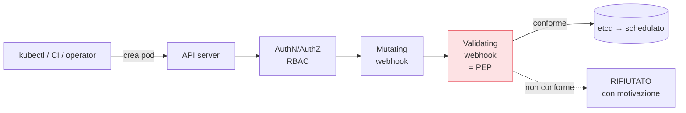

## Perché conta

L'[hardening]() definisce *come* dovrebbe girare un pod. Ma
chi impedisce che qualcuno applichi comunque un manifest che viola quelle regole? L'**admission
control** è la risposta: il punto, lungo il percorso di ogni richiesta all'API server, in cui si può
*rifiutare* o *modificare* un oggetto **prima** che venga persistito e schedulato. È l'ultima porta —
e la più efficace, perché agisce su *tutto* ciò che entra nel cluster, da qualunque fonte.

## Dove si inserisce



Dopo l'autenticazione e RBAC, la richiesta passa da due tipi di webhook:

- **Mutating**: *modifica* l'oggetto. Es. inietta automaticamente un security context sicuro, aggiunge
  label, imposta limiti di risorse di default.
- **Validating**: *accetta o rifiuta*. È il [PEP]()
  del cluster: valuta l'oggetto contro le policy e, se viola, lo blocca con un messaggio.

## Cosa si applica qui

L'admission control è dove le promesse dei capitoli precedenti diventano enforcement reale:

```text {hl_lines=[1,2,3]}
Rifiuta se:
  - immagine NON firmata da identità attesa   (verifica Sigstore/cosign)
  - immagine con CVE critici o senza SBOM
  - container privilegiato / runAsRoot / hostPath pericolosi
  - manca il limite di risorse, usa tag :latest, namespace sbagliato
Muta per imposizione:
  - aggiungi securityContext sicuro di default, label owner, networkpolicy
```

La verifica della firma è l'esempio più nitido: la [firma]()
diventa un *controllo d'accesso* solo quando un validating webhook la verifica e rifiuta ciò che non
proviene dall'identità attesa. Senza admission control, firmare è teatro.

## Kyverno e OPA Gatekeeper

Due approcci allo stesso ruolo di PEP:

- **Kyverno**: le policy sono risorse Kubernetes in YAML, native per chi già conosce i manifest.
  Nessun linguaggio nuovo da imparare; fa anche mutazione e generazione di risorse.
- **OPA Gatekeeper**: porta [OPA e Rego]() nel cluster.
  Più potente ed espressivo, a costo di imparare Rego, e con il vantaggio di condividere lo *stesso*
  linguaggio di policy tra pipeline e cluster.

## Pipeline e cluster: due reti, non una

L'admission control e il controllo in pipeline si rafforzano a vicenda. La pipeline cattura presto e
dà feedback allo sviluppatore (shift-left); l'admission control cattura *tutto* ciò che arriva
all'API, incluso ciò che bypassa la pipeline — un `kubectl apply` manuale, un operator, un attaccante
con credenziali. Fare entrambi significa feedback precoce **e** enforcement inaggirabile.


<details>
<summary><strong>Domanda:</strong> se già controllo tutto in pipeline — scansione immagini, firma, policy Rego — perché aggiungere l'admission control nel cluster? Non è controllare due volte la stessa cosa?</summary>
<p>È controllare la stessa <em>regola</em> in due punti con garanzie diverse, e la differenza è tutta in
ciò che ciascun punto può garantire. La pipeline ha un presupposto fatale come unico controllo: che ogni
cosa che arriva nel cluster sia passata <em>dalla</em> pipeline. Nella realtà non è così. Un operatore
sotto incidente fa un <code>kubectl apply</code> a mano per "sistemare al volo"; un operator o un
controller crea pod dinamicamente senza passare da nessuna CI; un Helm chart di terze parti installa
risorse che la tua pipeline non ha mai visto; un attaccante che ha ottenuto credenziali valide parla
direttamente con l'API server — e nessuno di questi percorsi tocca la pipeline. Tutto ciò che la pipeline
verifica diventa irrilevante per qualunque oggetto che entra da una porta diversa. L'admission control
chiude proprio questo: sta sull'API server, quindi vede <em>ogni</em> richiesta di creazione o modifica,
da qualunque fonte, e applica la policy lì, nell'unico collo di bottiglia che nessuno può aggirare senza
compromettere l'API stessa. Questo non rende inutile la pipeline, anzi: i due hanno scopi complementari.
La pipeline è veloce, dà feedback allo sviluppatore riga per riga sulla pull request, fa fallire la build
quando il contesto è fresco — è prevenzione e insegnamento (shift-left). L'admission control è tardivo e
muto per lo sviluppatore ma <em>inaggirabile</em> — è enforcement. Il modello corretto è lo stesso
principio ("solo immagini firmate") espresso una volta e applicato in due punti: in pipeline per fermare
presto e bene, all'ammissione per fermare comunque. Togliere la pipeline ti lascia l'enforcement senza
feedback precoce; togliere l'admission control ti lascia il feedback con un enforcement pieno di buchi.
Li vuoi entrambi perché difendono da fallimenti diversi.</p>
</details>


## Conclusione

L'admission control è il buttafuori del cluster: mutating webhook che impongono default sicuri,
validating webhook che rifiutano ciò che viola le policy — immagini non firmate, container
privilegiati, configurazioni fuori norma. È dove firma e policy diventano enforcement inaggirabile, a
complemento della pipeline. Ma tutti i controlli visti finora sono *preventivi*: agiscono prima che il
codice giri. Qualcosa passerà comunque, e allora serve vedere e reagire a ciò che accade *mentre*
succede. È la runtime security, prossimo capitolo.
