---
title: Anne 2 Pro Mods 
description: My first keybord mode ever 
slug: A2P Mods 
date:  2022-06-29T20:03:36+02:00
image: images/1.jpg
categories:
    Keyboards
tags:
     ["kbd", "mod","hack"]
---

# Why the Anne 2 Pro
i want to improve my writing speed and so i bought  a 60/100 keybord, i ended up with the Anne2Pro because of build quality and bluethoot compatibility
## Basic version 

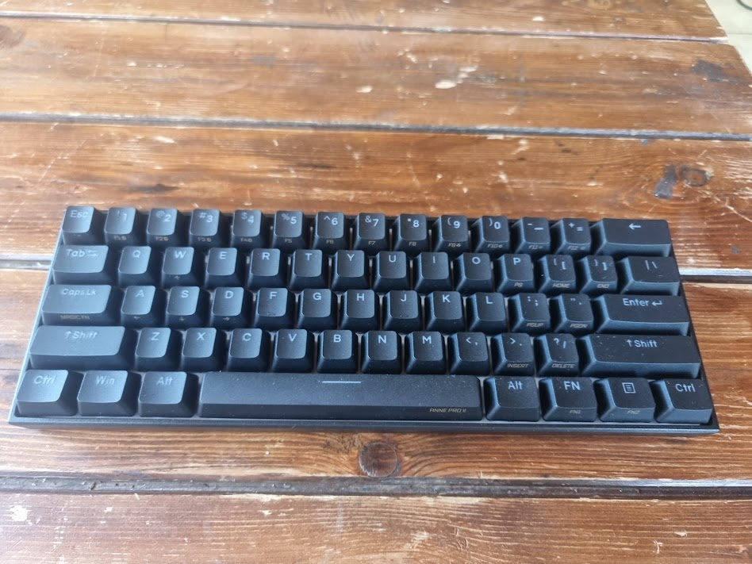
I choose the black version  with Cherry  MX  Brown and overall looks pretty solid and beautyfull, anyway it's for sure upgradable

## Teardown 
Let's start by removing keycaps
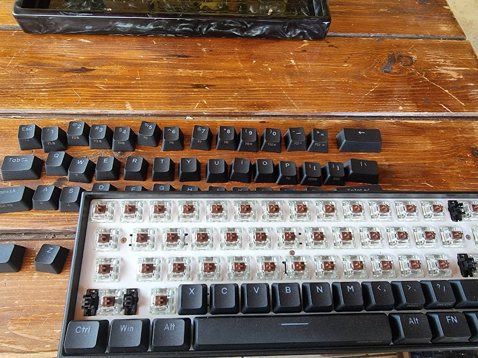

Remove the 5 T5 screw from the board then remove the board and the battery from the old case
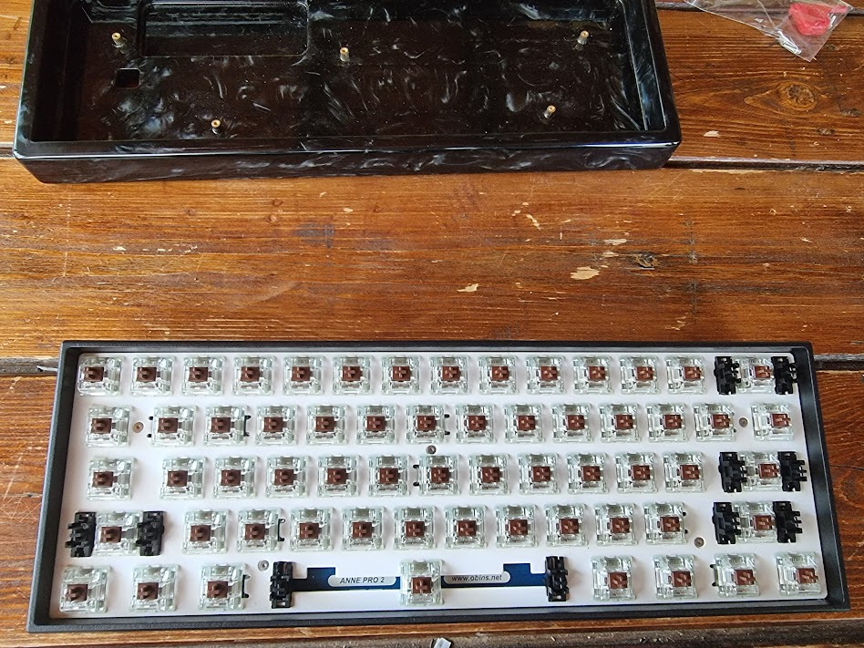

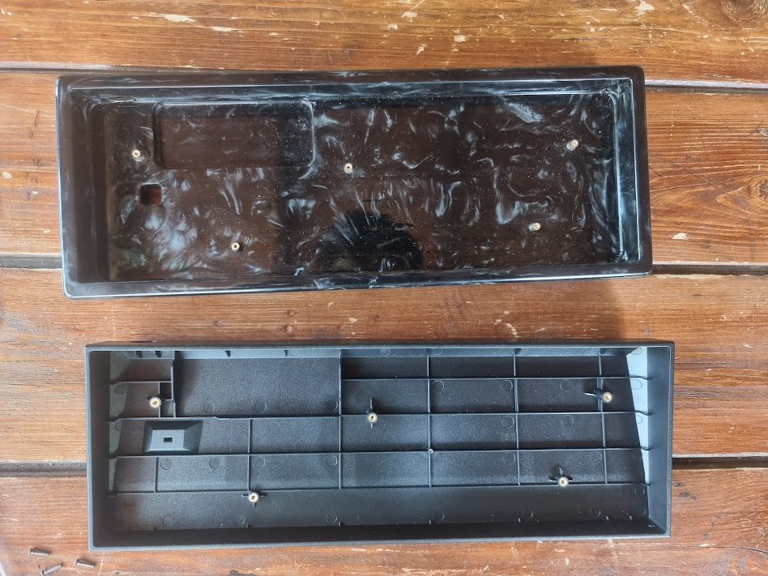
The battery is fixed on the bottom of the case but with just a little pressure  comes out
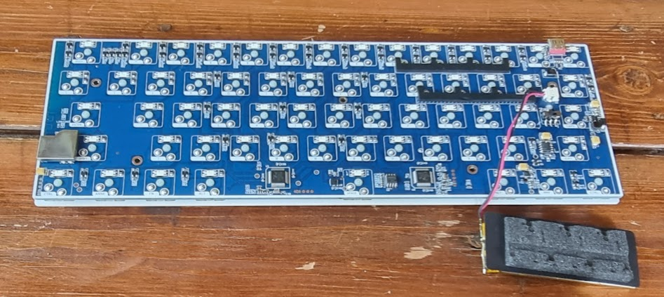

## Case 
For the case i choose a full resin case from kdbfans [LINK](https://kbdfans.com/products/alopow-resin-case-for-anne-pro-2?variant=39449105367179)

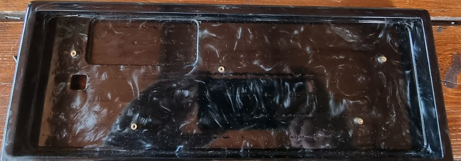

Then i made a foam mod with neoprene 

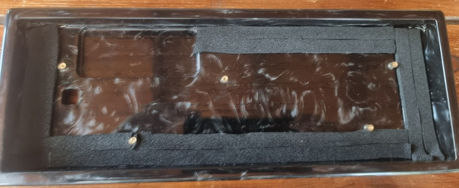

I also taped the rear of the board

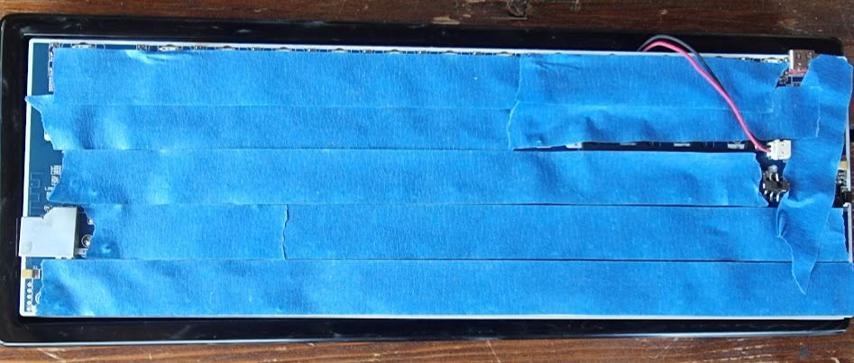

And reinstall the battery in his slot and  the board 

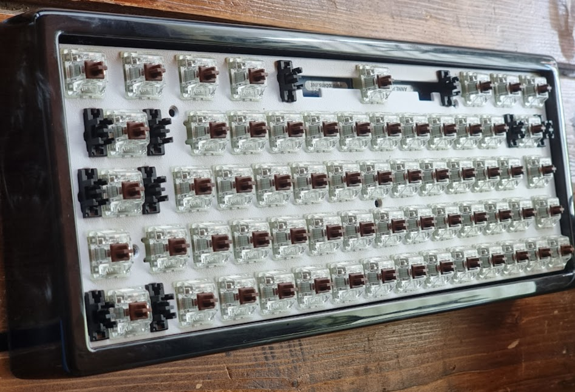

## Keycaps
For the keycaps i choose the  [ GMK hammerhead (DARK BASE COLOUR)](https://novelkeys.com/products/gmk-hammerhead?variant=35041791344807)

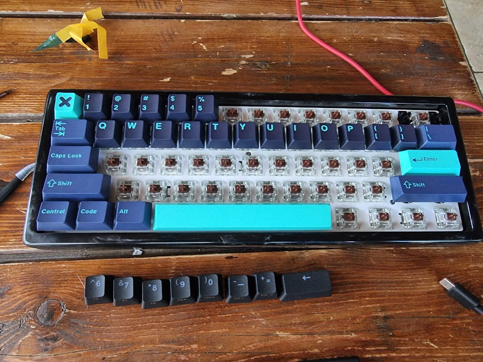
 I bought also some 0.1 mm oring for make the button pressing more quite and install a oring on every keycaps
 
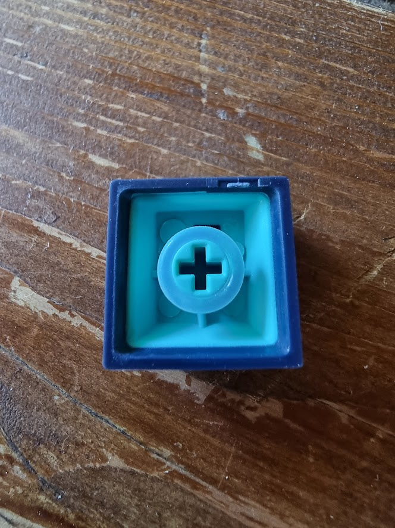
 

##  Final result
Tell me what you think on the final look of this modded Anne2Pro and how you would improve it
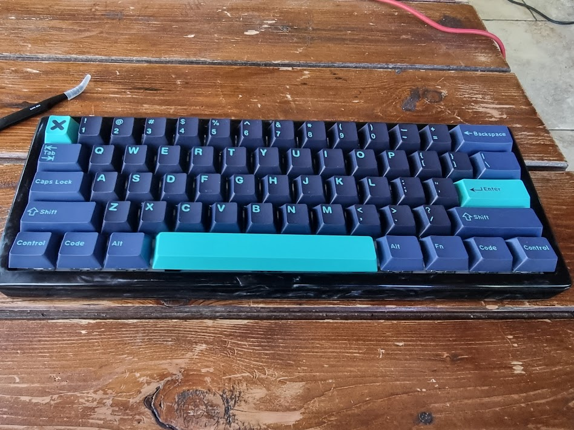
 

