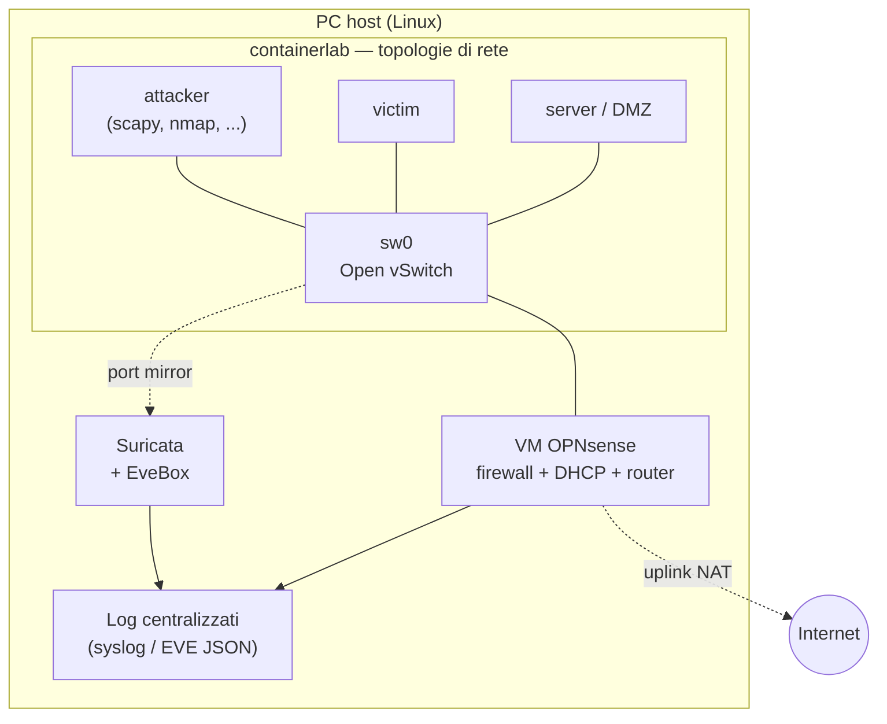

## Perché conta

Questa serie ha usato un lab fin dal primo capitolo. L'ultimo passo è renderlo **permanente**: un
ambiente che sta su un PC, si accende quando serve, si descrive in file versionabili e permette di
rifare — e inventare — attacchi e difese senza rischi per nessuno. Un homelab non è un lusso: è il
posto dove la teoria dei nove capitoli diventa pratica.

L'obiettivo è un lab che copra tutta la serie, su un solo PC, a costo zero di software.

## Requisiti

- Un PC Linux con **16 GB di RAM** e qualche decina di GB di disco. Funziona anche con 8 GB per i
  lab più piccoli.
- Virtualizzazione attiva nel BIOS (per la VM del firewall).
- Nessun hardware di rete particolare: tutto è virtuale.

Il principio guida: **container dove bastano, VM dove servono davvero**. I container condividono il
kernel dell'host, quindi decine di nodi di rete stanno in pochi GB; una VM intera (il firewall) ne
occupa uno o due da sola.

## Architettura



- **containerlab** ospita i nodi di rete (attaccante, vittime, server) e lo switch Open vSwitch.
- Una **VM OPNsense** fa da gateway: firewall stateful, DHCP, routing tra le VLAN. È l'unico pezzo
  che conviene tenere come VM intera, perché è un sistema operativo completo con la sua interfaccia.
- **Suricata** riceve il traffico da una porta mirror dello switch (modalità IDS del
  [capitolo 05]()).
- I **log** di firewall e IDS confluiscono in un punto solo: così si risponde alla minaccia T6 del
  [threat model]() e si impara a correlare gli eventi.

## La topologia della serie in un file

Tutti i capitoli partono dalla stessa base, estesa di volta in volta. Il cuore è il file
containerlab, qui con l'aggiunta delle VLAN per i capitoli 02-03:

```yaml {hl_lines=[4,13,14]}
name: homelab-secnet
topology:
  nodes:
    sw0:      { kind: ovs-bridge }                 # switch reale, gestisce le VLAN
    gateway:  { kind: linux, image: alpine:3.20 }  # oppure l'uplink verso la VM OPNsense
    victim:   { kind: linux, image: alpine:3.20 }
    server:   { kind: linux, image: nginx:alpine } # il "server in DMZ"
    attacker: { kind: linux, image: local/attacker } # immagine con i tool preinstallati
  links:
    - endpoints: ["gateway:eth1",  "sw0:p-gw"]
    - endpoints: ["victim:eth1",   "sw0:p-victim"]
    - endpoints: ["server:eth1",   "sw0:p-srv"]
    - endpoints: ["attacker:eth1", "sw0:p-att"]
```

Le righe evidenziate sono i punti da personalizzare: lo switch OVS (riga 4), che va pre-creato, e i
collegamenti (righe 13-14), che mappano ogni nodo a una porta nominata dello switch — gli stessi
nomi che si usano per assegnare VLAN e trunk.

```bash
# una tantum: crea lo switch
sudo ovs-vsctl add-br sw0 && sudo ip link set sw0 up

# avvio / spegnimento del lab
sudo containerlab deploy  -t homelab-secnet.clab.yml
sudo containerlab destroy -t homelab-secnet.clab.yml
```

## L'immagine dell'attaccante

Per non reinstallare i tool ogni volta, conviene un'immagine container con tutto pronto. Il
`Dockerfile` è parte del lab, quindi versionato e licenziato insieme al resto:

```dockerfile
FROM debian:stable-slim
RUN apt-get update && apt-get install -y --no-install-recommends \
    python3-scapy nmap tcpdump dsniff iproute2 iputils-ping \
    tshark hping3 && rm -rf /var/lib/apt/lists/*
```

> I file di configurazione del lab (`.clab.yml`, `Dockerfile`, regole Suricata, ruleset nftables)
> hanno una licenza diversa dai testi del blog. Vanno pubblicati con una licenza per codice, ad
> esempio MIT, così chiunque può riusarli; i testi restano sotto la licenza del sito (CC BY-NC-SA).

## Cosa fa ciascun capitolo in questo lab

| Capitolo | Nel lab |
|---|---|
| 02 ARP/DHCP/MAC | nodi Linux + sw0; scapy, dsniff, macof |
| 03 VLAN | porte OVS access/trunk; double tagging con scapy |
| 04 nftables | ruleset sul nodo gateway o sulla VM OPNsense |
| 05 Suricata | container Suricata su porta mirror di sw0 |
| 06-07 TLS/DNS | CA di test, unbound con DNSSEC+DoT |
| 08 DDoS | hping3 tra i nodi (dimostrativo) |
| 09 VPN | WireGuard tra due nodi su rete "non fidata" |
| 10 Wireshark | tshark cattura sulle porte di sw0 |

Un solo strumento base (containerlab) per quasi tutto; la VM OPNsense e, dove serve, GNS3 con
immagini Cisco per DTP, sono le uniche aggiunte.

## Lab: il primo avvio

1. Installate containerlab e Open vSwitch sull'host.
2. Costruite l'immagine attaccante (`docker build -t local/attacker .`).
3. Create `sw0` e fate il `deploy` della topologia.
4. Verificate la connettività di base: da `attacker`, `ping` gli altri nodi.
5. Rifate l'esercizio del [capitolo 02]() per
   confermare che il lab è pronto.


<details>
<summary><strong>Domanda:</strong> perché tenere OPNsense come VM invece di usare un container anche per il firewall?</summary>
<p>Per due motivi. Primo, OPNsense è basato su FreeBSD: non gira come container Linux, serve una VM.
Secondo, e più importante, il valore didattico sta proprio nell'usare un firewall "vero", con la sua
interfaccia web, le sue regole stateful, il DHCP e l'IDS integrati — lo stesso tipo di apparato che
si trova in produzione. Per i soli esercizi nftables del capitolo 04 basterebbe un nodo Linux
container; ma avere un firewall completo nel lab permette di collegare i concetti della serie a uno
strumento che si userà davvero. È un compromesso RAM contro realismo, e per un homelab permanente il
realismo vince.</p>
</details>


## Conclusione

Un homelab trasforma una serie di articoli in una palestra permanente. Con containerlab, Open
vSwitch, una VM OPNsense e Suricata — tutto open source, su un solo PC — si ricostruisce ogni
scenario della serie e se ne inventano di nuovi, in un ambiente isolato dove sbagliare non ha
conseguenze.

Qui finisce "Network Security dal cavo in su". Dal cavo e dallo switch (capitoli 02-03), su per il
firewall e l'IDS (04-05), fino a TLS, DNS e le VPN (06-09), e infine l'analisi (10) e il lab (11):
undici capitoli, un solo filo conduttore. La difesa in profondità non è uno slogan, è questo —
ogni strato che regge quando quello sotto cede.

[Torna alla roadmap]() per la mappa completa della serie.
