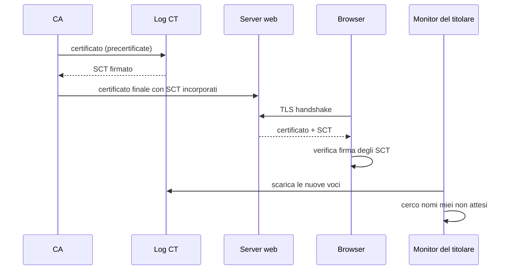

## Perché conta

Nel [capitolo su TLS]() abbiamo dato per scontato che un certificato valido
significhi "sono davvero io". Ma il browser si fida di **centinaia di CA**, e ognuna può firmare un
certificato per *qualsiasi* dominio. Basta una CA compromessa, un'emissione sbagliata o una
validazione ingannata (si pensi a un DNS hijack, vedi [DNS security]())
perché qualcuno ottenga un certificato legittimo per `www.example.com` e faccia un attacco
man-in-the-middle perfetto. Il punto debole è che **nessuno se ne accorge**: il titolare del dominio
non vede cosa le CA emettono a suo nome.

**Certificate Transparency (CT)** risolve il problema del rilevamento: ogni certificato deve finire in
un registro pubblico, append-only e verificabile. Non impedisce l'emissione abusiva, ma la rende
*visibile*, e un attacco visibile ha vita breve.

## Come funziona

Una CA, prima o subito dopo l'emissione, invia il certificato a uno o più **log CT**. Il log risponde
con un **SCT** (Signed Certificate Timestamp): la promessa firmata di includere il certificato entro
un tempo massimo (MMD). Il browser accetta il certificato solo se contiene SCT di log riconosciuti.



Il log è un **Merkle tree**: le foglie sono gli hash dei certificati, ogni nodo è l'hash dei figli.
Con $n$ voci, la **inclusion proof** di un certificato richiede solo $\lceil \log_2 n \rceil$ hash:

$$
\text{root} = H\big(H(\ldots H(H(0x00 \parallel c) \parallel h_1)\ldots) \parallel h_k\big), \qquad k = \lceil \log_2 n \rceil
$$

Con un miliardo di certificati bastano circa 30 hash per dimostrare che uno di essi è nel log, e una
**consistency proof** dimostra che il log non ha riscritto la storia: il nuovo albero contiene
quello vecchio come prefisso. Il log non può togliere o alterare una voce senza che i monitor lo vedano.

## L'attacco (e cosa vede chi osserva)

CT è un'arma a doppio taglio: i log sono pubblici, quindi **anche l'attaccante li legge**. È una fonte
di reconnaissance gratuita per scoprire sottodomini "nascosti" (staging, admin, VPN):

```bash
# tutti i nomi emessi per example.com, anche i sottodomini interni
curl -s 'https://crt.sh/?q=%25.example.com&output=json' \
  | jq -r '.[].name_value' | sort -u
```

Il secondo uso offensivo è l'emissione abusiva stessa: un certificato rogue per il tuo dominio. Con CT
finisce nel log nel giro di minuti, e un monitor lo trova:

```bash
# ispeziona un certificato sospetto: emittente, SAN, SCT incorporati
openssl s_client -connect www.example.com:443 -servername www.example.com </dev/null 2>/dev/null \
  | openssl x509 -noout -issuer -ext subjectAltName
```

La lezione per il red team è che i nomi interni *non vanno* in certificati pubblici; per il blue team
è che ogni emissione inattesa è un allarme.

## La difesa

Due strati complementari: **prevenire** con CAA, **rilevare** con il monitoring dei log.

Il record **CAA** (RFC 8659) dichiara quali CA possono emettere per il dominio. Una CA conforme deve
controllarlo prima di firmare:

```text {hl_lines=[2,3,4]}
; zona example.com
example.com.  IN CAA 0 issue "letsencrypt.org"
example.com.  IN CAA 0 issuewild ";"
example.com.  IN CAA 0 iodef "mailto:security@example.com"
```

La riga 2 limita l'emissione a una sola CA, la 3 vieta i certificati wildcard, la 4 indica dove
ricevere le segnalazioni di violazione. CAA protegge solo da CA oneste: va firmato con DNSSEC, altrimenti
chi falsifica il DNS falsifica anche la policy.

Per il monitoring si può interrogare il log in modo continuo, per esempio con uno script che avvisa sui
nomi non in inventario:

```bash {hl_lines=[3,6]}
#!/usr/bin/env bash
DOMAIN=example.com
KNOWN=/etc/ct/known-names.txt
curl -s "https://crt.sh/?q=%25.${DOMAIN}&output=json" | jq -r '.[].name_value' | sort -u > /tmp/seen.txt
# righe presenti nel log ma non nell'inventario
comm -13 <(sort "$KNOWN") /tmp/seen.txt | tee /dev/stderr | grep -q . && echo "ALERT: certificati inattesi"
```

Alternative più robuste: servizi di monitor gratuiti e le funzioni di alerting delle CA. Il browser fa
la sua parte: rifiuta certificati senza SCT validi, e così una CA non può emettere "in segreto".

## Lab

Obiettivo: in un lab con una CA di test (per esempio `step-ca` o `openssl ca`) verificare i concetti
senza toccare domini reali.

1. Crea una CA di test e emetti un certificato per `app.lab.test`.
2. Aggiungi un record CAA `0 issue "ca-sbagliata.test"` e spiega perché una CA conforme rifiuterebbe.
3. Con $n = 2^{20}$ voci, quanti hash servono per una inclusion proof?
4. Dato `crt.sh` per il tuo dominio, quali nomi rivelano infrastruttura interna?


<details><summary>Soluzione</summary>

<ol>
<li>Con <code>openssl req -x509</code> si crea la root; con <code>openssl ca</code> o <code>step ca certificate</code> si emette il certificato per <code>app.lab.test</code>.</li>
<li>La CA, prima di firmare, risolve il CAA dell'FQDN (risalendo verso la radice) e trova che solo <code>ca-sbagliata.test</code> è autorizzata: non essendolo, deve rifiutare l'emissione.</li>
<li>$\lceil \log_2 2^{20} \rceil = 20$ hash: la prova cresce in modo logaritmico, per questo i log sono verificabili anche con miliardi di voci.</li>
<li>Tipicamente <code>staging.</code>, <code>vpn.</code>, <code>admin.</code>, <code>jenkins.</code>: nomi che un attaccante usa per mappare la superficie d'attacco. Contromisura: wildcard o CA privata per i servizi interni.</li>
</ol>

</details>


## Conclusione

CT non impedisce a una CA di sbagliare, ma toglie all'errore la possibilità di restare nascosto:
la fiducia passa da "mi fido della CA" a "mi fido di ciò che posso verificare". Combinata con CAA, DNSSEC
e un monitor attivo sul proprio dominio, trasforma la PKI pubblica da atto di fede in sistema
auditabile. Il costo è la perdita di segretezza dei nomi, da tenere a mente quando si disegna la
[segmentazione]() dei servizi interni.

**Prossimo nella serie:** i certificati interni e la PKI privata · [Torna alla roadmap]()
