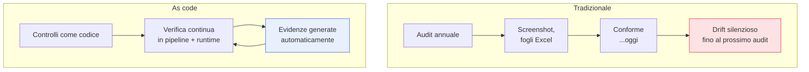

## Perché conta

Dopo l'[incident response](), un altro tipo di
pressione della fase *operate*: dimostrare a un revisore, un cliente o un regolatore che i controlli
esistono e funzionano. La compliance tradizionale lo fa a mano — screenshot, fogli di calcolo,
interviste — con un difetto fatale: fotografa un *istante*. È vera il giorno dell'audit e magari falsa
il giorno dopo, quando qualcuno cambia una configurazione. La **compliance as code** la rende
*continua*: i controlli sono codice che si verifica sempre e produce evidenze da solo.

## Point-in-time contro continuo



Il problema del modello tradizionale non è la fatica, è la *finestra*: tra due audit l'infrastruttura
deriva e nessuno lo sa. La compliance as code chiude la finestra verificando in continuo e segnalando
la deviazione quando avviene, non un anno dopo.

## I controlli ci sono già

La buona notizia: gran parte dei controlli richiesti dai framework (ISO 27001, SOC 2, PCI DSS) sono
proprio quelli costruiti in questa serie. Non serve un lavoro parallelo, serve *mappare*:

```text {hl_lines=[2,3,4]}
Requisito del framework           →  Controllo tecnico già in pipeline
"gestione delle vulnerabilità"    →  SCA + vulnerability management + gate
"controllo degli accessi"         →  RBAC + least privilege + identità workload
"integrità del software"          →  firma Sigstore + provenienza SLSA + SBOM
"logging e monitoraggio"          →  audit log a prova di manomissione + detection
```

Ogni controllo tecnico diventa l'evidenza di un requisito. L'audit smette di essere "trova le prove" e
diventa "interroga il sistema che le produce già".

## Generare evidenze, non raccoglierle

Il salto di qualità è l'evidenza *automatica*. Ogni volta che la pipeline firma un'immagine, verifica
una policy, blocca un gate o ruota un segreto, genera un record datato e verificabile. Questi record
*sono* l'evidenza di conformità, prodotta come effetto collaterale del lavoro normale — non raccolta a
mano in vista dell'ispezione. Standard emergenti come **OSCAL** permettono di esprimere i controlli e
la loro verifica in forma leggibile dalle macchine, così l'audit può essere in parte automatizzato.

## Policy as code, di nuovo

La compliance as code è, nella pratica, [policy as code]()
applicata ai requisiti normativi: la regola "ogni immagine in produzione deve essere firmata" è *allo
stesso tempo* un controllo di sicurezza e un'evidenza di conformità al requisito di integrità del
software. Un solo meccanismo serve due scopi, ed è verificato di continuo invece che attestato una
volta l'anno.

## Il limite onesto: la mappatura resta umana

Lo strumento verifica i controlli; decidere *quali* controlli soddisfano *quale* requisito, e se la
copertura è sufficiente, resta un giudizio umano — spesso negoziato con l'auditor. La compliance as
code non elimina il revisore: gli dà evidenze migliori e continue, e sposta la conversazione da "mi
fai vedere uno screenshot?" a "interroghiamo insieme il sistema". Riduce la fatica e il teatro, non la
responsabilità.


<details>
<summary><strong>Domanda:</strong> se trasformo la compliance in codice automatico, non rischio il "teatro della conformità" inverso — controlli che passano verde ma non riflettono la sicurezza reale, solo spuntati per far felice l'auditor?</summary>
<p>È il rischio giusto da tenere d'occhio, perché esiste in entrambi i mondi e la compliance as code lo
sposta ma non lo elimina da sola. Il "teatro della conformità" — controlli spuntati che non significano
sicurezza reale — nasce quando la conformità diventa il fine invece del mezzo, e questo può succedere con
gli screenshot come con il codice. La versione as code ha però due difese che il modello manuale non ha,
e un rischio specifico da gestire. Prima difesa: la verifica continua rende molto più difficile il
teatro <em>temporale</em>. Con gli screenshot "conforme il giorno dell'audit, derivato il giorno dopo" è
la norma; con la verifica continua un controllo che smette di essere vero si accende rosso subito, quindi
il verde significa almeno "vero adesso e ieri e l'altroieri", non "vero il 15 marzo alle 10". Seconda
difesa: se il controllo di conformità <em>è</em> lo stesso controllo di sicurezza operativo — la policy
"solo immagini firmate" che blocca davvero i deploy — allora passarlo per finta significa disattivare la
sicurezza vera, non solo ingannare l'auditor; il costo di barare diventa reale. È esattamente per questo
che vale la pena far coincidere i due, invece di avere controlli di sicurezza "veri" e controlli di
compliance "per l'audit" separati. Il rischio specifico da gestire è il disallineamento tra ciò che il
controllo <em>misura</em> e ciò che il requisito <em>intende</em>: un check può essere verde perché misura
la cosa sbagliata o una versione svuotata del requisito — "esiste una policy di password" (verde) mentre
la policy permette "1234". Qui la compliance as code non ti salva da sola: serve che la mappatura
requisito→controllo sia fatta con onestà e rivista, che i controlli misurino la sostanza e non la forma,
e che qualcuno — interno o auditor — sfidi periodicamente "questo verde dimostra davvero ciò che il
requisito vuole?". In altre parole, l'automazione elimina il teatro della <em>raccolta</em> di prove e
della finestra temporale, ma la qualità del <em>significato</em> dei controlli resta un giudizio umano da
presidiare. Il modo per non cadere nel teatro inverso è ancorare ogni controllo a un rischio reale che ti
interessa ridurre, non a una casella da spuntare: se il controllo esiste perché previene un attacco che
temi, il suo verde vale; se esiste solo perché un documento lo chiede, sei già nel teatro, codice o
screenshot che sia.</p>
</details>


## Conclusione

La compliance as code rende la conformità continua invece che istantanea: i controlli sono codice
verificato sempre, le evidenze si generano da sole come effetto del lavoro normale, e gran parte dei
requisiti è già coperta dai controlli della pipeline. È policy as code applicata ai framework, con la
mappatura che resta umana. Tutto questo — pipeline, runtime, operate, conformità — va governato e
*misurato* per sapere se funziona e migliora. Le metriche DevSecOps sono il prossimo capitolo.
