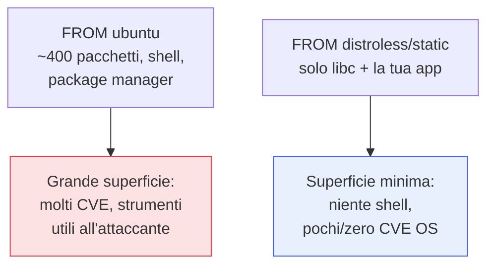

## Perché conta

Gli artefatti verificabili dei capitoli precedenti, nel mondo cloud-native, sono quasi sempre
**immagini container**. E un'immagine non è solo la tua app: è la tua app *più* un sistema operativo,
librerie, utility. Ogni pacchetto incluso è codice che può avere vulnerabilità e che un attaccante può
sfruttare una volta dentro. La regola guida è semplice: **meno c'è nell'immagine, meno c'è da
attaccare**. Questo poggia sul modello di [networking dei container]()
già visto; qui ci concentriamo sull'immagine come superficie.

## Il peso dell'immagine di base



Un'immagine basata su una distribuzione completa porta centinaia di pacchetti che l'app non usa — ma
che l'attaccante sì: una shell per muoversi, `curl` per scaricare payload, un package manager per
installare strumenti. Un'immagine **distroless** (o `scratch` per i binari statici) contiene solo
l'app e lo stretto indispensabile: niente shell significa niente `kubectl exec` in una shell, molto
meno con cui lavorare dopo una compromissione.

## Il multi-stage build

Lo strumento che rende tutto questo pratico: compilare in un'immagine ricca, spedire in una minimale.

```dockerfile {hl_lines=[2,7,8]}
# stage di build: ha compilatore, strumenti, dipendenze di sviluppo
FROM golang:1.23 AS build
WORKDIR /src
COPY . .
RUN CGO_ENABLED=0 go build -o /app ./cmd/server

# stage finale: SOLO il binario, su base minimale, utente non-root
FROM gcr.io/distroless/static:nonroot
COPY --from=build /app /app
USER nonroot
ENTRYPOINT ["/app"]
```

Le righe evidenziate sono il punto: gli strumenti di build restano nello stage `build` e non arrivano
in produzione; l'immagine finale ha solo il binario, gira come utente **non-root**, e non ha né shell
né package manager da sfruttare.

## Scansione delle vulnerabilità dell'immagine

Oltre a minimizzare, si scansiona. Uno scanner (Trivy, Grype) ispeziona i layer e trova i CVE nei
pacchetti OS e nelle dipendenze applicative — è la [SCA]()
applicata all'immagine assemblata, non solo al manifest. Si colloca:

- **In pipeline**, come gate dopo la build: blocca il nuovo rischio critico.
- **Nel registry**, in continuo: un CVE nuovo può colpire un'immagine già pubblicata, come per la SBOM.

## Le altre regole d'oro

```text {hl_lines=[1,2]}
USER non-root        → mai processi come root nel container
tag immutabili       → riferire per digest (sha256), non per :latest mutabile
niente segreti       → mai chiavi nei layer (restano nella history dell'immagine!)
filesystem read-only → l'app non deve scrivere sulla propria immagine
.dockerignore        → non copiare .git, .env, chiavi nel contesto di build
```

Nota il parallelo con i segreti: un segreto copiato in un layer resta nell'immagine *per sempre*, come
nella history di Git. L'immagine va trattata con la stessa cautela del repository.


<details>
<summary><strong>Domanda:</strong> le immagini distroless senza shell non rendono un incubo il debug in produzione? Quando qualcosa va storto non posso nemmeno aprire una shell nel container.</summary>
<p>È lo scambio reale, e la risposta è che la cosa che rende il debug scomodo per te è esattamente ciò che
rende la vita difficile all'attaccante — ma oggi non devi più scegliere tra le due. Partiamo dal perché
l'assenza di shell è un bene: la stragrande maggioranza delle tecniche post-exploitation presuppone di
avere, dentro il container, una shell per esplorare, `curl`/`wget` per scaricare lo stadio successivo, un
package manager per installare strumenti. Toglierli non ferma un attaccante determinato, ma alza
nettamente il costo e il rumore di ogni suo movimento, e neutralizza del tutto gli automatismi che
contano sulla presenza di `/bin/sh`. Rinunciarci per comodità di debug significa lasciare armi in casa.
Detto questo, il debug non è compromesso: i runtime moderni offrono i <em>debug container effimeri</em>
(in Kubernetes <code>kubectl debug</code> con <code>ephemeral containers</code>), che attaccano un
container temporaneo pieno di strumenti al pod in esecuzione, condividendone namespace e filesystem, senza
che quegli strumenti vivano mai nell'immagine di produzione. Hai la shell quando ti serve, dove ti serve,
e sparisce quando hai finito — l'immagine resta minimale. In aggiunta, la disciplina distroless spinge
verso un debug migliore a monte: logging strutturato, metriche ed endpoint di health invece dell'ispezione
manuale via shell, che è comunque il modo in cui si opera un sistema a scala. Quindi: sì, cambi abitudine,
ma non perdi capacità — sposti gli strumenti di debug fuori dall'immagine e li porti dentro solo quando
servono, ottenendo insieme operabilità e una superficie d'attacco minima.</p>
</details>


## Conclusione

Un'immagine sicura è piccola per principio: distroless o scratch via multi-stage build, utente
non-root, niente segreti nei layer, riferita per digest, scansionata in pipeline e nel registry. Meno
contiene, meno offre all'attaccante. Ma l'immagine è solo metà della storia: una volta in esecuzione
nel cluster, conta *come* gira. L'hardening di Kubernetes, prossimo capitolo.
