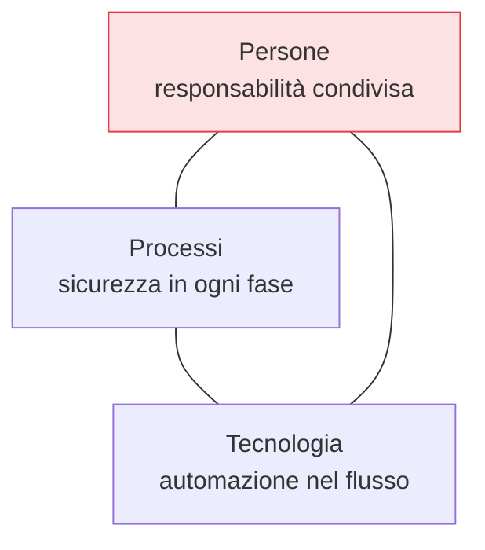

## Perché conta

Il modello tradizionale tratta la sicurezza come un cancello: il team costruisce per mesi, poi un
gruppo separato fa un audit e restituisce una lista di problemi. A quel punto correggere è costoso,
lento e conflittuale. **DevSecOps** elimina il cancello e distribuisce la sicurezza lungo tutto il
flusso. La [serie]() parte da qui perché, senza capire *il
perché*, ogni strumento diventa solo un altro ostacolo da aggirare.

## Il costo del difetto nel tempo

L'argomento economico è il più solido. Un difetto costa in modo crescente a seconda di quando lo si
scopre:

```text {hl_lines=[2,5]}
Fase in cui si trova il difetto      Costo relativo di correzione
  Design / requisiti                  1×   ← qui vuoi i controlli
  Implementazione                     ~5×
  Test / QA                           ~10×
  Produzione                          ~30× e oltre  ← qui li trovi se non fai nulla
```

Le cifre esatte variano da studio a studio, ma la direzione è costante: **prima trovi, meno paghi**.
Questo è il senso economico dello *shift left*, spostare i controlli verso sinistra nella timeline.

## I tre pilastri

DevSecOps non è un prodotto. È l'incontro di tre dimensioni:



- **Persone**: la sicurezza è di tutti, non di un team isolato. Gli sviluppatori ricevono feedback
  nel loro strumento (IDE, pull request), non in un report che leggeranno forse mai.
- **Processi**: ogni fase ha un controllo adeguato, dal design al runtime. Niente è lasciato "al
  momento del rilascio".
- **Tecnologia**: i controlli sono **automatizzati** nella pipeline. Ciò che è manuale viene saltato
  sotto pressione; ciò che è automatico vale per ogni commit.

## Cosa NON è DevSecOps

- **Non è comprare uno strumento**: uno scanner senza un processo che agisca sui risultati produce
  solo rumore.
- **Non è assumere un "DevSecOps engineer"** che faccia sicurezza al posto degli altri: ricrea il
  silo che si voleva eliminare.
- **Non è bloccare ogni build al primo warning**: una pipeline che grida al lupo viene disattivata.
  La sicurezza utile è quella *azionabile* e proporzionata al rischio.

## Guardrail, non gate

La metafora giusta non è il cancello (gate) che ferma tutti, ma il **guardrail**: una protezione che
ti lascia andare veloce mantenendoti in carreggiata. Un buon controllo DevSecOps dà un feedback
rapido, con pochi falsi positivi, e dice *come* risolvere — non solo *che* c'è un problema.


<details>
<summary><strong>Domanda:</strong> se "shift left" mette tutti i controlli all'inizio, non trascuriamo la sicurezza in produzione, dove avvengono gli attacchi veri?</summary>
<p>È un fraintendimento comune e importante da correggere: shift-left non significa spostare <em>tutto</em>
a sinistra, significa <em>aggiungere</em> controlli a sinistra senza togliere quelli a destra. Il termine
più onesto oggi è "shift everywhere". Trovare una SQL injection in fase di design con il threat modeling
costa un disegno su una lavagna; trovarla con il SAST in fase di build costa un commento su una pull
request; trovarla con il DAST in staging costa un ticket; trovarla in produzione con un WAF o la detection
costa un incidente. Sono controlli complementari, non alternativi: ognuno cattura ciò che gli altri si
lasciano sfuggire. Il SAST non vede un errore di configurazione del server, il runtime non vede una logica
di business difettosa fino a quando non viene sfruttata. La difesa in profondità vuole controlli a ogni
stadio; shift-left corregge solo lo squilibrio storico per cui a sinistra non c'era <em>nulla</em> e tutto
il peso cadeva su un audit finale. Chi interpreta shift-left come "smontiamo il monitoraggio di produzione"
ha capito l'esatto contrario.</p>
</details>


## Conclusione

DevSecOps è un cambiamento di responsabilità (da un silo a tutti), di tempismo (da fine a ovunque) e
di modo (da manuale ad automatico). L'argomento è economico prima che morale: trovare presto costa
meno. Il primo controllo che sposta a sinistra non è uno scanner, ma una conversazione sul design:
il threat modeling. Ma prima serve una cornice che dica *quali* pratiche e *dove* — il Secure SDLC,
prossimo capitolo.
