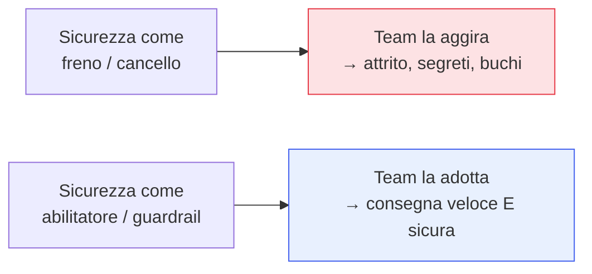

## Perché conta

Abbiamo attraversato trenta capitoli di strumenti, controlli e metriche. Ma tutto quanto —
[SAST](), [firma](),
[gate](), [metriche]() —
poggia su un presupposto che nessuno strumento può fornire: che le persone *vogliano* la sicurezza. Un
team che vive i controlli come un nemico li aggirerà, non importa quanto siano buoni. La cultura è
l'infrastruttura invisibile su cui sta tutto il resto, ed è il motivo per cui questo è l'ultimo
capitolo e non il primo: ora si capisce *cosa* la cultura deve sostenere.

## Il principio: sicurezza come abilitatore

Il cambio di cornice è tutto. Un controllo vissuto come *freno* genera attrito, e l'attrito genera
aggiramenti: il gate disattivato, il segreto committato "per fare in fretta", l'eccezione che diventa
regola. Un controllo vissuto come *guardrail* — qualcosa che ti fa andare veloce *perché* ti tiene in
carreggiata — viene adottato. Il lavoro della cultura è spostare la percezione dal primo al secondo: la
sicurezza che dà strumenti, default sicuri e feedback utile, non che dice solo "no".

## I security champions

Il team di sicurezza non può essere ovunque, e non deve: ricreerebbe il silo che DevSecOps vuole
abolire. Il modello che scala è il **security champion**: una persona *dentro* ogni team di sviluppo,
non necessariamente un esperto, che fa da ponte.

- **Porta il contesto di sicurezza nel team**: partecipa alle decisioni di design, solleva la domanda
  di [threat modeling]() al momento giusto.
- **Porta il contesto del team alla sicurezza**: spiega perché un certo gate è impraticabile, dove i
  controlli creano attrito inutile.
- **Diffonde la conoscenza**: è il primo punto di contatto, moltiplica la competenza senza
  moltiplicare il team di sicurezza.

I champion funzionano se sono *supportati* — tempo dedicato, formazione, riconoscimento — non se è un
titolo in più su chi è già oberato.

## Default sicuri: la cultura nel codice

La cultura più efficace è quella che non richiede eroismo quotidiano. Rendere la *via sicura* anche la
*via facile*: template di pipeline che arrivano già con i controlli, immagini base
[approvate e minimali](), librerie interne sicure per
default, scaffold di progetto che nascono [hardened](). Così
lo sviluppatore fa la cosa sicura senza doverci pensare, e la cosa insicura richiede uno sforzo
consapevole. È cultura cristallizzata in strumenti.

## Blameless come norma

L'abbiamo visto per gli [incidenti]() e per le
[metriche](): la colpa nasconde i problemi, l'apertura li
risolve. Una cultura in cui segnalare un errore o un dubbio di sicurezza è sicuro — anzi, premiato — è
una cultura che *vede* i suoi rischi. Una in cui ammettere un errore costa è una cultura cieca per
scelta. Questo non è un dettaglio soft: è ciò che determina se la tua detection e la tua IR hanno
materiale su cui lavorare o se tutto viene insabbiato fino all'incidente grande.

## Chiusura della serie

Trenta capitoli, un unico filo: portare la sicurezza *dentro* il ciclo di sviluppo invece di
appiccicarla alla fine. Dal [perché]() dello shift-left, ai
controlli di build, alla [supply chain](), alla pipeline, al
runtime di Kubernetes, all'operare nel tempo. Gli strumenti che abbiamo nominato cambieranno — tra due
anni alcuni avranno nomi diversi. I principi no: trovare presto costa meno, fidarsi solo di ciò che si
verifica, difendere in profondità, misurare senza ingannarsi, e — soprattutto — fare della sicurezza
una proprietà del *come lavoriamo*, non un reparto alla fine della catena. Quella proprietà non si
compra: si costruisce, una cultura e un default sicuro alla volta.



<strong>Domanda:</strong> "cambiare la cultura" suona come la raccomandazione vaga con cui si chiudono tutti gli articoli di sicurezza. Concretamente, da dove parte un team che oggi vive la sicurezza come un freno?

Hai ragione a diffidare: "cambiate cultura" come imperativo astratto è inutile, perché la cultura non si
decreta, si costruisce con atti concreti e ripetuti che cambiano l'esperienza quotidiana delle persone.
Ecco da dove si parte, in ordine di impatto. Primo e più potente: togliere attrito prima di aggiungere
controlli. Se oggi la sicurezza è vissuta come freno, quasi sempre è perché <em>lo è</em> — gate rumorosi,
falsi positivi, processi manuali. Prima di chiedere alle persone di "apprezzare la sicurezza", rendi i
controlli esistenti meno dolorosi: taratura dei falsi positivi, feedback nella pull request invece che in
un report, default sicuri che non richiedono lavoro. Un solo controllo che passa da ostacolo a invisibile
cambia la percezione più di qualsiasi predica. Secondo: rendi la via sicura la via facile, concretamente —
un template di pipeline con i controlli già dentro, un'immagine base approvata, uno scaffold di progetto
che nasce hardened. Non chiedere allo sviluppatore di ricordarsi di essere sicuro, fai sì che lo sia per
default e che l'insicurezza richieda uno sforzo. Terzo: nomina e sostieni un security champion per team,
con tempo vero allocato (non "in più del lavoro vero") e riconoscimento visibile — è la persona che
traduce in entrambe le direzioni ed è il tuo moltiplicatore. Quarto: scegli una vittoria dimostrabile e
raccontala. Un CVE critico patchato in ore grazie alla SBOM invece che in settimane; un incidente contenuto
in fretta grazie alla detection; un deploy sicuro che è stato anche <em>più veloce</em>. Le persone cambiano
abitudine quando vedono il beneficio, non quando lo sentono affermare. Quinto: rendi il blameless reale —
la prossima volta che qualcuno segnala un proprio errore, la reazione pubblica dev'essere gratitudine e un
fix di sistema, non una colpa; una sola reazione sbagliata qui azzera anni di parole. Nota cosa hanno in
comune questi punti: nessuno è "indire una campagna sulla cultura". Sono atti tecnici e gestionali
concreti — meno attrito, default sicuri, persone supportate, prove visibili, sicurezza nel segnalare — la
cui <em>somma</em>, nel tempo, è ciò che chiamiamo cultura. La cultura non è il punto di partenza da cui
discendono le pratiche; è il risultato che emerge da pratiche ripetute che rendono la sicurezza, giorno
dopo giorno, la scelta facile e conveniente. Si parte dagli atti, e la cultura segue.



## Conclusione

La cultura è ciò che regge tutto il resto: sicurezza come abilitatore e non come freno, security
champions che moltiplicano la competenza nei team, default sicuri che fanno della via giusta la via
facile, blameless come norma che rende visibili i rischi. Gli strumenti dei trenta capitoli funzionano
solo dentro questa cornice — e la cornice si costruisce con atti concreti, non con proclami. Qui la
serie DevSecOps si chiude: la sicurezza migliore non è quella che si aggiunge alla fine, è quella che
nessuno nota più perché è semplicemente *come si lavora*.
