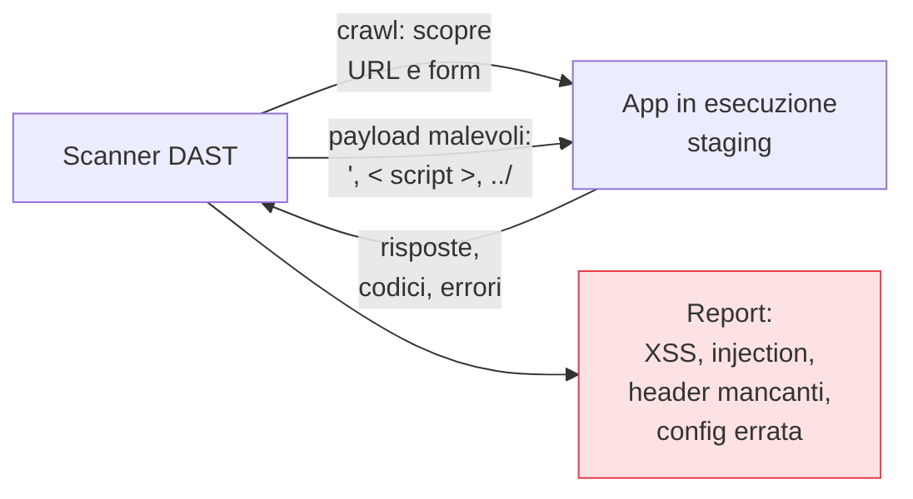

## Perché conta

Il [SAST]() e la [SCA]()
guardano il codice fermo. Ma un'applicazione in esecuzione è più della somma del suo sorgente: ha una
configurazione, un web server, header HTTP, sessioni, un ambiente. Il **DAST (Dynamic Application
Security Testing)** la testa *viva*, attaccandola dall'esterno come farebbe un avversario, senza
vedere il codice. Trova ciò che esiste solo a runtime.

## Black box: la prospettiva dell'attaccante

Il DAST non sa nulla del codice: manda richieste, osserva le risposte, deduce.



Prima *esplora* (crawl) per scoprire URL, parametri e form; poi *attacca* iniettando payload e
osservando se l'app reagisce in modo rivelatore. Trova:

- **Configurazioni errate**: header di sicurezza assenti, cookie senza flag, pagine di errore
  troppo verbose, metodi HTTP pericolosi abilitati.
- **Vulnerabilità confermate a runtime**: una XSS che si attiva davvero, un'injection che restituisce
  dati, un redirect aperto.
- **Problemi di sessione e autenticazione** osservabili dall'esterno.

## Il vantaggio: pochi falsi positivi

Dove il SAST dice "questo *potrebbe* essere sfruttabile", il DAST spesso *dimostra* lo sfruttamento:
ha inviato il payload e ha visto la risposta. Un finding DAST confermato è quasi sempre reale, perché
riproduce l'attacco. Questo lo rende prezioso come controprova dei sospetti del SAST.

## I limiti, da conoscere

```text {hl_lines=[2,3]}
Limiti strutturali del DAST:
  - Copertura parziale: testa solo i percorsi che riesce a RAGGIUNGERE
  - Lento: una scansione completa può durare ore
  - Non localizza: dice "c'è una XSS qui", non "riga 42 del file X"
  - Richiede un ambiente in esecuzione, simile a produzione
```

La copertura è il limite più sottile: se lo scanner non riesce a navigare un flusso complesso (un
wizard multi-step, un'area dietro login), non lo testa. Per questo si fornisce al DAST
l'autenticazione e, idealmente, la mappa degli endpoint (una definizione OpenAPI), così attacca anche
le API, non solo le pagine che riesce a cliccare.

## Nel flusso di lavoro

La lentezza impone una collocazione diversa dal SAST:

- **Scansione "baseline" veloce** su ogni deploy in staging: pochi minuti, solo i controlli passivi e
  rapidi, come gate leggero.
- **Scansione completa** notturna o settimanale, fuori dal percorso critico della pipeline.
- **Mai in produzione senza cautela**: il DAST invia payload reali; girarlo su produzione può creare
  dati spazzatura o, peggio, innescare azioni. Si usa uno staging fedele.


<details>
<summary><strong>Domanda:</strong> se il DAST trova vulnerabilità confermate e con pochi falsi positivi, non è semplicemente migliore del SAST? Perché tenere entrambi?</summary>
<p>"Migliore" dipende da cosa misuri, e sulle due metriche che contano di più i due si invertono. Il DAST
vince su <em>precisione</em> (i suoi finding sono spesso dimostrati) e su <em>realismo</em> (vede l'app
come un attaccante, con la sua configurazione e il suo ambiente). Ma perde su <em>copertura</em> e
<em>tempismo</em>, che per un difetto grave contano quanto la precisione. Copertura: il DAST testa solo i
percorsi che riesce a raggiungere navigando; un ramo di codice che si attiva solo con un input raro non
verrà mai esercitato, mentre il SAST lo legge comunque. Tempismo: il DAST richiede un'app in esecuzione in
staging, quindi arriva a codice già scritto e integrato, mentre il SAST dà feedback sulla pull request,
riga per riga, quando correggere costa un commento invece di un ciclo di rilascio. E c'è una classe di
difetti che il DAST non localizza: ti dice "c'è una XSS raggiungendo questo URL", non "nasce da questa
funzione" — per il fix serve comunque risalire al codice. Il modello mentale giusto non è una gara ma una
pipeline di reti progressivamente più fini e più tardive: SAST e SCA ampi e precoci sul codice, DAST
realistico e confermante sull'app viva, poi i controlli di runtime in produzione. Scartarne uno non ti dà
più precisione, ti dà un buco in un punto preciso della timeline.</p>
</details>


## Conclusione

Il DAST attacca l'applicazione viva dall'esterno: trova configurazioni errate e difetti di runtime
che il codice fermo nasconde, con pochi falsi positivi ma copertura parziale e tempi lunghi. SAST e
DAST insieme coprono codice e comportamento. Esiste però un terzo punto di vista, ibrido: strumentare
l'app *dall'interno* mentre viene testata, per unire visibilità sul codice e realismo del runtime.
Sono IAST e RASP, prossimo capitolo.
