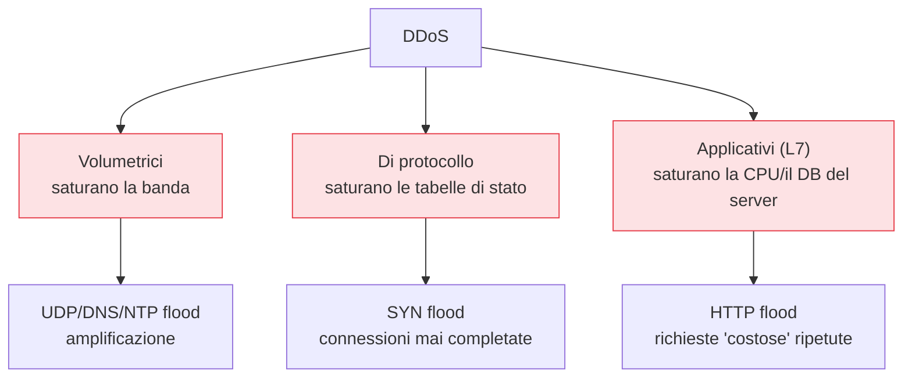

## Perché conta

La riservatezza e l'integrità si proteggono con la crittografia. La **disponibilità** no: non
esiste una chiave che impedisca a un milione di richieste di saturare un server. Il DDoS
(Distributed Denial of Service) attacca proprio questa terza gamba — la minaccia T4 del
[threat model]() — e lo fa con la forza bruta
distribuita su migliaia di macchine.

È anche il capitolo dove la verità è scomoda: contro un attacco volumetrico grande, da soli non si
può fare quasi nulla. Capire **perché** è il primo passo per difendersi bene.

## Tre famiglie, tre bersagli



- **Volumetrici**: riempiono la banda in ingresso. Si misurano in Gbit/s o Tbit/s. Se il tubo è
  pieno, nessuna regola locale aiuta: il traffico legittimo non arriva nemmeno.
- **Di protocollo**: non serve banda, serve esaurire una risorsa. Il SYN flood riempie la tabella
  delle connessioni half-open.
- **Applicativi**: poche richieste, ma costose (una ricerca complessa, un login). Difficili da
  distinguere dal traffico vero.

## Il SYN flood e le SYN cookies

Quando un client apre una connessione TCP, manda un SYN; il server risponde SYN-ACK e **riserva
memoria** per la connessione half-open, in attesa dell'ACK finale. Il SYN flood invia molti SYN,
spesso con IP sorgente falsificato, e non completa mai l'handshake. La tabella si riempie, e i
client veri non entrano più.

La difesa è elegante: le **SYN cookies**. Il server non riserva memoria al SYN. Codifica lo stato
dentro il numero di sequenza del SYN-ACK (una funzione crittografica dei parametri della
connessione). Se l'ACK finale torna, il server lo decodifica e ricostruisce lo stato; se non
torna — come nel flood — non ha sprecato nulla.

```bash
# attivare le SYN cookies sul kernel Linux
sysctl -w net.ipv4.tcp_syncookies=1
```

## L'amplificazione: perché un attaccante piccolo fa male

Gli attacchi volumetrici più grandi sfruttano l'**amplificazione**. L'attaccante invia una piccola
query a un server pubblico (DNS, NTP, memcached), ma falsifica l'IP sorgente mettendoci quello
della **vittima**. Il server risponde — alla vittima — con un pacchetto molto più grande.

Il fattore di amplificazione è il rapporto:

$$
F = \frac{\text{dimensione della risposta}}{\text{dimensione della richiesta}}
$$

Per una query DNS `ANY` una risposta può essere decine di volte più grande della domanda; con
memcached mal configurato si sono visti fattori oltre $10\,000$. Con $F = 50$, un attaccante che
dispone di 1 Gbit/s di upload genera 50 Gbit/s verso la vittima. La potenza dell'attaccante viene
**moltiplicata** dai server riflettori.

L'amplificazione dipende da due difetti: server pubblici che rispondono a chiunque, e reti che
lasciano uscire pacchetti con IP sorgente falsificato (assenza di **BCP 38 / source address
validation**). Entrambi vanno risolti da altri, non dalla vittima — ed è il motivo per cui il DDoS
è un problema collettivo.

## Cosa si può mitigare da soli, e cosa no

| Attacco | Mitigabile localmente? | Come |
|---|---|---|
| SYN flood | Sì, in gran parte | SYN cookies, rate limiting sulla `new` |
| HTTP flood (L7) | In parte | rate limiting per IP, CAPTCHA, cache |
| Volumetrico piccolo | In parte | rate limiting, filtri sul router |
| Volumetrico grande | **No** | serve un servizio di mitigazione a monte (scrubbing) |

Per i volumetrici grandi la realtà è semplice: se la banda in ingresso è satura, il filtro va fatto
**prima** che il traffico arrivi al vostro tubo, cioè da un provider di scrubbing o da una CDN che
assorbe l'attacco sulla propria rete. È un servizio, non una configurazione.

Localmente, il rate limiting di nftables (dal [capitolo 04]())
aiuta contro gli attacchi piccoli:

```nftables {hl_lines=[3]}
table inet filter {
    chain input {
        tcp dport 443 ct state new limit rate 50/second burst 100 packets accept
        tcp dport 443 ct state new drop     # oltre la soglia: scarta i nuovi SYN
    }
}
```

La riga evidenziata limita le **nuove** connessioni a 50/s: le connessioni già stabilite
(`established`) non sono toccate, quindi gli utenti legittimi collegati continuano a lavorare.

## Lab

Nel lab containerlab (traffico contenuto, è una dimostrazione del meccanismo, non un vero flood):

1. Sul nodo server, attivate `tcp_syncookies` e osservate `netstat -s | grep -i syn`.
2. Dal nodo attacker, generate molti SYN con `hping3 -S --flood -p 443 <server>`.
3. Confrontate l'uso della tabella di connessione con e senza SYN cookies.
4. Aggiungete il rate limiting nftables e misurate quante connessioni nuove passano.


<details>
<summary><strong>Domanda:</strong> perché falsificare l'IP sorgente è utile all'attaccante in un flood volumetrico ma non in un HTTP flood?</summary>
<p>In un flood volumetrico o SYN l'attaccante non ha bisogno di ricevere risposte: vuole solo
inondare. Falsificare l'IP sorgente nasconde l'origine e, nell'amplificazione, dirige le risposte
dei riflettori verso la vittima. In un HTTP flood invece serve completare l'handshake TCP e la
sessione TLS per inviare richieste HTTP vere: questo richiede un IP sorgente reale che riceve le
risposte, quindi lo spoofing non è possibile. È per questo che gli attacchi L7 usano botnet di
macchine reali compromesse, non pacchetti falsificati.</p>
</details>


## Conclusione

Il DDoS attacca la disponibilità, che la crittografia non protegge. Alcune forme si mitigano da
soli — SYN cookies, rate limiting — ma i grandi attacchi volumetrici si fermano solo a monte, ed
esistono perché altre reti permettono lo spoofing e l'amplificazione. Difendersi bene significa sia
proteggere i propri server, sia non essere parte del problema (niente resolver aperti, source
address validation).

Abbiamo attraversato tutti gli strati. Nel prossimo capitolo torniamo a un tema concreto: come
proteggere il traffico che attraversa reti non fidate, confrontando i due tunnel più usati.

**Prossimo nella serie:** [09 · IPsec contro WireGuard]() ·
[Torna alla roadmap]()
