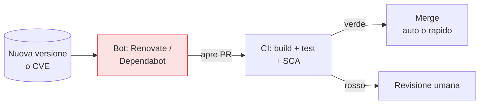

## Perché conta

La [SCA]() e la [SBOM]()
dicono *cosa* è vulnerabile. Ma trovare non è correggere, e qui comincia il lavoro vero della fase
*operate*: un flusso infinito di CVE su software già in produzione. Le dipendenze non aggiornate sono,
anno dopo anno, tra i vettori d'ingresso più sfruttati in assoluto — non per sofisticazione, ma per
pigrizia collettiva. Il problema non è tecnico, è di *sostenibilità del flusso*.

## Il debito che matura da solo

Un codice fermo non è un codice sicuro: le vulnerabilità arrivano *a lui*, non da lui.

```text {hl_lines=[4]}
Giorno del rilascio:   0 CVE noti nelle dipendenze
3 mesi dopo:           3 CVE scoperti (tu non hai toccato nulla)
12 mesi dopo:          decine di CVE, e il salto di versione è ormai enorme
→ "non aggiorniamo per non rompere" → il costo di aggiornare cresce ogni mese
```

Il paradosso: più rimandi, più l'aggiornamento diventa rischioso (tre major in un colpo), e più
rimandi ancora. Si esce solo con aggiornamenti **piccoli e frequenti**, resi indolori
dall'automazione.

## Automatizzare il flusso



Un bot apre pull request di aggiornamento; la CI le testa; quelle a basso rischio (patch, minor con
test verdi) si possono auto-mergiare, le altre vanno a revisione. Il team non insegue più i CVE a
mano: gestisce un flusso di PR già testate. Questo trasforma il patching da progetto periodico
doloroso a routine continua invisibile.

## Non tutto è urgente: prioritizzare

Patchare *tutto subito* è impossibile e inutile. Si prioritizza per rischio reale, non per numero:

- **Sfruttamento attivo**: un CVE nel catalogo **CISA KEV** (vulnerabilità sfruttate in natura) va
  prima di cento CVE teorici. Chi vi attacca usa quelli.
- **Esposizione**: internet-facing e dati sensibili prima dei servizi interni.
- **Raggiungibilità**: il CVE in codice che esegui davvero, non in una funzione mai chiamata — il
  tema del [vulnerability management]().

## Le immagini base: un flusso dedicato

Le immagini container hanno una dinamica propria: anche se la tua app non cambia, la base accumula CVE
nei pacchetti OS. La pratica è **ricostruire periodicamente** le immagini dalla base aggiornata (una
pipeline schedulata che ricompila e ridistribuisce), non solo quando cambia il codice. Un'immagine
[minimale]() riduce drasticamente questo flusso, perché
ha meno pacchetti da patchare.

## Patch virtuale: guadagnare tempo

Quando non si può patchare subito (nessuna fix disponibile, finestra di manutenzione lontana, sistema
legacy), la **patch virtuale** compra tempo: un WAF o le regole di [runtime
security]() bloccano lo *sfruttamento* del CVE mentre la
correzione vera viene pianificata. È una mitigazione, non una cura: riduce il rischio nell'immediato,
non elimina la vulnerabilità.


<details>
<summary><strong>Domanda:</strong> l'auto-merge degli aggiornamenti non è pericoloso? Un bot che fonde dipendenze da solo è esattamente il vettore di un attacco di supply chain.</summary>
<p>È una preoccupazione legittima, e la risposta non è "mai auto-merge" né "auto-merge di tutto", ma
calibrare l'automazione sul rischio e circondarla di controlli — perché l'alternativa, il patching
manuale, ha un tasso di fallimento molto più alto e più silenzioso. Partiamo dal rischio che sollevi: una
release compromessa (account del maintainer violato, pacchetto typosquatting) fusa automaticamente in
produzione. Si mitiga così. Primo, l'auto-merge non va mai dritto in produzione: fonde in un branch che
passa dalla <em>tua</em> CI completa — build, test, SCA, policy — e poi dalla tua pipeline di deploy con
i suoi gate; non è "il bot spinge in prod", è "il bot propone, i tuoi controlli decidono". Secondo, si
auto-mergia solo la classe a basso rischio: patch e minor con changelog pulito e test verdi, non i major,
non le dipendenze critiche di sicurezza, che vanno a revisione umana. Terzo, si impone una
<em>quarantena temporale</em>: Renovate può aspettare che una versione abbia N giorni di vita prima di
proporla (<code>minimumReleaseAge</code>), così le release malevole, che di solito vengono scoperte e
ritirate in fretta, non ti raggiungono all'ora zero. Quarto, i lockfile con hash garantiscono che stai
scaricando esattamente l'artefatto atteso, e la verifica di provenienza (SLSA/Sigstore) aggiunge un
controllo sull'origine. Ora il rovescio: non automatizzare significa che gli aggiornamenti si accumulano
perché "non c'è tempo", il debito matura, e finisci per girare mesi con CVE <em>noti e con exploit
pubblici</em> — un rischio molto più certo e sfruttato di una release compromessa che la quarantena
intercetta. Il patching manuale fallisce per omissione, in silenzio, ed è il vettore numero uno delle
violazioni reali. L'automazione ben calibrata riduce quel rischio enorme e certo, al prezzo di un rischio
piccolo e gestibile con quarantena, test e provenienza. La domanda giusta non è "mi fido del bot?" ma
"mi fido dei miei controlli automatici più di quanto mi fidi del fatto che qualcuno aggiorni a mano in
tempo?" — e quasi sempre la risposta onesta è sì.</p>
</details>


## Conclusione

Le dipendenze non aggiornate sono il vettore più sfruttato perché il debito matura da solo: si gestisce
con aggiornamenti piccoli e frequenti automatizzati dai bot, immagini base ricostruite di continuo,
prioritizzazione per sfruttamento reale (KEV) e patch virtuale per guadagnare tempo. Ma decidere *cosa*
patchare prima richiede un modo per confrontare migliaia di CVE: metriche, contesto, triage. È il
vulnerability management, prossimo capitolo.
