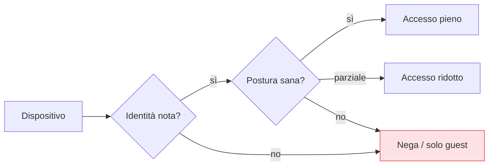

## Perché conta

La [verifica esplicita]() usa *tutti* i segnali,
e il dispositivo è tra i più importanti. Un utente perfettamente legittimo, con
[MFA resistente al phishing](), che accede da un
laptop infetto da malware è comunque un vettore: l'attaccante cavalca la sessione dell'utente
autenticato. L'identità dell'utente da sola non basta; serve anche l'identità e lo **stato** del
dispositivo. È l'altra metà del perimetro-identità.

## Due domande sul dispositivo

Lo Zero Trust pone al dispositivo due domande distinte:

1. **Identità**: è un dispositivo che conosciamo e gestiamo? (non un portatile qualunque)
2. **Postura**: è in uno stato sano? (cifrato, aggiornato, con EDR attivo, senza jailbreak)



La postura non è binaria: un dispositivo quasi conforme può ottenere accesso **ridotto** invece di
essere respinto — è la gradualità dell'accesso adattivo (cap. 15).

## Identità hardware: il TPM

L'identità forte di un dispositivo si àncora all'hardware. Il **TPM (Trusted Platform Module)** è un
chip che custodisce chiavi che non lasciano il dispositivo e può **attestare** lo stato di avvio
(secure boot, misura dei componenti caricati). Un certificato legato al TPM diventa l'identità del
dispositivo — l'equivalente, per la macchina, di una
[passkey]() per l'utente: non trasferibile, non
clonabile.

Questa identità si usa per l'accesso alla rete via [802.1X / EAP-TLS]()
e per i controlli ZTNA.

## I segnali di postura

La postura si compone di segnali concreti, raccolti da un agente di gestione (MDM/EDR):

| Segnale | Perché conta |
|---|---|
| Disco cifrato | un dispositivo rubato non rivela i dati |
| OS aggiornato / patch | niente vulnerabilità note aperte |
| EDR attivo e sano | rilevamento sul dispositivo |
| Firewall locale attivo | superficie ridotta |
| Nessun jailbreak/root | il modello di sicurezza dell'OS è intatto |

Questi segnali alimentano il [PDP](): la
decisione di accesso combina identità dell'utente **e** postura del dispositivo.

## Il dispositivo non gestito

Non tutti gli accessi vengono da dispositivi aziendali: il BYOD e i collaboratori esterni esistono.
Lo Zero Trust non li blocca in assoluto, li tratta per quello che sono — meno fidati — concedendo
accesso **ridotto**: solo app web via [ZTNA]() clientless,
nessun download di dati, sessioni più brevi. La fiducia è commisurata a ciò che si può verificare.

```text {hl_lines=[3,4]}
# policy concettuale: accesso in funzione del dispositivo
se dispositivo gestito E cifrato E patchato:  accesso pieno
se dispositivo gestito ma non conforme:        accesso ridotto + remediation
se dispositivo non gestito (BYOD):             solo web, sola lettura, no download
altrimenti:                                     nega
```

## Lab

Con un MDM/strumento di compliance open source (o uno script di attestazione) e
[802.1X]():

1. Emettete un certificato dispositivo legato al TPM (dove disponibile) e usatelo per l'accesso alla
   rete.
2. Raccogliete segnali di postura di base (cifratura disco, stato patch) con uno script.
3. Costruite una policy che dia accesso pieno solo se i segnali sono verdi, altrimenti ridotto.
4. Degradate un segnale (disattivate la cifratura su una VM di test) e osservate l'accesso
   restringersi.


<details>
<summary><strong>Domanda:</strong> i segnali di postura arrivano da un agente sul dispositivo; se la macchina è compromessa, l'agente non può mentire e dichiararsi sano?</summary>
<p>È la critica più seria al device trust, e la risposta sta nel radicare la fiducia nell'hardware, non
nel software. Un agente software su una macchina pienamente compromessa <em>può</em> essere manomesso:
per questo i segnali più forti non vengono dall'agente ma dall'<strong>attestazione hardware</strong>.
Il TPM misura la catena di avvio e firma quelle misure con una chiave che il malware non può estrarre:
un sistema con bootkit o secure boot disattivato produce un'attestazione che non combacia, e lo si
rileva a prescindere da cosa dichiari l'agente. I segnali software (patch, EDR) restano utili come
strato aggiuntivo, ma non sono la radice della fiducia. Il principio è lo stesso di
<a href="/p/mfa-resistente-al-phishing/">FIDO2</a>: la prova nasce in un elemento sicuro che il
software compromesso non controlla. Dove l'hardware di attestazione non c'è (vecchi dispositivi, BYOD),
lo si tratta onestamente come meno fidato e si concede meno — invece di fingere una garanzia che non
si ha.</p>
</details>


## Conclusione

Lo Zero Trust verifica il dispositivo quanto l'utente: identità ancorata all'hardware (TPM) e
postura (cifratura, patch, EDR) entrano nella decisione di accesso, che diventa graduale invece che
binaria. Il dispositivo non gestito non è bandito, è limitato a ciò che si può verificare. Verificati
utente e dispositivo, resta da stringere *cosa* possono fare: il minimo privilegio e l'accesso
Just-in-Time, il prossimo capitolo.
