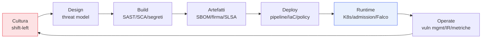

## Perché questa serie

Per anni la sicurezza è arrivata alla fine: un audit a ridosso del rilascio, una lista di
vulnerabilità da sistemare *dopo* che il codice era già scritto, un cancello che rallentava la
consegna senza renderla più sicura. **DevSecOps** ribalta questo ordine: la sicurezza entra in ogni
fase del ciclo di vita, automatizzata, misurata e trattata come responsabilità di tutti — non come
il compito di un team separato alla fine della catena.

Questa serie è un percorso pratico in **30 capitoli**. Non un elenco di strumenti, ma un modo di
pensare: ogni controllo il più presto possibile (*shift left*), ogni artefatto verificabile, ogni
decisione di rischio esplicita. Gli strumenti cambiano ogni due anni; i principi no.

## Come è organizzata

Il filo conduttore segue il viaggio del codice: nasce da una **cultura** e da un **design** sicuri,
viene **costruito** con controlli automatici, impacchettato in **artefatti** verificabili, portato in
produzione da una **pipeline** governata, difeso a **runtime** e **operato** con misure e risposta
agli incidenti. Poi si ricomincia: DevSecOps è un ciclo, non una linea.

## I capitoli

1. **Fondamenta** — Cos'è DevSecOps, il Secure SDLC, il threat modeling nel ciclo, la gestione dei
   segreti.
2. **Build** — SAST, SCA e dipendenze, DAST, IAST/RASP, fuzzing: trovare i difetti mentre si scrive.
3. **Supply chain** — SBOM, SLSA, firma degli artefatti: fidarsi solo di ciò che si può verificare.
4. **Pipeline e deploy** — Sicurezza della CI/CD, IaC security, policy as code nella pipeline.
5. **Runtime** — Sicurezza delle immagini, hardening di Kubernetes, admission control, runtime
   security, segreti e identità dei workload.
6. **Operate** — Patch management, security gates, vulnerability management, logging e detection,
   incident response, compliance as code, metriche e cultura.

## A chi si rivolge

A chi scrive codice e vuole capire dove la sicurezza tocca il suo lavoro; a chi gestisce pipeline e
cluster e deve renderli difendibili; a chi guida team e vuole misurare il rischio invece di
subirlo. Diamo per note le basi di Git, container e CI/CD; tutto il resto lo costruiamo insieme.

DevSecOps non rallenta la consegna: la rende *ripetibile*. Un rilascio sicuro e automatizzato è più
veloce di un audit manuale fatto nel panico la sera prima. Partiamo dal perché, nel primo capitolo.
