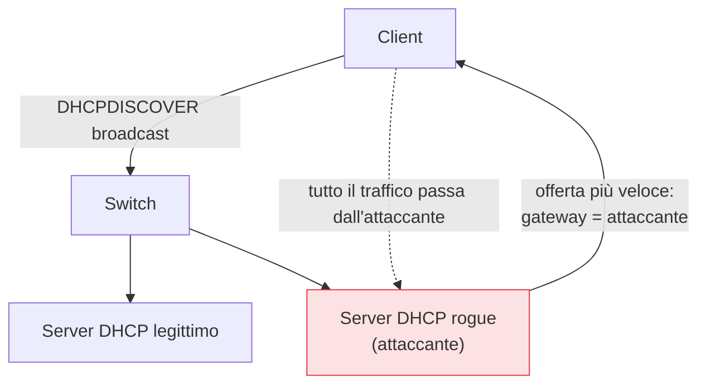
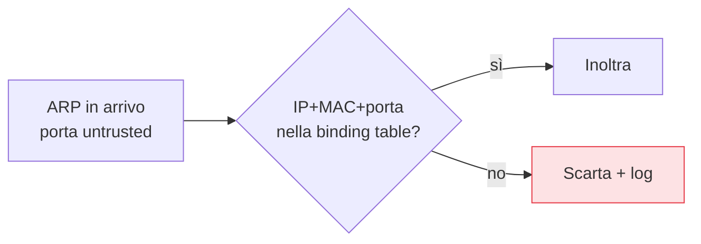

## Perché conta

Nel [capitolo sugli attacchi L2]() abbiamo visto che
ARP non autentica nulla: chiunque sulla LAN può dire "l'IP del gateway sono io" e dirottare il
traffico. Il DHCP ha lo stesso difetto: un client crede al primo server che risponde, e un
**server DHCP rogue** può distribuire un gateway o un DNS malevolo a tutta la rete. Due attacchi,
una radice comune: lo switch si fida di qualunque porta. DHCP snooping e Dynamic ARP Inspection
(DAI) chiudono entrambi partendo dalla stessa idea — distinguere le porte fidate da quelle no.

## Il server DHCP rogue

In una LAN normale il client manda un `DHCPDISCOVER` in broadcast e accetta la prima offerta. Se un
attaccante collega un proprio server DHCP, può rispondere più in fretta di quello legittimo e
imporre i propri parametri:



Il client finisce con un default gateway che è l'attaccante: un man-in-the-middle completo, senza
aver toccato una sola tabella ARP.

## DHCP snooping: porte fidate e non fidate

DHCP snooping divide le porte dello switch in due classi:

- **Trusted**: le porte dove ci si *aspetta* un server DHCP (il link verso il server legittimo o
  l'uplink). Le risposte DHCP (`OFFER`, `ACK`) sono accettate solo da qui.
- **Untrusted**: tutte le porte verso i client. Da queste, una risposta DHCP viene **scartata**: un
  client non offre indirizzi.

```text {hl_lines=[2,5]}
! abilita DHCP snooping sulla VLAN 10
ip dhcp snooping
ip dhcp snooping vlan 10
interface Gi0/1
  ip dhcp snooping trust          ! uplink verso il server DHCP legittimo
! tutte le altre porte restano untrusted per default
```

La riga `ip dhcp snooping trust` sull'uplink è il fulcro: ovunque altrove, una risposta DHCP è per
definizione sospetta e viene bloccata. Il server rogue, collegato a una porta client (untrusted),
non riesce più a rispondere.

## La binding table: il sottoprodotto prezioso

Mentre ispeziona il traffico DHCP, lo switch registra ogni assegnazione legittima in una
**binding table**: *quale MAC, su quale porta, ha ottenuto quale IP, in quale VLAN*.

| MAC | IP | VLAN | Porta | Lease |
|---|---|---|---|---|
| aa:bb:cc:00:11:22 | 10.0.10.5 | 10 | Gi0/5 | 86400 |
| aa:bb:cc:00:33:44 | 10.0.10.6 | 10 | Gi0/6 | 86400 |

Questa tabella è la **verità** su chi è chi sulla rete. È ciò che rende possibile il passo
successivo.

## Dynamic ARP Inspection: usare il binding contro l'ARP spoofing

DAI intercetta ogni pacchetto ARP su una porta untrusted e lo confronta con la binding table. Se
qualcuno sulla porta Gi0/6 (dove la tabella dice esserci 10.0.10.6) manda un ARP che dichiara "io
sono 10.0.10.1" (il gateway), il binding non corrisponde: il pacchetto viene scartato.

```text {hl_lines=[2]}
! DAI usa la binding table di DHCP snooping sulla VLAN 10
ip arp inspection vlan 10
interface Gi0/1
  ip arp inspection trust         ! uplink fidato, non ispezionato
```



Ecco perché i due meccanismi vanno insieme: DAI non ha una propria fonte di verità, **usa** la
binding table che DHCP snooping ha costruito. Senza snooping, DAI non sa cosa sia legittimo.

## Gli indirizzi statici: IP Source Guard e le entry manuali

Non tutti gli host usano DHCP: server e stampanti hanno spesso IP statici, assenti dalla binding
table. Per loro servono **entry statiche** nella tabella, altrimenti DAI li bloccherebbe. Lo stesso
binding abilita anche **IP Source Guard**, che filtra i pacchetti il cui IP sorgente non combacia
con la porta — fermando lo spoofing di IP oltre a quello di ARP.

## Lab

Con tre nodi containerlab (o GNS3) collegati a uno switch che supporti queste funzioni (o Open
vSwitch con regole equivalenti):

1. Avviate un server DHCP legittimo su una porta e un secondo server "rogue" su un'altra.
2. Senza snooping: osservate il client accettare l'offerta rogue.
3. Abilitate DHCP snooping con la sola porta del server legittimo come trust: il rogue viene zittito.
4. Abilitate DAI e, da un client, lanciate un ARP spoofing (come nel capitolo 02): i pacchetti
   devono essere scartati e loggati.


<details>
<summary><strong>Domanda:</strong> se ho già la port security e 802.1X, DHCP snooping e DAI non sono ridondanti?</summary>
<p>No, agiscono su piani diversi. La <a href="/p/layer2-attacks-arp-spoofing/">port security</a> limita
<em>quanti</em> MAC usano una porta; <a href="/p/nac-8021x/">802.1X</a> decide <em>chi</em> può
collegarsi alla porta. Ma una volta che un dispositivo è legittimamente connesso e autenticato, nulla
gli impedisce di <em>mentire</em> a livello 3: offrire DHCP o falsificare ARP. DHCP snooping e DAI
controllano proprio il <em>contenuto</em> di quel traffico, non l'accesso alla porta. Un dipendente
autenticato con un laptop infetto supera 802.1X e port security, ma i suoi pacchetti ARP falsi cadono
contro DAI. Sono strati complementari: accesso, identità e integrità del traffico.</p>
</details>


## Conclusione

DHCP snooping e DAI affrontano insieme due attacchi che condividono la stessa radice: la fiducia
cieca dello switch. Snooping distingue le porte che possono offrire DHCP e, così facendo, costruisce
una tabella di binding affidabile; DAI riusa quella tabella per bocciare ogni ARP che non torna. Il
risultato è che le due tecniche viste nel capitolo 02 — rogue DHCP e ARP spoofing — vengono fermate
alla porta, prima che diventino un man-in-the-middle.
