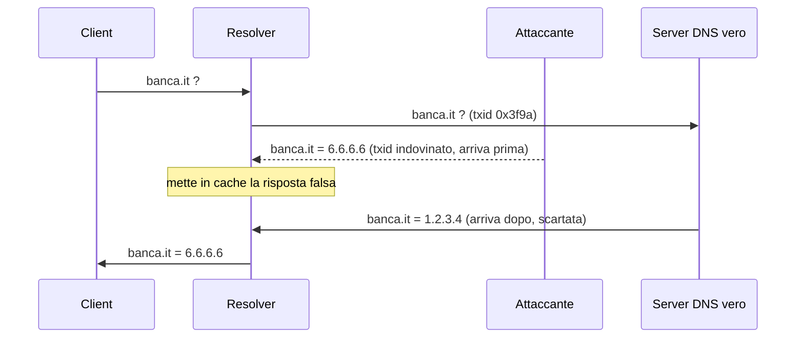
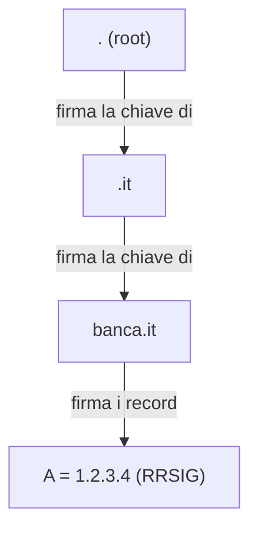

## Perché conta

Nel [capitolo su TLS]() abbiamo visto come proteggere una
connessione. Ma prima di aprirla, il client chiede al DNS: "qual è l'IP di `banca.it`?". Se un
attaccante risponde al posto del DNS legittimo — minaccia T7 del
[threat model]() — manda il client su un IP che
controlla lui. TLS su quel sito mostrerebbe un errore di certificato, certo, ma il DNS è il primo
anello, e troppi attacchi partono da lì.

Il DNS classico ha due difetti indipendenti: non autentica le risposte (chiunque può falsificarle)
e non le cifra (chiunque sulla rete le legge). Vanno risolti separatamente.

## Il problema 1: autenticità — cache poisoning

Una query DNS esce con un ID di transazione a 16 bit e attende la risposta. Chi risponde per primo
con l'ID giusto vince — anche un attaccante, se indovina l'ID prima del server vero. La risposta
falsa viene **messa in cache** dal resolver, e da quel momento tutti quelli che usano quel resolver
vengono mandati sull'IP sbagliato. È il **cache poisoning**.



### La soluzione: DNSSEC

DNSSEC firma le risposte DNS con la crittografia a chiave pubblica. Ogni zona firma i propri record;
la zona superiore firma la chiave di quella inferiore, formando una **catena di fiducia** che parte
dalla radice `.`, esattamente come la PKI di TLS parte dalle CA radice.



Il resolver verifica le firme risalendo la catena. Una risposta falsificata non ha una firma
valida e viene **scartata**: il cache poisoning fallisce perché l'attaccante non possiede la chiave
privata della zona.

```bash
# chiedere i record DNSSEC e verificare la firma
dig banca.it +dnssec
# il flag "ad" (Authenticated Data) nella risposta indica validazione riuscita
dig @1.1.1.1 banca.it | grep -o 'flags:.*;'
```

Attenzione: DNSSEC **autentica** ma **non cifra**. Chiunque sulla rete vede ancora quali domini
chiedete. Risolve il problema 1, non il problema 2.

## Il problema 2: riservatezza — tutti leggono le query

Una query DNS classica viaggia in UDP, in chiaro, sulla porta 53. Chiunque sia sul percorso — il
proprietario della rete Wi-Fi, il provider, un uomo nel mezzo — legge l'elenco dei siti che
visitate, anche se poi vi collegate in HTTPS. E può ancora intercettarla e rispondere.

### La soluzione: DoT e DoH

Due standard cifrano il trasporto del DNS dentro TLS:

| | DoT (DNS over TLS) | DoH (DNS over HTTPS) |
|---|---|---|
| Porta | 853 (dedicata) | 443 (come il traffico web) |
| Visibilità | si distingue dal resto del traffico | indistinguibile dal normale HTTPS |
| Blocco | facile da bloccare (porta nota) | difficile: bloccarlo blocca il web |
| Uso tipico | resolver di rete, policy aziendali | browser, aggiramento della censura |

```bash
# DoT verso un resolver pubblico
kdig -d @1.1.1.1 +tls banca.it

# DoH: una query DNS dentro una normale richiesta HTTPS
curl -s -H 'accept: application/dns-json' \
  'https://1.1.1.1/dns-query?name=banca.it&type=A'
```

## Le due soluzioni sono complementari

È l'errore più comune: pensare che DoH "renda sicuro" il DNS. DoH cifra la query verso il resolver,
ma se quel resolver non valida DNSSEC, può comunque ricevere e inoltrarvi una risposta falsa. E
DNSSEC autentica, ma lascia la query visibile. La configurazione robusta usa **entrambi**: un
resolver che valida DNSSEC, raggiunto via DoT/DoH.

Nel lab si costruisce con `unbound`:

```text {hl_lines=[2,5]}
server:
    auto-trust-anchor-file: "/var/lib/unbound/root.key"   # abilita la validazione DNSSEC
    # ... ascolto su localhost ...
forward-zone:
    name: "."
    forward-tls-upstream: yes                              # inoltra agli upstream via DoT
    forward-addr: 1.1.1.1@853
```

La prima riga evidenziata attiva la validazione DNSSEC (problema 1); la seconda cifra l'inoltro
verso l'upstream con DoT (problema 2).

## Lab

Nel lab containerlab, con un nodo resolver (`unbound`) e un nodo client:

1. Configurate `unbound` con validazione DNSSEC e upstream in DoT.
2. Da client, `dig` un dominio firmato DNSSEC e verificate il flag `ad`.
3. `dig` un dominio con firma deliberatamente rotta (ne esistono di test, es.
   `dnssec-failed.org`): il resolver deve rispondere `SERVFAIL`, non l'IP.
4. Catturate il traffico tra resolver e upstream: con DoT deve essere illeggibile (TLS sulla 853).


<details>
<summary><strong>Domanda:</strong> perché un dominio con DNSSEC rotto dà SERVFAIL e non l'IP?</summary>
<p>Perché la validazione è una scelta binaria: o la firma è valida, o la risposta non è fidata. Un
resolver che valida DNSSEC, di fronte a una firma che non torna (scaduta, mancante, manomessa),
non ha modo di sapere se è un errore di configurazione o un attacco in corso, quindi tratta la
risposta come non attendibile e restituisce <code>SERVFAIL</code>. È un "fallire in sicurezza":
meglio nessuna risposta che una risposta potenzialmente falsa. Lo svantaggio è che un errore di
firma del gestore del dominio rende il sito irraggiungibile per chi valida — ed è successo a domini
importanti.</p>
</details>


## Conclusione

Il DNS ha due problemi distinti: autenticità e riservatezza. DNSSEC firma (problema 1), DoT/DoH
cifrano (problema 2). Confonderli porta a configurazioni che sembrano sicure e non lo sono. La
difesa completa li combina: resolver che valida DNSSEC, raggiunto con trasporto cifrato.

Fin qui abbiamo difeso riservatezza, integrità e autenticità. Resta la terza gamba della
sicurezza: la **disponibilità**. Nel prossimo capitolo l'attacco che la prende di mira: il DDoS.

**Prossimo nella serie:** [08 · Anatomia di un DDoS]() ·
[Torna alla roadmap]()
