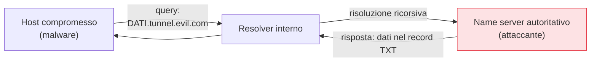

## Perché conta

Nel [capitolo sulla sicurezza DNS]() abbiamo visto come
proteggere l'integrità e la riservatezza delle query. Ma il DNS ha un'altra proprietà sfruttabile:
**passa quasi sempre**. Anche nelle reti dove ogni altra porta è filtrata, la 53 resta aperta
perché senza risoluzione dei nomi nulla funziona. Gli attaccanti ne fanno un **canale nascosto**:
codificano dati dentro i nomi di dominio delle query e li fanno uscire sotto forma di traffico DNS
apparentemente normale. È uno dei modi più comuni per il comando-e-controllo (C2) e per
l'esfiltrazione di dati da una rete altrimenti chiusa.

## Come si nascondono i dati in una query

L'idea è semplice: un nome DNS può contenere testo arbitrario nei suoi sottodomini. L'attaccante
controlla il name server autoritativo di un dominio, per esempio `tunnel.evil.com`, e il malware
sulla macchina compromessa invia i dati come sottodomini:

```text
ZGF0YS1ydWJhdG8.tunnel.evil.com      <- dati codificati in base32/64
c2Vzc2lvbi1pZC00Mg.tunnel.evil.com
```



La query risale la catena DNS fino al name server dell'attaccante, che **decodifica** i dati dal
nome e risponde — spesso in un record `TXT` — rimandando indietro comandi. Si crea un canale
bidirezionale completo, costruito interamente con DNS legittimo. Nessuna connessione diretta,
nessuna porta sospetta: solo query.

## I segnali che lo tradiscono

Il tunneling è efficace perché mimetizza, ma lascia tracce statistiche. Il DNS normale ha un
profilo preciso; il tunnel lo rompe:

- **Volume**: un host che genera migliaia di query verso lo stesso dominio è anomalo. Il DNS di un
  utente reale è sporadico e vario.
- **Lunghezza dei nomi**: i sottodomini del tunnel sono lunghi (devono trasportare dati); i nomi
  reali sono corti.
- **Entropia**: i dati codificati sembrano casuali, mentre i nomi legittimi sono pronunciabili.
- **Tipo di record**: un uso massiccio di `TXT` o `NULL` verso un singolo dominio è sospetto.

L'entropia è il segnale più robusto. Per un nome con frequenze dei caratteri $p_i$, l'entropia di
Shannon è:

$$
H = -\sum_{i} p_i \log_2 p_i
$$

Un sottodominio come `www` o `mail` ha entropia bassa; una stringa base64 casuale si avvicina al
massimo teorico ($\approx 6$ bit/carattere per base64). Una soglia sull'entropia media dei
sottodomini per dominio separa quasi sempre il traffico reale dal tunnel.

## Rilevare: dalla statistica alla regola

In pratica si combinano i segnali in logica di detection, idealmente dentro il
[SIEM]() che già raccoglie i log DNS:

```text {hl_lines=[2,3,4]}
regola: possibile DNS tunneling
  QUANDO  un host interroga lo stesso dominio di 2° livello
          piu di 100 volte in 10 minuti
          E entropia media dei sottodomini > 3.5 bit/char
          E lunghezza media dei sottodomini > 40 caratteri
  ALLORA  allarme, tecnica ATT&CK T1071.004
```

Nessun singolo criterio basta — esistono servizi legittimi (antivirus, CDN) che generano molte
query. È la **combinazione** di volume, lunghezza ed entropia verso un unico dominio a distinguere
il tunnel.

## Difese dirette

Oltre al rilevamento, alcune misure riducono la superficie:

- **Forzare un resolver interno**: bloccare la porta 53 in uscita verso internet e obbligare tutti i
  client a usare il resolver aziendale (che logga e ispeziona). Senza questo, il tunneling via
  [DoH]() diventa ancora più difficile da vedere,
  perché il traffico è cifrato in HTTPS.
- **RPZ (Response Policy Zone)**: bloccare la risoluzione verso domini noti per tunneling o appena
  registrati.
- **Threat intelligence**: liste di domini C2 noti, integrate nel resolver.

## Lab

In un ambiente di test isolato (mai verso internet reale):

1. Avviate uno strumento di tunneling DNS da laboratorio (es. `iodine` o `dnscat2`) tra due nodi
   containerlab, con un dominio di test e un name server controllato.
2. Catturate il traffico DNS con [Wireshark]() e
   osservate i sottodomini lunghi e ad alta entropia.
3. Scrivete uno script che calcoli l'entropia di Shannon dei sottodomini dai log del resolver.
4. Tarate una soglia che distingua il tunnel dal traffico DNS normale catturato in parallelo.


<details>
<summary><strong>Domanda:</strong> se il DNS tunneling è così lento e rumoroso statisticamente, perché gli attaccanti lo usano ancora?</summary>
<p>Per un motivo che batte ogni svantaggio: funziona dove nient'altro funziona. In una rete segmentata
e filtrata — pensate a un ambiente industriale o a una DMZ ostile — può darsi che l'unica cosa
autorizzata a uscire sia la risoluzione dei nomi, perché bloccarla romperebbe tutto. Lì un canale C2
su HTTP o su una porta custom è semplicemente impossibile, mentre il DNS esce. La lentezza non è un
problema per il C2: comandi e piccole quantità di dati rubati (credenziali, chiavi) stanno in pochi
kilobyte. È rumoroso <em>solo se qualcuno guarda</em>: in una rete che non ispeziona né correla i log
DNS, il tunnel è invisibile proprio perché somiglia a traffico legittimo. È il classico caso in cui il
rilevamento conta più della prevenzione: non potete chiudere il DNS, ma potete accorgervi di come
viene abusato.</p>
</details>


## Conclusione

Il DNS tunneling sfrutta l'unica porta che quasi nessuno osa chiudere, trasformando le query in un
canale nascosto per C2 ed esfiltrazione. La difesa non può essere bloccare il DNS, ma riconoscerne
l'abuso: volume, lunghezza dei nomi ed entropia verso un singolo dominio sono i segnali, e la loro
combinazione — meglio se dentro un SIEM che correla — è ciò che distingue il tunnel dal traffico
reale. A monte, un resolver interno obbligatorio e le RPZ riducono la superficie. Come spesso nella
sicurezza DNS, la chiave è guardare un protocollo che di solito nessuno guarda.
