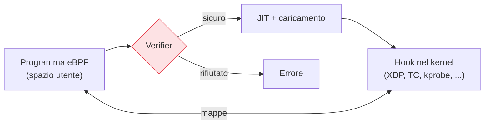

## Perché conta

Tradizionalmente, per cambiare come il kernel Linux tratta i pacchetti bisognava scrivere un modulo
kernel — rischioso, un bug manda in crash l'intera macchina — oppure accettare la velocità e i
limiti di netfilter. **eBPF** apre una terza via: eseguire piccoli programmi **dentro il kernel**,
verificati per sicurezza, attaccati a punti precisi del percorso di rete. È la tecnologia dietro
strumenti come Cilium, Falco e la nuova generazione di firewall e osservabilità. Per la sicurezza
di rete significa filtrare, vedere e applicare policy a velocità di kernel, senza punti ciechi.

## Cos'è eBPF, in breve

Un programma eBPF viene caricato dallo spazio utente, passato a un **verifier** che ne dimostra la
sicurezza (nessun loop infinito, nessun accesso di memoria fuori limite) e poi compilato
(JIT) ed eseguito a un **hook** del kernel. Se non supera il verifier, non viene caricato: è questa
la garanzia che distingue eBPF da un modulo kernel.



Le **mappe** (map) sono strutture dati condivise tra il programma nel kernel e lo spazio utente:
così un filtro può contare pacchetti, mantenere liste di IP, ed essere interrogato dall'esterno.

## XDP: filtrare prima di tutto

L'hook più potente per la sicurezza di rete è **XDP (eXpress Data Path)**: esegue il programma
eBPF nel driver di rete, **prima** che il pacchetto entri nello stack del kernel. È il punto più
precoce possibile. Un programma XDP può restituire `XDP_DROP` e scartare il pacchetto a costo
bassissimo — è la base di molte mitigazioni DDoS ad alte prestazioni (vedi
[Anatomia di un DDoS]()), perché scarta i pacchetti
malevoli prima di spendere risorse su di essi.

```c
// XDP minimale: scarta tutto il traffico UDP verso la porta 53 da un IP in blocklist
SEC("xdp")
int drop_dns_flood(struct xdp_md *ctx) {
    // ... parsing di Ethernet/IP/UDP (omesso) ...
    if (udp->dest == bpf_htons(53) && in_blocklist(ip->saddr))
        return XDP_DROP;     // scartato nel driver, prima dello stack
    return XDP_PASS;         // prosegue normalmente
}
```

Il confronto con netfilter è netto: una regola nftables agisce dopo che il pacchetto è già entrato
nello stack; XDP lo ferma al primo contatto con la scheda di rete.

## Tre usi per la sicurezza

1. **Filtro ad alte prestazioni (XDP)**: scartare flood e traffico malevolo a velocità di linea.
2. **Osservabilità profonda**: agganciare hook a syscall ed eventi di rete per vedere *quale
   processo* apre *quale connessione*. Strumenti come Falco rilevano comportamenti sospetti (una
   shell che apre una connessione in uscita) che un IDS di rete non vede, perché legano il traffico
   al processo.
3. **Policy di rete per workload (Cilium)**: in Kubernetes, applicare regole basate sull'identità
   del servizio invece che sull'IP — gli IP dei pod cambiano di continuo, l'identità no.

## Osservare le connessioni con bpftrace

`bpftrace` permette di scrivere piccoli programmi eBPF al volo. Per vedere ogni nuova connessione
TCP in uscita e il processo che la apre:

```bash
# traccia le connect() TCP: PID, comando, e porta di destinazione
bpftrace -e 'tracepoint:syscalls:sys_enter_connect {
    printf("%s (pid %d) -> connessione\n", comm, pid);
}'
```

Questo tipo di visibilità — *quale processo* contatta *dove* — è esattamente ciò che manca a chi
guarda solo il traffico sul filo. Lega l'attività di rete all'identità del processo.

## Il verifier è la sicurezza (e il limite)

Il verifier è ciò che rende eBPF sicuro da eseguire nel kernel: rifiuta programmi che potrebbero
leggere memoria arbitraria o non terminare. Ma è anche il limite: i programmi eBPF non sono C
ordinario, hanno vincoli stretti (dimensione, cicli limitati, accessi controllati). Scrivere eBPF
complesso è difficile proprio perché ogni programma deve essere *dimostrabilmente* sicuro — ed è il
compromesso che vale la pena accettare, perché l'alternativa (un modulo kernel) non offre nessuna
garanzia.

## Lab

Su un kernel Linux recente (5.x+) con `bpftrace` e `bpftool`:

1. Installate `bpftrace` ed eseguite il one-liner sopra; in un altro terminale, aprite una
   connessione (`curl`) e osservate l'evento.
2. Elencate i programmi eBPF caricati: `bpftool prog show`.
3. (Avanzato) Caricate un programma XDP di esempio su un'interfaccia del lab containerlab e
   verificate che scarti il traffico scelto con `XDP_DROP`.


<details>
<summary><strong>Domanda:</strong> se eBPF gira nel kernel, un programma eBPF malevolo non è un rischio enorme?</summary>
<p>È la prima preoccupazione legittima, e la risposta sta nel verifier e nei privilegi. Primo: caricare
programmi eBPF richiede privilegi elevati (storicamente <code>CAP_SYS_ADMIN</code>, oggi il più
granulare <code>CAP_BPF</code> più capability specifiche); un utente non privilegiato non può farlo.
Secondo: il verifier rifiuta a priori i programmi che accedono a memoria fuori dai limiti, che non
terminano, o che usano helper non consentiti per il tipo di hook. Un programma eBPF non può quindi
"fare qualsiasi cosa" come un modulo kernel: opera in una sandbox dimostrata. Il rischio non è zero —
sono esistiti bug nel verifier stesso, ed è un bersaglio di ricerca — ma il modello di sicurezza è
radicalmente più forte di quello dei moduli kernel, che girano senza alcun controllo.</p>
</details>


## Conclusione

eBPF porta programmabilità sicura nel cuore del kernel. Per la sicurezza di rete significa tre cose:
filtri a velocità di linea con XDP, visibilità che lega il traffico ai processi, e policy basate
sull'identità dei workload. Il verifier è insieme la garanzia e il vincolo. È la base su cui si
stanno costruendo gli strumenti di rete e sicurezza della prossima generazione, da Cilium a Falco.
