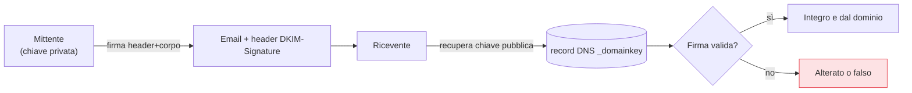

## Perché conta

Il protocollo SMTP è nato senza alcuna autenticazione del mittente: scrivere `From:
ceo@azienda.it` è facile come scrivere un indirizzo falso sul retro di una busta. È la base del
phishing e del business email compromise. Tre record DNS — SPF, DKIM e DMARC — costruiscono, strato
su strato, una risposta: *questo server può spedire per il dominio?*, *il messaggio è integro e
davvero firmato dal dominio?* e infine *l'indirizzo che l'utente vede corrisponde?*. Poggiano tutti
sul DNS, quindi si legano direttamente al [capitolo sulla sicurezza DNS]().

## SPF: quali server possono spedire

SPF è un record TXT nel DNS del dominio che elenca gli indirizzi IP autorizzati a inviare posta
per quel dominio. Il server ricevente estrae il dominio dal `MAIL FROM` (l'envelope, non l'header
visibile) e controlla se l'IP che si è connesso è nella lista.

```text
azienda.it.  IN TXT  "v=spf1 ip4:203.0.113.0/24 include:_spf.google.com -all"
```

- `ip4:...` e `include:...` elencano gli emittenti legittimi.
- `-all` (hard fail) dice: qualunque altro IP **non** è autorizzato, rifiuta.

Il limite di SPF: autentica l'envelope, non l'indirizzo `From:` che l'utente legge. E si rompe con
l'inoltro, perché il server che inoltra non è nella lista del dominio originale.

## DKIM: firmare il messaggio

DKIM aggiunge una **firma crittografica** all'email. Il server mittente firma header e corpo con
una chiave privata; la chiave pubblica sta nel DNS. Il ricevente la recupera e verifica la firma.



Una firma valida prova due cose: il messaggio **non è stato alterato** in transito, ed è stato
firmato da chi controlla la chiave del dominio. A differenza di SPF, DKIM sopravvive all'inoltro,
perché la firma viaggia con il messaggio.

## DMARC: allineare e decidere

SPF e DKIM, da soli, autenticano domini che l'utente non vede (l'envelope, il dominio della firma).
DMARC aggiunge il pezzo mancante: l'**allineamento** con il dominio dell'header `From:`, quello
visibile. Un'email passa DMARC se supera SPF **o** DKIM *e* il dominio corrispondente è allineato a
quello del `From:`.

```text {hl_lines=[1]}
_dmarc.azienda.it.  IN TXT  "v=DMARC1; p=reject; rua=mailto:dmarc@azienda.it; pct=100"
```

La `p=` è la decisione sui messaggi che falliscono:

| Policy | Effetto |
|---|---|
| `p=none` | non fare nulla, solo monitorare (fase di avvio) |
| `p=quarantine` | metti in spam |
| `p=reject` | rifiuta del tutto |

Il campo `rua=` chiede ai riceventi di inviare **report aggregati**: chi sta spedendo a nome vostro,
e con quale esito. Sono la bussola per passare da `none` a `reject` senza bloccare la posta
legittima.

## Il percorso di adozione

L'errore classico è partire da `p=reject` e scoprire di aver bloccato la newsletter aziendale o il
gestionale che spedisce fatture. Il percorso corretto:

1. Pubblicate SPF e DKIM per tutti gli emittenti legittimi (inclusi i servizi terzi).
2. Pubblicate DMARC con `p=none` e raccogliete i report `rua` per settimane.
3. Dai report, trovate e sistemate gli emittenti legittimi non allineati.
4. Passate a `p=quarantine`, poi a `p=reject` solo quando i report sono puliti.

## Lab

Con un dominio di test (o un ambiente mail da laboratorio come Mailu/mailcow):

1. Pubblicate un record SPF e verificatelo con `dig TXT azienda.it`.
2. Generate una coppia di chiavi DKIM, pubblicate la pubblica nel DNS e firmate un messaggio.
3. Inviate verso un servizio di test (es. un account controllato) e leggete gli header
   `Authentication-Results`: devono mostrare `spf=pass` e `dkim=pass`.
4. Aggiungete DMARC `p=none` con `rua` e osservate i primi report aggregati.


<details>
<summary><strong>Domanda:</strong> se ho già SPF e DKIM che passano, DMARC cosa aggiunge davvero?</summary>
<p>Aggiunge il controllo che manca a entrambi: l'allineamento con l'indirizzo che l'utente
<em>vede</em>. SPF autentica il dominio dell'envelope (<code>MAIL FROM</code>), DKIM il dominio della
firma: nessuno dei due guarda l'header <code>From:</code> mostrato nel client. Un attaccante può
registrare un proprio dominio, configurarci SPF e DKIM perfetti, e poi scrivere nel <code>From:</code>
visibile <code>ceo@azienda.it</code>. SPF e DKIM passano — ma sul <em>suo</em> dominio, non su
azienda.it. DMARC è ciò che esige che il dominio autenticato <em>coincida</em> con quello visibile, e
dà al dominio legittimo il potere di dire "rifiuta tutto ciò che si spaccia per me ma non lo prova".
Senza DMARC, SPF e DKIM proteggono un nome che l'utente non legge mai.</p>
</details>


## Conclusione

Tre record, tre domande in sequenza: SPF chiede se il server è autorizzato, DKIM se il messaggio è
integro e firmato dal dominio, DMARC se tutto questo è allineato all'indirizzo che l'utente vede — e
cosa fare quando non lo è. Insieme trasformano un `From:` falsificabile in un'identità verificabile,
e sono la difesa di base contro lo spoofing e il phishing. Come per DNSSEC, la forza sta
nell'adozione graduale guidata dai dati: `p=none`, i report, poi `reject`.
