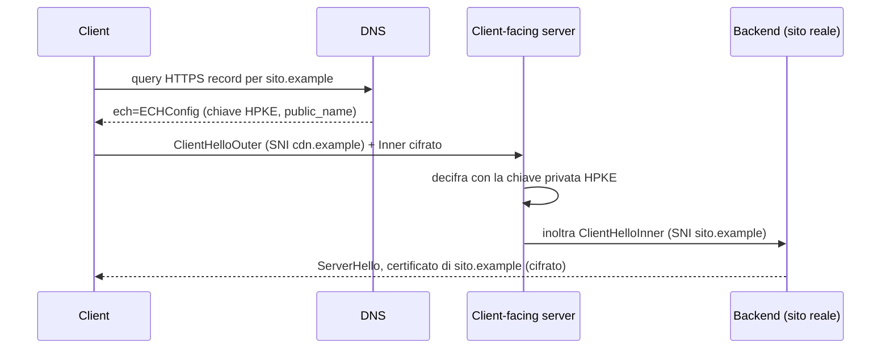

## Perché conta

Nel [capitolo su TLS]() abbiamo visto che TLS 1.3 cifra quasi tutto
l'handshake. Quasi. Il **ClientHello** viaggia ancora in chiaro, e contiene l'estensione **SNI**
(Server Name Indication): il nome del sito che il client vuole raggiungere. Serve al server per scegliere
il certificato giusto quando ospita migliaia di domini sullo stesso IP, ma per chi sta sul percorso
(ISP, Wi-Fi pubblico, firewall aziendale, un attaccante) è un'etichetta leggibile: `clinica-xyz.example`
anche se il contenuto è cifrato.

Anche [DoH e DoT]() nascondono la query DNS, ma lo SNI
ripropone la stessa informazione un attimo dopo. **Encrypted Client Hello (ECH)**, standardizzato
nella RFC 9849, chiude questa falla cifrando l'intero ClientHello.

## Come funziona

Il server pubblica una **ECHConfig**: una chiave pubblica HPKE (RFC 9180) e un `public_name`, il nome
della "facciata" (il *client-facing server*). Il client la ottiene dal DNS, nel record `HTTPS`
(RFC 9848 su RFC 9460), poi costruisce due messaggi:

- **ClientHelloOuter**: in chiaro, con SNI = `public_name` (per esempio `cdn.example`);
- **ClientHelloInner**: quello vero, con lo SNI reale, cifrato con HPKE e incapsulato nell'estensione
  `encrypted_client_hello` del Outer.



Per chi osserva, la connessione sembra diretta verso `cdn.example`. La chiave di cifratura è derivata
con un KEM a curva ellittica (tipicamente X25519): se $sk_S$ è la chiave privata del server e $pk_S$
quella pubblica, il client genera una coppia effimera $(sk_E, pk_E)$ e entrambi ottengono lo stesso segreto

$$
Z = \text{DH}(sk_E, pk_S) = \text{DH}(sk_S, pk_E)
$$

da cui HPKE ricava chiave e nonce AEAD per cifrare l'Inner. L'anonymity set è l'insieme dei siti
dietro lo stesso client-facing server: più è grande, più ECH protegge.

## L'attacco (e cosa vede chi osserva)

Senza ECH, il monitoraggio dello SNI è banale. Un sensore passivo lo legge senza decifrare nulla:

```bash
# elenca i nomi richiesti in chiaro nei ClientHello
tshark -r capture.pcap -Y 'tls.handshake.type == 1' \
  -T fields -e ip.dst -e tls.handshake.extensions_server_name | sort | uniq -c | sort -rn
```

È lo stesso dato su cui si basano molti filtri di censura e i web filter aziendali: bloccare un sito
significa scartare i pacchetti con quello SNI. Con ECH il comando restituisce solo il `public_name`.

Vale anche il rovescio: ECH **non è magia**. Resta visibile l'indirizzo IP di destinazione (se il sito
non è dietro una CDN condivisa, l'IP lo identifica comunque), la dimensione e i tempi dei pacchetti
(traffic analysis), e la query DNS se non è cifrata: ECH ha senso solo insieme a DoH/DoT. Inoltre se il
DNS è manipolabile, un attaccante può togliere il parametro `ech` e forzare un handshake in chiaro:
serve DNSSEC o un resolver fidato.

Per verificare cosa pubblica un dominio:

```bash
# il parametro ech= compare nel record HTTPS (tipo 65)
dig +short HTTPS crypto.cloudflare.com
# 1 . alpn=h3,h2 ipv4hint=... ech=AEX+DQBB...
```

## La difesa

Chi gestisce un server può pubblicare ECH; chi gestisce una rete deve capire cosa perde. Lato server,
ad esempio con un front-end che supporta ECH (OpenSSL 4.0 ne ha il supporto; nginx e Apache dipendono
dalla build), si genera la chiave e si pubblica il record:

```bash {hl_lines=[2,5,6]}
# genera la ECHConfig (formato PEM) per il public_name
openssl ech -public_name cdn.example -out sito.ech

# record DNS: abilita ALPN h2/h3 e pubblica la config in base64
sito.example. 300 IN HTTPS 1 . alpn="h2,h3" ech="AEX+DQBB..."
```

La riga 2 crea la coppia di chiavi e la ECHConfig, la 5 il record `HTTPS` con il parametro `ech` che i
browser cercano. Ruotare la chiave periodicamente e tenere attive le due versioni ($N$ e $N-1$) evita
errori durante la rotazione: se la chiave è sbagliata il server risponde con `retry_configs` e il
client riprova con quella corretta.

Lato rete aziendale, i controlli basati su SNI smettono di funzionare. Le opzioni sono tre: far
rispettare una policy di **resolver DNS interno** che filtra il record `HTTPS` (e quindi disattiva ECH
per i domini non approvati), usare un **TLS inspection proxy** con CA aziendale (che termina la sessione,
vedi [microsegmentazione]() per il perimetro), oppure
spostare il controllo sull'**identità** del dispositivo e non sul nome del sito, come propone
[Zero Trust](). I rilevatori di rete come
[Suricata]() perdono la regola `tls.sni`: va compensata con il
logging DNS e il JA4 fingerprint.

## Lab

Obiettivo: osservare con Wireshark la differenza tra un handshake con e senza ECH.

1. Cattura il traffico verso un sito senza ECH e leggi lo SNI con `tshark`.
2. Con Firefox (`network.dns.echconfig.enabled` e DoH attivo) visita un sito che supporta ECH: quale
   nome vedi nel ClientHello?
3. Perché ECH non protegge se l'IP di destinazione appartiene a un solo sito?
4. Cosa succede se un middlebox rimuove il parametro `ech` dal record DNS?


<details><summary>Soluzione</summary>

<ol>
<li>Il filtro <code>tls.handshake.extensions_server_name</code> mostra il nome del sito in chiaro.</li>
<li>Vedi solo il <code>public_name</code> del client-facing server (per esempio quello della CDN), più l'estensione <code>encrypted_client_hello</code>: il nome vero è dentro il payload HPKE.</li>
<li>L'anonymity set vale 1: l'indirizzo IP identifica già il sito, quindi cifrare lo SNI non aggiunge riservatezza. ECH dà valore quando molti domini condividono lo stesso front-end.</li>
<li>Il client non conosce la ECHConfig e fa un handshake classico con SNI in chiaro (downgrade). Per questo serve un canale DNS autenticato (DNSSEC, DoH verso un resolver fidato); se il client ha già una config e il server la rifiuta, riceve <code>retry_configs</code> e prosegue in modo sicuro.</li>
</ol>

</details>


## Conclusione

ECH toglie dal ClientHello l'ultima grossa informazione in chiaro, ma sposta il problema: la
privacy migliora per l'utente, mentre chi difende una rete perde un segnale semplice e deve
ricostruire visibilità da DNS, identità e comportamento. Come sempre in TLS la sicurezza sta
nell'insieme: ECH, DoH, DNSSEC e [certificati verificabili]()
funzionano meglio insieme che da soli.

**Prossimo nella serie:** la PKI interna per i servizi privati · [Torna alla roadmap]()
