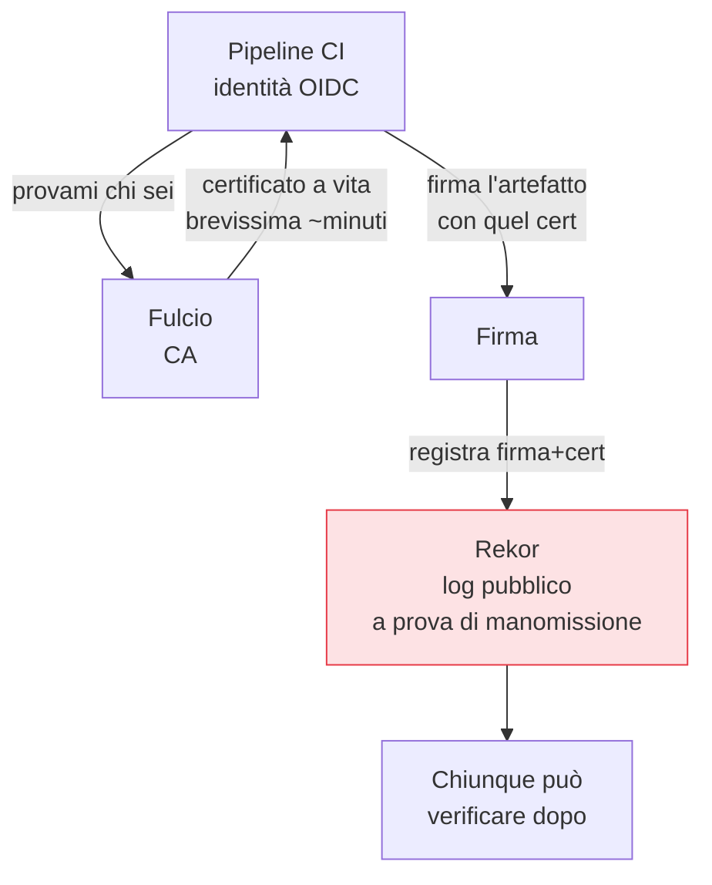

## Perché conta

[SLSA]() richiede provenienza *firmata*, e la
[SBOM]() vale di più se firmata e legata all'artefatto. Ma la
firma crittografica aveva un problema pratico che l'ha resa rara: per firmare serve una chiave
privata, e custodire chiavi a lungo termine (rotazione, revoca, HSM, il rischio che trapelino) è un
onere che quasi nessun team si assumeva. **Sigstore** elimina proprio quell'onere.

## L'idea: firma keyless

Sigstore permette di firmare *senza gestire una chiave privata a lungo termine*. Il meccanismo:



1. La pipeline prova la propria identità via **OIDC** (es. "sono la GitHub Action del repo X").
2. **Fulcio**, una CA, emette un certificato a vita *brevissima* (minuti) legato a quell'identità.
3. Si firma l'artefatto con quel certificato effimero; la chiave privata sparisce subito dopo.
4. La firma e il certificato vengono registrati in **Rekor**, un log pubblico, append-only, a prova
   di manomissione (lo stesso principio del transparency log).

Nessuna chiave da custodire: l'identità sostituisce la chiave a lungo termine, e il certificato vive
troppo poco per valere la pena di rubarlo.

## Firmare e verificare con cosign

In pratica, dalla pipeline:

```bash {hl_lines=[2,5]}
# firma keyless: l'identità OIDC della CI diventa il firmatario
cosign sign --yes registry.io/app@sha256:abc...

# verifica: accetta solo artefatti firmati dall'identità attesa
cosign verify registry.io/app@sha256:abc... \
  --certificate-identity "https://github.com/org/repo/.github/workflows/release.yml@refs/heads/main" \
  --certificate-oidc-issuer "https://token.actions.githubusercontent.com"
```

La verifica è il punto che conta: non "è firmato?" ma "è firmato **dall'identità che mi aspetto**?".
Un artefatto firmato da un'identità sconosciuta va rifiutato esattamente come uno non firmato. cosign
firma e verifica allo stesso modo anche le **SBOM** e le **attestazioni** di provenienza SLSA,
allegandole all'immagine nel registry.

## Dove si applica nel ciclo

- **Al rilascio**: la pipeline firma l'immagine, la SBOM e la provenienza subito dopo la build.
- **All'ingresso**: l'[admission control]() del cluster
  verifica la firma e rifiuta ciò che non proviene dall'identità attesa. È qui che la firma smette di
  essere decorativa e diventa un controllo di accesso.

## Il limite: la firma attesta l'origine, non la bontà

Una firma valida dice "questo artefatto viene davvero da chi dice" — non "questo artefatto è privo di
vulnerabilità". Si può firmare perfettamente un'immagine piena di CVE. La firma risolve *autenticità e
integrità*, non *qualità*: va combinata con SCA, SBOM e policy, non le sostituisce.


<details>
<summary><strong>Domanda:</strong> se la firma usa l'identità OIDC della pipeline invece di una chiave che custodisco io, non sto solo spostando la fiducia su GitHub/Fulcio/Rekor? Cosa impedisce a chi li compromette di firmare qualunque cosa?</summary>
<p>Stai spostando la fiducia, sì, ma verso componenti progettati per essere difendibili e — soprattutto —
<em>osservabili</em>, il che cambia la natura del rischio. Primo: la fiducia nell'identità OIDC non è
peggiore di prima, è migliore. Con una chiave privata a lungo termine il rischio era una stringa che
poteva trapelare da un file di config, un backup, un laptop, e restare valida per mesi senza che nessuno
se ne accorgesse; con la firma keyless non esiste nessun segreto persistente da rubare, e il certificato
vive minuti. Un attaccante dovrebbe compromettere l'identità della pipeline <em>nel momento</em> della
build — il che è un problema di sicurezza della CI/CD che hai comunque, firma o no. Secondo, ed è il punto
di Rekor: ogni firma finisce in un log pubblico, append-only, a prova di manomissione. Se qualcuno
riuscisse a firmare un artefatto malevolo con la tua identità, quella firma sarebbe <em>pubblicamente
registrata</em>, con l'identità e l'istante, visibile a te e a chiunque monitori il log — un attacco non
ripudiabile e rilevabile, non un furto silenzioso di chiave che scopri sei mesi dopo. Terzo, la verifica
è vincolata: non accetti "una firma qualsiasi", accetti solo l'identità esatta (quel repo, quel workflow,
quel branch), quindi compromettere "GitHub in generale" non basta, serve proprio la tua identità precisa.
Resta vero che Fulcio e Rekor sono radici di fiducia: se vengono compromessi a livello di infrastruttura,
il modello vacilla — ma sono gestiti come infrastruttura critica, replicati e monitorati, e puoi anche
operarne istanze tue. Il confronto corretto non è "fiducia zero contro fiducia in Sigstore", è "una chiave
privata fragile e silenziosa che custodisci male contro un'identità effimera registrata pubblicamente":
la seconda sposta la fiducia su qualcosa di più piccolo, più breve nel tempo e, decisivo, verificabile a
posteriori da tutti.</p>
</details>


## Conclusione

Sigstore rende la firma pratica eliminando le chiavi da custodire: identità effimera via Fulcio, log
pubblico via Rekor, firma e verifica di immagini, SBOM e provenienza con cosign. La firma attesta
l'origine, non la qualità, e diventa un controllo solo quando qualcuno la *verifica* all'ingresso. Con
artefatti verificabili in mano, il tema si sposta su dove tutto questo si orchestra e dove un
attaccante punterebbe per primo: la pipeline CI/CD stessa, prossimo capitolo.
