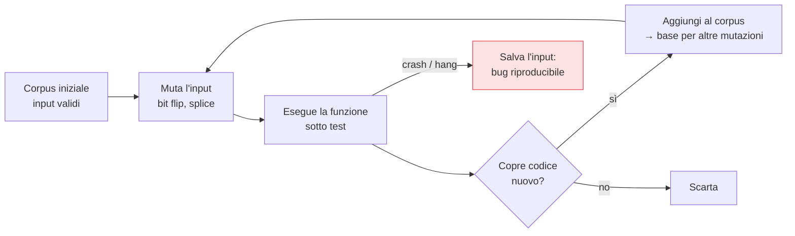

## Perché conta

Ogni controllo visto finora — [SAST](),
[DAST](), [IAST]() — cerca
problemi che sappiamo descrivere. I test unitari verificano i casi che *immaginiamo*. Ma gli
attaccanti vivono nei casi che *non* abbiamo immaginato: l'input malformato, la lunghezza assurda, la
sequenza impossibile. Il **fuzzing** esplora proprio quello spazio, generando input anomali a milioni
e osservando cosa rompe.

## Dall'input casuale alla copertura guidata

Il fuzzing ingenuo lancia byte casuali e spera in un crash: inefficiente, perché quasi tutti gli
input vengono rifiutati subito dal parsing. Il salto di qualità è il **coverage-guided fuzzing**: il
fuzzer osserva *quali rami di codice* ogni input attiva e tiene gli input che esplorano codice nuovo,
mutandoli per andare più in profondità.



Guidato dalla copertura, il fuzzer "impara" a superare i controlli di validazione e a penetrare in
profondità nel codice, trovando in ore ciò che input casuali non troverebbero in anni.

## Cosa trova

Il fuzzing eccelle sul codice che *interpreta input non fidati*: parser, decoder, deserializzatori,
protocolli di rete, elaborazione di file. Scopre:

- **Crash**: dereferenze null, buffer overflow (in C/C++), eccezioni non gestite.
- **Corruzioni di memoria**: potenti vettori di exploit, rilevate se si combina il fuzzing con i
  *sanitizer* (ASan, UBSan) che rendono visibile una corruzione altrimenti silenziosa.
- **Hang e consumo di risorse**: input che mandano l'app in loop o esauriscono la memoria (DoS).

## Il fuzz target

Il cuore pratico è scrivere una piccola funzione che riceve i byte del fuzzer e li passa al codice da
testare:

```c {hl_lines=[3]}
int LLVMFuzzerTestOneInput(const uint8_t *data, size_t size) {
    // il fuzzer fornisce 'data'; noi lo passiamo al parser sotto test
    parse_config(data, size);   // ← se crasha, abbiamo un bug riproducibile
    return 0;
}
```

La riga evidenziata è tutto: dai l'input non fidato alla funzione critica e lasci che il fuzzer trovi
l'input che la rompe. Lo stesso pattern esiste per i linguaggi gestiti (Go `testing.F`, Jazzer per la
JVM, Atheris per Python).

## Continuo, non una tantum

Il fuzzing dà di più col tempo: più gira, più in profondità arriva. Per questo in DevSecOps è
**continuo** — gira in background su un corpus che cresce, non in un singolo passaggio di pipeline che
deve finire in cinque minuti. Progetti come OSS-Fuzz dimostrano il modello: fuzzing 24/7, con i bug
che aprono automaticamente ticket. Nella CI si esegue un fuzzing *breve* di regressione sul corpus
noto (per non reintrodurre crash già risolti) e si lascia il fuzzing profondo all'infrastruttura
dedicata.


<details>
<summary><strong>Domanda:</strong> il fuzzing sembra utile solo per codice in C/C++ che fa parsing di basso livello; ha senso per una tipica app web in un linguaggio gestito?</summary>
<p>Ha senso, ma cambia cosa trova e dove conviene puntarlo. È vero che il raccolto più ricco del fuzzing —
corruzioni di memoria sfruttabili — vive in C/C++, dove un buffer overflow diventa un exploit; in un
linguaggio gestito la memoria è protetta dal runtime, quindi quella classe sparisce. Ma non sparisce il
resto: eccezioni non gestite che diventano DoS o errori 500 informativi, loop e allocazioni che esauriscono
le risorse (una "zip bomb" o un input che fa esplodere un parser in tempo quadratico), bug logici nei
deserializzatori, differenze di parsing tra due librerie che portano a confusione di tipo o a bypass di
validazione. E soprattutto conta <em>dove</em> lo punti: non sulla logica di business, ma su ogni punto in
cui l'app ingoia input non fidato e lo struttura — l'endpoint che accetta JSON o XML, il decoder di
immagini, il parser di un formato proprietario, il layer che gestisce upload di file. Lì il fuzzing
coverage-guided trova casi limite che nessun test scritto a mano copre, perché nessuno pensa a un JSON
annidato diecimila livelli o a un campo numerico con un valore che fa overflow in una conversione. In più
le dipendenze native sotto a un'app gestita (una libreria di compressione, un codec) sono spesso C/C++
sotto mentite spoglie, e lì il raccolto classico torna. La regola pratica: se un componente parsa qualcosa
che arriva dall'esterno, è un candidato al fuzzing, qualunque sia il linguaggio.</p>
</details>


## Conclusione

Il fuzzing esplora lo spazio degli input che non abbiamo immaginato; guidato dalla copertura, impara a
penetrare in profondità e trova crash e corruzioni riproducibili, specie nei parser di input non
fidato. È continuo per natura. Con questo chiudiamo i controlli sul codice e sul comportamento. Ma il
software che spediamo non è solo codice: è un *artefatto* costruito da una catena di strumenti, e di
quella catena dobbiamo poterci fidare. Comincia la parte sulla supply chain, con l'inventario di ciò
che spediamo: la SBOM, prossimo capitolo.
