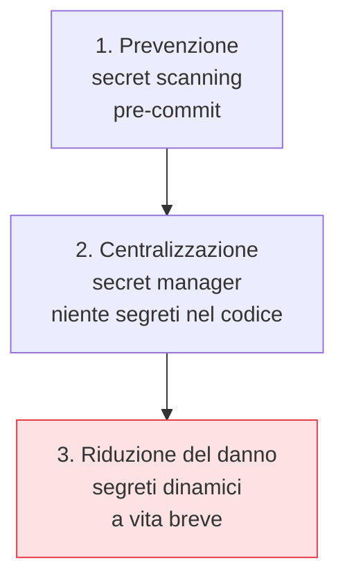

## Perché conta

Il [threat modeling]() identifica dove i dati
attraversano confini di fiducia; i **segreti** — chiavi, token, password — sono proprio ciò che
protegge quei confini. Lasciarli nel codice è l'errore più banale e più diffuso: una chiave AWS in
un commit, un token in un file `.env` versionato, e un repository anche privato diventa una bomba a
orologeria. È il primo difetto concreto da eliminare nel flusso di sviluppo.

## Il problema della history di Git

Il tranello peggiore: rimuovere un segreto con un commit successivo **non lo elimina**. Resta
nell'intera history, recuperabile da chiunque abbia accesso al repository.

```text {hl_lines=[3]}
git add config.py        # contiene AWS_SECRET=...
git commit -m "config"   # il segreto è ora NELLA history, per sempre
git rm config.py         # lo toglie dalla HEAD, NON dalla history
# → il segreto va considerato COMPROMESSO: ruotalo subito
```

Regola d'oro: **un segreto committato è un segreto bruciato**. Non basta rimuoverlo, va *ruotato*
(invalidato e rigenerato). La pulizia della history (con strumenti come `git filter-repo`) serve a
non ripetere l'incidente, non a "annullarlo".

## I tre livelli di difesa



1. **Prevenzione**: uno scanner (gitleaks, trufflehog) come hook di pre-commit e nella pipeline
   blocca il segreto *prima* che entri nella history.
2. **Centralizzazione**: un **secret manager** (Vault, AWS Secrets Manager, cloud KMS) custodisce i
   segreti; l'applicazione li recupera a runtime con una propria identità, non li porta nel codice.
3. **Riduzione del danno**: i **segreti dinamici** — credenziali generate su richiesta e valide
   pochi minuti — fanno sì che un segreto trapelato valga quasi nulla, perché scade subito.

## Segreti dinamici: il salto di qualità

Un segreto statico vive per mesi: se trapela, l'attaccante ha mesi. Vault può invece generare al
volo una credenziale di database valida un'ora, legata al servizio che l'ha chiesta. Il furto
diventa una finestra di minuti, non un accesso permanente. È lo stesso principio dei certificati a
vita breve che vedremo per l'[identità dei workload]():
ridurre il valore nel tempo di ogni credenziale.

## Nel flusso di lavoro

- **Pre-commit**: hook locale che rifiuta il commit con un segreto.
- **CI**: scansione del diff e, periodicamente, dell'intera history.
- **Runtime**: l'app chiede il segreto al manager con la sua identità; nessun segreto nel container
  image né nelle variabili d'ambiente scritte a mano.
- **Rotazione**: automatica e regolare, non "quando ci ricordiamo".


<details>
<summary><strong>Domanda:</strong> se l'app recupera i segreti da Vault, le serve comunque una credenziale per autenticarsi a Vault — non abbiamo solo spostato il problema?</summary>
<p>È la domanda giusta, ed è il classico "problema del segreto zero" — lo stesso che SPIFFE/SPIRE risolve
per i workload. Sì, serve una credenziale iniziale per parlare con Vault, ma la si è spostata da "mille
segreti sparsi in mille repository e file di config" a "un solo punto di bootstrap, progettato apposta per
essere protetto". E quel bootstrap non deve essere a sua volta un segreto statico scritto da qualche parte:
i metodi di auth di Vault sfruttano un'identità che la piattaforma <em>attesta</em>, non una stringa
consegnata. In Kubernetes l'app si autentica con il suo ServiceAccount token, che il cluster emette e
verifica; in cloud con l'identità dell'istanza (IAM role, managed identity), provata dal provider; con
SPIFFE, con lo SVID emesso per attestazione. In tutti i casi la fiducia iniziale poggia su qualcosa che
l'ambiente testimonia — "sei il pod X nel namespace Y sul nodo Z" — non su una chiave che qualcuno deve
custodire per prima. Il problema non è "spostato" in circolo: è ridotto da N segreti fragili a un unico
punto radicato nell'identità della piattaforma, molto più difendibile e monitorabile.</p>
</details>


## Conclusione

I segreti non stanno mai nel codice: si previene con lo scanning, si centralizza con un secret
manager, si riduce il danno con segreti dinamici a vita breve. E un segreto committato è un segreto
da ruotare, non da nascondere. Con i segreti fuori dal codice, possiamo guardare il codice stesso:
il primo controllo automatico che lo ispeziona mentre viene scritto è l'analisi statica, prossimo
capitolo.
