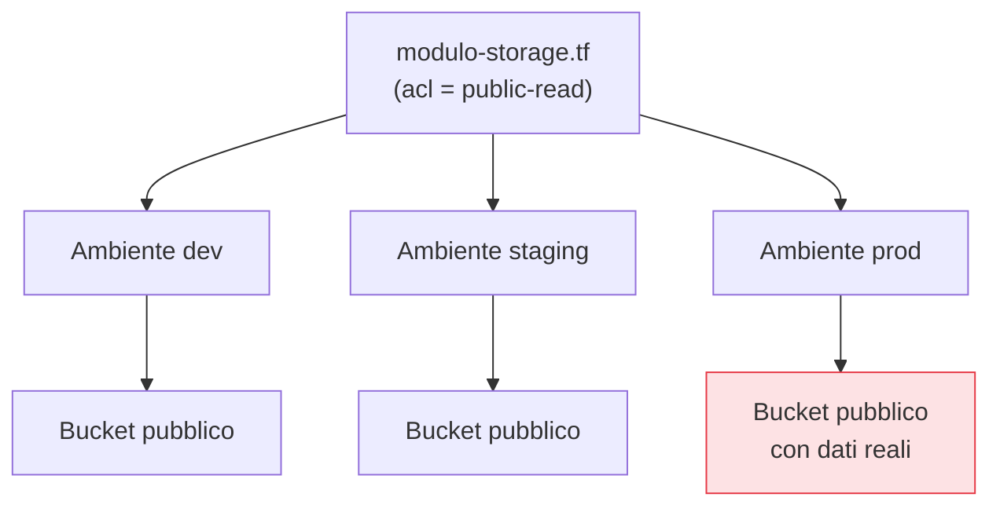

## Perché conta

La [pipeline]() non costruisce solo applicazioni:
costruisce anche l'**infrastruttura**, ormai definita come codice — Terraform, CloudFormation,
Pulumi, manifest Kubernetes. È una grande notizia per la sicurezza: se l'infrastruttura è codice,
possiamo analizzarla come codice, *prima* del deploy. È anche un rischio nuovo: un errore in un
modulo riusato si replica identico su ogni ambiente, trasformando un singolo sbaglio in una falla
sistemica.

## L'errore si moltiplica



Un bucket reso pubblico in un modulo condiviso diventa *tre* bucket pubblici. Il lato positivo è
speculare: correggere il modulo e ripassare lo scanner mette in sicurezza tutti gli ambienti in un
colpo. L'IaC amplifica sia gli errori sia le correzioni.

## Cosa trova lo scanning dell'IaC

Gli scanner statici (Checkov, tfsec, Terrascan, KICS) applicano centinaia di regole, spesso allineate
ai **CIS Benchmark**, cercando le configurazioni pericolose più comuni:

```hcl {hl_lines=[3,4]}
resource "aws_s3_bucket_public_access_block" "ex" {
  bucket                  = aws_s3_bucket.ex.id
  block_public_acls       = false   # ← lo scanner segnala: accesso pubblico possibile
  restrict_public_buckets = false   # ← idem
}
```

Difetti tipici: storage pubblico, security group con `0.0.0.0/0` su porte di gestione, cifratura a
riposo disattivata, log disabilitati, ruoli IAM troppo ampi, assenza di tag. Sono *misconfiguration*,
non bug di codice: il SAST non le vede, perché il "codice" qui descrive infrastruttura, non logica.

## Dove collocarlo

Come il SAST, l'IaC scanning dà il meglio presto e in modo incrementale:

- **Pre-commit / IDE**: feedback immediato mentre si scrive il Terraform.
- **Pull request**: gate che blocca il *nuovo* rischio alto, con baseline sul debito esistente.
- **Pre-apply nella pipeline**: ultimo controllo prima di toccare l'infrastruttura reale, idealmente
  anche sul *piano* (`terraform plan`) per vedere l'effetto concreto, non solo il sorgente.

## Il problema spesso dimenticato: lo state

Il file di **state** di Terraform contiene spesso dati sensibili in chiaro: password generate,
chiavi, output. Va trattato come un segreto: backend remoto cifrato, accesso ristretto, mai
committato nel repository. È l'errore IaC meno appariscente e più comune, perché non riguarda una
risorsa ma il *meccanismo stesso* che le gestisce.

## Il limite: lo statico non vede il reale

Lo scanning dell'IaC vede ciò che il codice *dichiara*, non ciò che esiste davvero nel cloud. Le
modifiche manuali (il famigerato "clic in console") creano **drift**: la realtà diverge dal codice, e
lo scanner, che legge solo il codice, non se ne accorge. Servono controlli a runtime sul cloud (CSPM)
e la disciplina di non modificare mai l'infrastruttura fuori dall'IaC. Il "cosa è dichiarato pericoloso"
è però esprimibile come regola generale, e questo apre il tema del prossimo capitolo: le policy as code.


<details>
<summary><strong>Domanda:</strong> se lo scanner IaC non vede il drift e le modifiche manuali, posso fidarmi che un "piano pulito" significhi infrastruttura sicura?</summary>
<p>No, e confondere le due cose è una delle illusioni di sicurezza più comuni con l'IaC. Uno scanner che
passa sul tuo Terraform dimostra una cosa precisa e limitata: che <em>ciò che il codice descrive</em> non
contiene le misconfigurazioni note alle sue regole. Non dimostra che l'infrastruttura <em>reale</em> sia
in quello stato, per tre motivi. Primo, il drift: qualcuno apre la console cloud e modifica a mano un
security group per "sbloccare al volo" un incidente, e non lo riporta mai nel codice; il tuo Terraform
resta pulito, il cloud no, e il prossimo apply potrebbe persino non toccare quella risorsa. Secondo, la
copertura: quasi nessuna infrastruttura è gestita al 100% da IaC — ci sono risorse create prima
dell'adozione, risorse di altri team, cose fatte a mano "temporaneamente" tre anni fa; tutto ciò che non è
nel codice è invisibile allo scanner per definizione. Terzo, le regole hanno punti ciechi: lo scanner
trova le misconfigurazioni che conosce, non la logica di autorizzazione sbagliata o la combinazione
insolita di risorse che crea un percorso d'attacco non previsto da nessuna singola regola. La risposta
corretta è usare due lenti complementari: lo scanning statico dell'IaC come controllo <em>preventivo</em>
sul codice prima del deploy (economico, precoce, ferma l'errore prima che esista), e un controllo
<em>a runtime</em> sul cloud reale — un CSPM che interroga le API del provider e confronta lo stato
effettivo con le policy — come rete che cattura drift, risorse fuori IaC e deviazioni. Più la disciplina
organizzativa di vietare le modifiche manuali e far passare ogni cambiamento dall'IaC, così il drift
tende a zero. Un piano pulito è una condizione necessaria, non sufficiente: ti dice che non stai
<em>introducendo</em> un problema noto, non che non ne hai già uno in produzione.</p>
</details>


## Conclusione

L'IaC rende l'infrastruttura analizzabile prima del deploy: gli scanner trovano bucket pubblici,
security group aperti e cifratura mancante, e una correzione al modulo mette in sicurezza ogni
ambiente. Ma lo statico non vede il drift, e le regole predefinite non conoscono le *tue* policy. Per
esprimere ed applicare regole su misura — nella pipeline e nel cluster — serve un motore di policy
generale. È il policy as code, prossimo capitolo.
