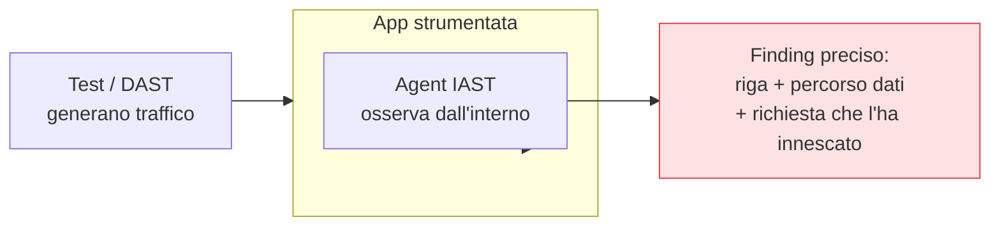

## Perché conta

Il [SAST]() vede il codice ma non il runtime; il
[DAST]() vede il runtime ma non il codice. **IAST** e
**RASP** colmano il divario strumentando l'applicazione *dall'interno*: un agent gira dentro il
processo, osserva il flusso reale dei dati nel codice mentre l'app riceve richieste vere. Uniscono la
localizzazione precisa del SAST al realismo del DAST.

## IAST: osservare durante i test

L'**IAST (Interactive AST)** è un agent attivo *durante i test* (funzionali, DAST, QA). Mentre il
traffico di test attraversa l'app, l'agent vede dall'interno se un input contaminato raggiunge un
sink pericoloso — ma stavolta nel codice reale in esecuzione, non per inferenza.



Il risultato è il meglio dei due mondi: pochi falsi positivi (l'ha *visto* accadere) **e**
localizzazione esatta (riga di codice, non solo URL). Lo svantaggio: copre solo ciò che i test
esercitano — se non c'è traffico di test su un percorso, l'IAST non vede nulla lì.

## RASP: difendere in produzione

Il **RASP (Runtime Application Self-Protection)** è lo stesso principio spostato in **produzione** e
con un ruolo diverso: non osservare, ma *bloccare*. L'agent, dentro l'app, intercetta le operazioni
pericolose a runtime e le ferma quando vede uno sfruttamento in corso.

```text {hl_lines=[3]}
Richiesta → entra nell'app → RASP osserva l'operazione reale
  query SQL che contiene la struttura di un'injection?   → blocca
  tentativo di leggere /etc/passwd via path traversal?   → blocca
  → decide sul COMPORTAMENTO reale, non su firme di pattern come un WAF
```

La differenza con un WAF: il WAF sta *fuori* e indovina dalle richieste; il RASP sta *dentro* e vede
cosa l'app sta effettivamente per fare con quell'input. Meno falsi positivi, ma al prezzo di vivere
nel processo.

## Il costo: prestazioni e accoppiamento

Niente è gratis. Un agent nel processo aggiunge overhead (CPU, latenza) e si accoppia al runtime
specifico (JVM, .NET, Node): va mantenuto, aggiornato, testato a ogni upgrade del linguaggio. Il RASP
in produzione aggiunge anche un rischio di stabilità: un agent difettoso può degradare o far cadere
l'app che dovrebbe proteggere. Per questo non sono controlli "di default" ma scelte mirate, su
applicazioni ad alto valore dove il beneficio giustifica il peso.


<details>
<summary><strong>Domanda:</strong> se il RASP vede e blocca gli attacchi dall'interno dell'app, non rende superflui WAF, SAST e DAST?</summary>
<p>No, e pensarlo porta a un unico punto di difesa, che è l'opposto della sicurezza a strati. Il RASP ha
un difetto strutturale che gli altri controlli non hanno: <em>protegge l'app solo se l'attacco arriva fino
all'app</em>, e lo fa consumando risorse dell'app stessa. Un WAF davanti assorbe il rumore di fondo — le
scansioni automatiche, i payload banali, i picchi volumetrici — prima che tocchino il processo, così il
RASP si occupa solo di ciò che passa; toglierlo significa far arrivare ogni tentativo fin dentro la JVM.
Il SAST e il DAST agiscono <em>prima</em> del rilascio: il loro scopo è che la vulnerabilità non esista
in produzione, non difenderla una volta che c'è. Affidarsi al solo RASP equivale a dire "lasciamo pure i
difetti nel codice, tanto li blocca a runtime" — ma il RASP può fallire, può essere aggirato, può essere
disattivato per un problema di prestazioni, e nel frattempo la falla è lì. C'è anche il rischio di
stabilità già citato: il RASP vive nel processo, un suo bug degrada l'app. Il modello corretto è difesa
in profondità: eliminare i difetti a sinistra con SAST/DAST, filtrare il grosso con il WAF, e tenere il
RASP come ultima rete interna per lo sfruttamento che supera tutto il resto — non come sostituto di
nessuno di essi.</p>
</details>


## Conclusione

IAST e RASP strumentano l'app dall'interno: l'IAST unisce precisione e realismo durante i test, il
RASP blocca lo sfruttamento in produzione. Pagano in prestazioni e accoppiamento, quindi si scelgono
per i servizi ad alto valore, non ovunque. Finora abbiamo testato ciò che immaginiamo possa andare
storto; manca un metodo per scoprire i difetti che *non* abbiamo immaginato, bombardando l'app di
input imprevisti. È il fuzzing, prossimo capitolo.
