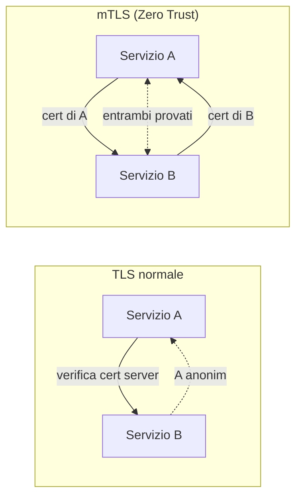

## Perché conta

Abbiamo dato un'[identità forte]() agli utenti e ai
[dispositivi](). Ma in un'architettura a microservizi la
maggior parte del traffico è **tra servizi** (est-ovest), senza un utente di mezzo. "Assumere la
breccia" vale anche qui: se un attaccante entra nella rete interna, cosa impedisce al suo processo di
fingersi il servizio di pagamento? La risposta dello Zero Trust è dare a ogni **workload** un'identità
crittografica e autenticare ogni connessione tra servizi con il **mutual TLS (mTLS)**.

> Questo capitolo inquadra l'mTLS nello Zero Trust. Per il funzionamento dettagliato
> dell'handshake, la configurazione e il confronto con le API key, si veda l'approfondimento
> [mTLS: autenticare i servizi, non solo i server]().

## Dal TLS normale all'mTLS

Nel TLS normale solo il server prova la sua identità; il client resta anonimo. Tra servizi questo non
basta: entrambi devono sapere con certezza chi è l'altro.



In mTLS ogni servizio presenta un certificato; la connessione si stabilisce solo se **entrambe** le
identità sono valide. L'identità è reciproca e provata a livello di trasporto, prima di qualsiasi
dato applicativo.

## Identità, non indirizzo (di nuovo)

L'mTLS è il complemento crittografico della
[microsegmentazione](): la policy di rete
dice *chi può parlare con chi*, l'mTLS **prova** che è davvero quel chi. L'identità del servizio sta
nel certificato (nel Subject o in un SAN), non nell'IP:

```text {hl_lines=[2]}
# l'identità del chiamante è nel certificato, non nell'IP
SAN: spiffe://azienda/ns/pagamenti/sa/servizio-ordini
```

Questa forma di identità — un URI che descrive il servizio — è lo standard SPIFFE, il tema del
[prossimo capitolo]().

## Perché un certificato batte una API key

Il modo tradizionale di autenticare servizi è una **API key**: una stringa segreta condivisa. Ma una
key è un segreto riutilizzabile: chi la ruba diventa il servizio, e resta valida finché qualcuno non
se ne accorge. Un certificato lega l'identità a una **chiave privata** che non lascia il servizio;
sul filo viaggia solo una firma, mai il segreto. E ha una scadenza, quindi un furto ha una vita
breve. È la stessa logica delle [passkey]() per gli
utenti, applicata ai servizi.

## Certificati a vita breve

Nello Zero Trust i certificati dei workload hanno vita **breve** (ore, non anni): un certificato
compromesso smette presto di valere, e la rotazione continua riduce il danno. Questo rende
impraticabile la gestione manuale — ed è esattamente perché l'mTLS su scala vive dentro un
[service mesh]() o un sistema come
[SPIRE](), che emettono e ruotano i certificati automaticamente.

## Lab

Con una CA di test e due servizi (o `openssl s_server`/`s_client`), come nell'approfondimento
dedicato:

1. Create una CA, un certificato "server" e uno "client", tutti firmati dalla CA.
2. Avviate il server con verifica obbligatoria del certificato client.
3. Connettetevi senza certificato (deve fallire), poi con (deve riuscire e mostrare l'identità).
4. Provate un certificato firmato da un'altra CA: deve essere rifiutato.


<details>
<summary><strong>Domanda:</strong> se i servizi girano già in un cluster privato, cifrare e autenticare tutto con mTLS non è paranoia costosa?</summary>
<p>È la stessa obiezione del "la rete interna è fidata", e lo Zero Trust nasce proprio per smontarla.
"Dentro il cluster" non significa "fidato": se un attaccante compromette un solo pod o si inserisce
nella rete interna, senza mTLS può leggere il traffico tra servizi e impersonarne uno, perché nulla
verifica le identità est-ovest. L'mTLS rende quel traffico illeggibile e ogni chiamata autenticata:
anche chi è dentro non può né ascoltare né fingersi un altro servizio. Sul costo: fatto a mano sarebbe
davvero insostenibile — generare e ruotare certificati per decine di servizi — ed è il motivo per cui
non si fa a mano. Un <a href="/p/service-mesh-e-zero-trust/">service mesh</a> lo rende trasparente
all'applicazione: i servizi non sanno nemmeno di parlare mTLS, lo fa il sidecar. La paranoia costosa è
l'alternativa: scoprire a posteriori che un intruso ha ascoltato e impersonato servizi per mesi su una
rete interna che credevamo fidata.</p>
</details>


## Conclusione

Lo Zero Trust estende l'identità forte ai servizi: ogni workload ha un certificato, ogni connessione
est-ovest è autenticata reciprocamente e cifrata con mTLS, e l'identità sta nel certificato, non
nell'IP. È il complemento crittografico della microsegmentazione, e richiede certificati a vita breve
gestiti automaticamente. Chi assegna e ruota quelle identità su scala? È il lavoro di SPIFFE e SPIRE,
il prossimo capitolo.
