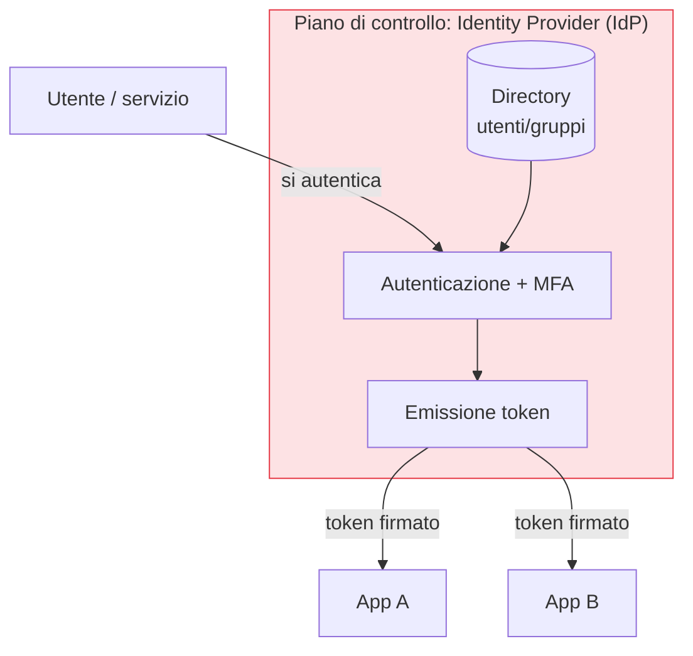

## Perché conta

Nel capitolo precedente abbiamo tolto alla rete il potere di conferire fiducia
([oltre il perimetro]()). Ma la fiducia deve pur fondarsi su
qualcosa: nello Zero Trust quel qualcosa è l'**identità**. Non più "da quale IP arrivi", ma "chi sei
e cosa ti è concesso". L'identità diventa il **piano di controllo**: il punto da cui parte ogni
decisione di accesso. Se l'identità è debole, tutto il resto dell'architettura poggia sulla sabbia.

## Identità: non solo utenti

Un errore comune è pensare all'identità solo come all'utente umano. Nello Zero Trust hanno
un'identità verificabile anche:

- **Dispositivi**: il laptop, il telefono (cap. 09).
- **Workload**: servizi, container, funzioni — che si autenticano a vicenda con
  [mTLS]() e identità come
  [SPIFFE]().
- **Servizi esterni**: API di terze parti, partner.

Ogni attore che fa una richiesta ha un'identità, e ogni identità è verificata.

## Il piano di controllo dell'identità



Un **Identity Provider (IdP)** centrale autentica l'identità una volta e rilascia **token firmati**
(OpenID Connect / SAML) che le applicazioni verificano. Centralizzare l'autenticazione significa un
solo posto dove applicare MFA, un solo posto dove revocare un accesso, un solo registro di chi è
chi.

## SSO e federazione

Il **Single Sign-On (SSO)** permette a un'identità di accedere a molte applicazioni con una sola
autenticazione forte presso l'IdP. La **federazione** estende questo tra organizzazioni e domini:
un partner si autentica presso il proprio IdP, e il nostro si fida di quell'asserzione tramite una
relazione di trust stabilita.

Il vantaggio per lo Zero Trust è doppio: meno password in giro (meno da rubare) e un punto unico
dove applicare le policy. Lo svantaggio da gestire: l'IdP diventa il bersaglio numero uno — se cade
lui, cade tutto. Per questo il capitolo 04 dedica attenzione all'autenticazione resistente al
phishing.

## Un token non è un lasciapassare eterno

Un token OIDC/SAML dice "questa identità è stata verificata". Ma nello Zero Trust non basta averlo:
conta per **quanto** vale e **cosa** autorizza. Token a vita breve, scope minimi, e verifica a ogni
accesso (non "ho il token, entro ovunque"). Il token prova l'identità; l'autorizzazione resta una
decisione separata del [PDP]().

```text {hl_lines=[4,5]}
# claim essenziali di un token (concettuale)
sub: alice@azienda.it      # chi
aud: app-gestionale        # per quale servizio
exp: +10m                  # scadenza BREVE
scope: ordini:lettura      # privilegio MINIMO, non "tutto"
```

## Identità forte come prerequisito

Se l'identità è il perimetro, va resa robusta prima di tutto il resto:

1. Una **fonte autorevole** unica delle identità (directory), senza account fantasma.
2. **MFA** ovunque, meglio se resistente al phishing (cap. 04).
3. **Deprovisioning** immediato: quando qualcuno se ne va, l'accesso sparisce subito.
4. Separazione tra **autenticazione** (chi sei) e **autorizzazione** (cosa puoi), per poter cambiare
   i privilegi senza toccare l'identità.

## Lab

Con un IdP open source (Keycloak o Authentik) in laboratorio:

1. Configurate un IdP e due applicazioni di test che si fidano di esso via OpenID Connect.
2. Abilitate il SSO: autenticatevi una volta e accedete a entrambe le app senza re-login.
3. Impostate token a vita breve e osservate il rinnovo.
4. Revocate l'utente nell'IdP e verificate che l'accesso a entrambe le app cada.


<details>
<summary><strong>Domanda:</strong> centralizzare tutto sull'IdP non crea un singolo punto di fallimento catastrofico?</summary>
<p>Sì, e va affrontato apertamente: l'IdP diventa il sistema più critico dell'intera architettura, sul
piano sia della disponibilità sia della sicurezza. Ma l'alternativa — identità e password sparse su
decine di sistemi, ognuno con la propria logica — non è più sicura, è solo più difficile da difendere e
da revocare. La concentrazione è un vantaggio <em>se</em> la si tratta come tale: alta disponibilità e
ridondanza per non restare chiusi fuori, MFA resistente al phishing per gli account, protezione
rigorosa degli amministratori dell'IdP, e monitoraggio di ogni autenticazione anomala. Si sposta il
rischio da "molti bersagli mediocri" a "un bersaglio critico ben difeso": è un compromesso migliore,
ma solo se quel bersaglio lo si difende davvero.</p>
</details>


## Conclusione

Tolta alla rete, la fiducia si fonda sull'identità: utenti, dispositivi e workload, ciascuno con
un'identità verificata a ogni accesso tramite un IdP centrale. L'identità è il piano di controllo
dello Zero Trust, e perciò va resa forte per prima. Il pezzo più fragile dell'identità è
l'autenticazione: nel prossimo capitolo la rendiamo resistente al phishing.
