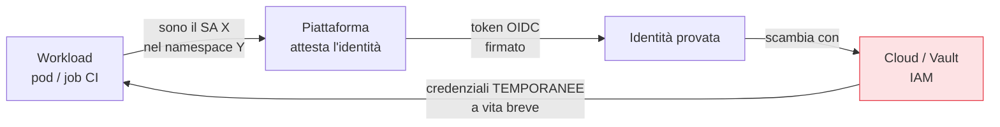

## Perché conta

Il capitolo sui [segreti in Kubernetes]() si è chiuso con
un'idea radicale: il modo più sicuro di gestire un segreto è **non averne uno**. Invece di consegnare
a un servizio una chiave statica — che va custodita, ruotata, e che se trapela vale finché non la
revochi — gli si dà un'**identità**, e le credenziali si *derivano* da quell'identità, attestata dalla
piattaforma, a vita breve. È lo stesso principio della firma keyless di
[Sigstore]() e dell'identità Zero Trust di
[SPIFFE/SPIRE](), portato attraverso tutto il ciclo DevSecOps.

## Il problema del "segreto zero"

Ogni schema a chiavi statiche ha la stessa ricorsione: per proteggere il segreto serve un altro
segreto. L'identità dei workload spezza la catena ancorandosi a qualcosa che la *piattaforma
testimonia*.



Il workload non presenta nessuna chiave: prova *chi è* (il ServiceAccount, provato dal cluster) e in
cambio riceve credenziali temporanee. Non c'è nessun segreto di lunga durata da rubare, perché non
esiste.

## Nella pipeline: OIDC federation

L'abbiamo già incontrato parlando della [pipeline CI/CD]():
la **workload identity federation** permette alla CI di autenticarsi al cloud *senza* chiavi statiche
nei secret. La pipeline presenta un token OIDC che prova "sono la build del repo X sul branch main";
il cloud, configurato a fidarsi di quell'emittente e di quell'identità precisa, rilascia credenziali
temporanee valide per il job.

```text {hl_lines=[2,3]}
Prima:  AWS_SECRET_KEY statica nei secret della CI  → se trapela, accesso per sempre
Dopo:   token OIDC "repo:org/app:ref:main"          → credenziali valide ~1h, legate al job
```

## Nel runtime: dal ServiceAccount al cloud

Stessa logica dentro il cluster: un pod ha un **ServiceAccount**, il cui token (proiettato, a vita
breve) il cluster firma. Quel token si federa verso il cloud (IAM Roles for Service Accounts, Workload
Identity, Managed Identity) per ottenere credenziali cloud temporanee, oppure verso un vault per i
segreti applicativi. Per l'identità **servizio-a-servizio**, SPIFFE/SPIRE emette SVID a vita breve per
mTLS, come visto nella serie Zero Trust.

## Perché è il punto d'arrivo naturale

L'identità dei workload chiude il cerchio del [least privilege e del JIT]():
ogni componente ha esattamente l'accesso che la sua identità consente, per il tempo in cui serve, senza
credenziali permanenti. È la fine della caccia ai segreti statici: non si tratta più di *proteggere*
mille chiavi, ma di *eliminarle*, sostituendole con identità verificabili e credenziali effimere. È
anche il legame più diretto tra DevSecOps e Zero Trust.


<details>
<summary><strong>Domanda:</strong> se le credenziali si derivano dall'identità "attestata dalla piattaforma", non abbiamo semplicemente reso la piattaforma (il cluster, il provider OIDC) l'unico segreto che, se compromesso, dà accesso a tutto?</summary>
<p>Hai individuato dove si concentra la fiducia, ed è giusto guardarci, ma il confronto corretto non è
"identità contro nessun rischio", è "identità contro mille chiavi statiche sparse" — e su quel confronto
l'identità vince nettamente, per ragioni concrete. Primo, la superficie. Con le chiavi statiche hai N
segreti di lunga durata in N posti: file di config, variabili d'ambiente, secret di CI, backup, laptop,
wiki dimenticate. Ognuno è un punto di fuga indipendente, e statisticamente qualcuno trapela: la maggior
parte delle violazioni cloud nasce esattamente da una chiave finita dove non doveva. Con l'identità dei
workload quei segreti <em>non esistono</em>: non c'è nulla da trapelare in N posti, c'è un meccanismo di
attestazione in un posto. Hai ridotto N punti fragili a un punto, progettato apposta per essere protetto.
Secondo, la natura di quel punto. Compromettere "la piattaforma" non è come rubare una stringa: richiede
di compromettere il control plane del cluster o il sistema di firma OIDC del provider — componenti
isolati, monitorati, con il proprio hardening — ed è un problema di sicurezza che <em>hai comunque</em>,
chiavi o no: se un attaccante controlla il tuo cluster, hai già perso, indipendentemente da come gestisci
i segreti. L'identità non crea quel rischio, lo rende semplicemente l'unico che conta, invece di sommarlo
ai mille rischi delle chiavi. Terzo, il tempo e la verificabilità. Le credenziali derivate sono effimere:
anche nel caso peggiore, una credenziale catturata vale minuti, non mesi, e la finestra di attestazione è
vincolata a un'identità precisa ("quel repo, quel branch", "quel SA, quel namespace"), non a "chiunque
abbia la chiave". E ogni scambio di token è tracciabile e revocabile centralmente: puoi togliere accesso
a un'identità istantaneamente, cosa impossibile con una chiave statica già copiata altrove. Quindi sì, la
fiducia si concentra — ma si concentra su qualcosa di piccolo, difendibile, monitorato ed effimero,
sottraendola a qualcosa di diffuso, fragile e permanente. Concentrare la fiducia dove puoi difenderla è
una strategia di sicurezza, non un difetto: è lo stesso motivo per cui metti i valori in una cassaforte
invece che sotto mille zerbini.</p>
</details>


## Conclusione

L'identità dei workload sostituisce le chiavi statiche con credenziali effimere derivate da chi è il
servizio, attestato dalla piattaforma: OIDC federation nella pipeline, ServiceAccount e SPIFFE a
runtime. Il segreto più sicuro è quello che non esiste. Con questo chiudiamo i controlli di build e
runtime; resta la parte *operate*, dove il software vive nel tempo e le vulnerabilità emergono dopo il
rilascio. Si parte dal tenere aggiornato ciò che gira: patch e dipendenze, prossimo capitolo.
