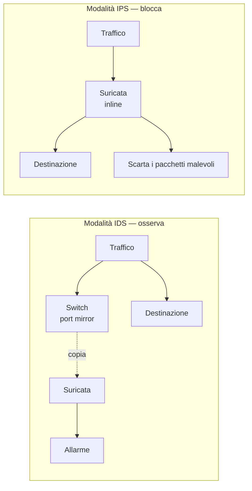

## Perché conta

Il [firewall]() decide **chi** può parlare con
chi. Ma una connessione permessa — un HTTP verso il server web in DMZ — può trasportare un
exploit. Il firewall non lo vede: per lui è traffico sulla porta 443, consentito. Serve qualcosa
che ispezioni il **contenuto** e riconosca gli schemi di un attacco. Questo è un IDS/IPS, e
Suricata è lo strumento open source di riferimento.

## IDS o IPS: dov'è sulla rete

La stessa macchina fa due mestieri diversi a seconda di dove la mettete.



- **IDS (Intrusion Detection System)**: Suricata riceve una **copia** del traffico (da una porta
  mirror dello switch) e genera allarmi. Non è nel percorso dei pacchetti: non può rallentare né
  bloccare nulla. Se va in crash, la rete non si ferma.
- **IPS (Intrusion Prevention System)**: Suricata è **inline**, cioè in mezzo al traffico. Può
  scartare i pacchetti malevoli, ma ogni pacchetto ci passa attraverso: diventa un punto di
  rallentamento e di possibile guasto.

La scelta è un compromesso tra sicurezza e rischio operativo. Spesso si parte in IDS per
"ascoltare", e si passa a IPS solo sulle regole di cui ci si fida.

## Installare Suricata nel lab

Nel lab containerlab si aggiunge un nodo con Suricata. In IDS ascolta un'interfaccia; in IPS si
mette tra due interfacce con `nfqueue` e una regola nftables che devia il traffico.

```bash
# IDS: ascolta eth1 e logga in formato EVE (JSON)
suricata -i eth1 -l /var/log/suricata

# aggiornare le regole (Emerging Threats Open)
suricata-update
```

Gli allarmi finiscono in `/var/log/suricata/eve.json`, una riga JSON per evento, pronta per essere
letta da strumenti come EveBox o inviata a un sistema di log centralizzato — il tema del capitolo
sull'osservabilità.

## Anatomia di una regola

Una regola Suricata ha due parti: l'**header** (azione, protocollo, chi verso chi) e le
**opzioni** tra parentesi (cosa cercare, come segnalarlo).

```text
alert tcp any any -> 10.0.1.10 80 (msg:"Possibile SQL injection UNION SELECT"; \
    content:"UNION"; nocase; content:"SELECT"; nocase; distance:0; \
    flow:established,to_server; classtype:web-application-attack; sid:1000001; rev:1;)
```

Letta a pezzi:

- `alert tcp any any -> 10.0.1.10 80`: genera un **allarme** per il traffico TCP da chiunque verso
  il server web (porta 80). In IPS, `alert` diventa `drop`.
- `content:"UNION"; nocase;`: cerca la stringa `UNION` nel payload, ignorando maiuscole/minuscole.
- `distance:0;` sul secondo `content`: `SELECT` deve comparire dopo `UNION`.
- `flow:established,to_server;`: solo su connessioni già stabilite, nei pacchetti verso il server.
  Riduce i falsi positivi.
- `sid:1000001;`: l'identificativo univoco della regola. I sid locali partono da 1000000.

Il formato è lo stesso di Snort, quindi gran parte delle regole è interscambiabile.

## Riconoscere gli attacchi dei capitoli precedenti

Suricata non vede l'ARP spoofing del [capitolo 02]()
con una regola sul contenuto — ARP è a livello 2 — ma ha un modulo dedicato che segnala quando lo
stesso IP cambia MAC di continuo. Lo scan `nmap -sS` invece si riconosce dalla frequenza:

```text
alert tcp any any -> $HOME_NET any (msg:"Possibile port scan SYN"; \
    flags:S; flow:to_server; \
    threshold:type both,track by_src,count 30,seconds 5; \
    classtype:attempted-recon; sid:1000002; rev:1;)
```

`threshold` è la chiave: non allarma su un singolo SYN (normale), ma su **30 SYN in 5 secondi
dalla stessa sorgente**, che è lo schema di uno scan. Senza soglia, una regola così genererebbe
migliaia di falsi positivi.

## Il problema vero: i falsi positivi

Un IDS che allarma su tutto è un IDS che nessuno guarda. La gestione di un IDS non è scrivere
regole, è **ridurre il rumore**: alzare le soglie, limitare le regole al traffico che conta,
disattivare quelle che non si applicano alla propria rete. Un ruleset Emerging Threats completo ha
decine di migliaia di regole: attivarle tutte ciecamente seppellisce gli allarmi veri sotto quelli
inutili.

## Lab

1. Avviate Suricata in IDS sul nodo che riceve il traffico.
2. Dal nodo `attacker`, lanciate `nmap -sS` contro un altro nodo.
3. Aggiungete la regola `sid:1000002` in un file `local.rules`, ricaricate e ripetete lo scan.
4. Leggete `eve.json` e trovate l'evento di tipo `alert` generato dallo scan:
   `jq 'select(.event_type=="alert") | .alert.signature' /var/log/suricata/eve.json`.


<details>
<summary><strong>Domanda:</strong> perché in IDS Suricata non può bloccare lo scan che rileva?</summary>
<p>Perché in modalità IDS riceve solo una <em>copia</em> del traffico da una porta mirror: i pacchetti
veri hanno già raggiunto la destinazione quando Suricata li analizza. Può solo generare un allarme
a posteriori. Per bloccare serve la modalità IPS, dove Suricata è inline e ogni pacchetto deve
attraversarlo prima di proseguire: solo lì <code>drop</code> ha effetto. Il prezzo è che Suricata
diventa un punto critico: se si satura o va in crash, blocca tutto il traffico.</p>
</details>


## Conclusione

Un IDS/IPS è il secondo strato della difesa in profondità: vede ciò che il firewall lascia
passare. Ma vale solo quanto le sue regole e la cura con cui si combatte il rumore. Un IDS
installato e dimenticato produce allarmi che nessuno legge.

Fin qui abbiamo lavorato su pacchetti in chiaro. Dal prossimo capitolo saliamo all'applicazione,
dove entra la crittografia: come TLS protegge una connessione, e perché nemmeno un IPS inline può
leggere dentro un flusso cifrato correttamente.

**Prossimo nella serie:** [06 · TLS 1.3 in profondità]() ·
[Torna alla roadmap]()
