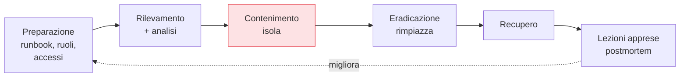

## Perché conta

La [detection]() scatta. E adesso? Un'allerta senza
una risposta preparata è panico in tempo reale: decisioni improvvisate, prove distrutte per sbaglio,
tempi lunghi. La **incident response (IR)** è il piano che trasforma il caos in procedura. E in un
mondo DevSecOps — infrastruttura immutabile, tutto automatizzato, artefatti verificabili — la risposta
cambia forma rispetto all'IR tradizionale: si sfruttano proprio le proprietà che abbiamo costruito nei
capitoli precedenti.

## Le fasi, in breve



Il modello NIST è un ciclo: ci si *prepara* prima, si *rileva e analizza*, si *contiene*, si *eradica*,
si *recupera*, e si imparano le *lezioni* che migliorano la preparazione. La differenza DevSecOps sta
in come si eseguono contenimento ed eradicazione.

## Isola e rimpiazza, non riparare

Nell'IR classico si "ripuliva" un server compromesso. In un'infrastruttura **immutabile** è un errore:
non sai cosa l'attaccante ha toccato, quindi non puoi fidarti di nessuna pulizia. Il modello
cloud-native è diverso:

```text {hl_lines=[2,3]}
Contenimento:  isola il pod/nodo compromesso (network policy, cordon)
               → preservalo per la forense, NON spegnerlo subito
Eradicazione:  rimpiazza con un'istanza NUOVA da un artefatto PULITO e firmato
               → non riparare il compromesso, sostituiscilo
```

Il contenimento sfrutta la [microsegmentazione]():
una network policy che taglia il pod dal resto del cluster lo ferma senza distruggere le prove.
L'eradicazione sfrutta gli artefatti [firmati]() e
immutabili: si ridistribuisce una versione pulita verificabile, con la certezza di cosa contiene.

## La provenienza come bussola forense

Durante l'analisi, le proprietà costruite prima diventano strumenti d'indagine. La
[SBOM]() dice esattamente cosa girava nell'immagine compromessa.
La **provenienza** SLSA dice da quale commit e quale build proveniva. Gli
[audit log]() a prova di manomissione danno la
timeline. La domanda "cosa è stato toccato?" — che senza questi dati richiede settimane — diventa una
serie di query.

## Automazione: contenere alla velocità della macchina

Gli attacchi automatizzati vanno più veloci di un umano. Per i casi ad alta confidenza, il
contenimento può essere **automatico** (SOAR): la detection "pod che esfiltra dati" innesca da sola
l'isolamento del pod, poi avvisa gli umani. L'automazione compra i minuti che contano, con la stessa
cautela dell'enforce nella runtime security: solo su segnali affidabili, per non isolare servizi sani
a un falso positivo.

## Il blameless postmortem

La fase più trascurata e più preziosa. Dopo l'incidente, un **postmortem senza colpevoli** ricostruisce
cosa è successo e *perché i controlli non l'hanno fermato* — non chi ha sbagliato. L'output non è una
reprimenda ma azioni concrete: una regola di detection nuova, un gate più stretto, un controllo
mancante aggiunto alla pipeline. È così che l'incidente alimenta il miglioramento invece di ripetersi,
chiudendo il ciclo DevSecOps.


<details>
<summary><strong>Domanda:</strong> il "blameless postmortem" non è un modo per non responsabilizzare nessuno? Se nessuno paga per l'errore, cosa impedisce che si ripeta?</summary>
<p>È l'obiezione classica, e si basa su un'intuizione sbagliata su cosa previene la ripetizione degli
errori. L'idea che la paura della colpa migliori la sicurezza è intuitiva ma smentita da decenni di
pratica nelle industrie ad alto rischio, dall'aviazione alla medicina: la colpa non previene gli errori,
li <em>nasconde</em>. Se sai che ammettere un errore ti costa, la tua reazione razionale non diventa
"starò più attento", diventa "non lo segnalerò, non lascerò tracce, dirò che non so come sia successo".
Il risultato è che perdi esattamente l'informazione che ti serve per correggere il sistema, e l'errore si
ripete — solo che ora nessuno te lo dice finché non esplode di nuovo, più in grande. "Blameless" non
significa "nessuna responsabilità": significa separare la responsabilità <em>di capire e migliorare il
sistema</em> (collettiva, aperta, onesta) dalla ricerca di un capro espiatorio (che distrugge l'onestà
senza aggiungere sicurezza). Il postmortem blameless parte da un presupposto preciso: le persone
competenti fanno quasi sempre scelte sensate con le informazioni e gli strumenti che avevano in quel
momento. Quindi se qualcuno ha fatto un errore, la domanda produttiva non è "perché quella persona è
incompetente?" ma "perché il sistema ha <em>permesso</em> che quell'errore facile da fare arrivasse fino
in produzione? dov'era il controllo che avrebbe dovuto intercettarlo?". Questo porta ad azioni concrete
che prevengono davvero la ripetizione — un gate mancante, una detection assente, una procedura ambigua,
un valore di default pericoloso — mentre "licenziamo il responsabile" lascia il sistema identico e pronto
a far inciampare la prossima persona allo stesso modo. La responsabilità vera, in questo modello, è dare
seguito alle azioni del postmortem: quello sì che va tracciato e preteso. Punire l'individuo è emotivamente
soddisfacente e tecnicamente inutile; correggere il sistema è il contrario, ed è l'unico che riduce il
tasso di incidenti nel tempo.</p>
</details>


## Conclusione

L'incident response DevSecOps isola e rimpiazza invece di riparare, usa SBOM, provenienza e audit log
come bussola forense, automatizza il contenimento sui segnali affidabili e chiude con un postmortem
blameless che migliora i controlli. Il piano trasforma il panico in procedura. Molto di ciò che
abbiamo costruito — controlli, audit, procedure — deve anche *dimostrarsi* a un revisore o a un
regolatore. Farlo senza fermare la consegna è la compliance as code, prossimo capitolo.
