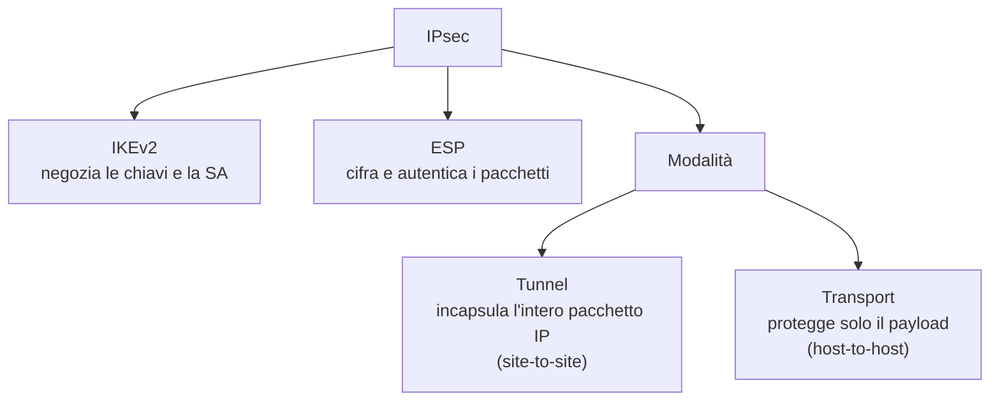

## Perché conta

Nel [capitolo su TLS]() abbiamo cifrato una singola connessione.
Una VPN fa un passo più in là: cifra **tutto** il traffico IP tra due punti, creando un tunnel
attraverso una rete non fidata. Serve a collegare due sedi (site-to-site) o a far entrare un
lavoratore da remoto nella LAN — la minaccia T6 del
[threat model](), dove serviva anche tracciare chi si
collega.

Le due tecnologie dominanti sono agli antipodi per filosofia: IPsec è una suite completa e
configurabile all'eccesso; WireGuard è una cinquantina di righe di concetti. Abbiamo già visto
[WireGuard in pratica](); qui lo confrontiamo con IPsec per
capire quando scegliere cosa.

## IPsec: una suite, non un protocollo

IPsec non è un protocollo ma un insieme. Ha due modalità e due protocolli di protezione, e una
negoziazione separata delle chiavi:



- **IKEv2** stabilisce la Security Association (SA): le due parti si autenticano (con chiavi
  precondivise o certificati) e concordano chiavi e algoritmi, con forward secrecy.
- **ESP** è ciò che protegge davvero i pacchetti: li cifra e li autentica.
- In **modalità tunnel** l'intero pacchetto IP originale viene incapsulato in uno nuovo: è quella
  usata per collegare due reti.

La forza di IPsec è la sua universalità: lo parlano router, firewall e sistemi operativi di ogni
marca, ed è lo standard nelle interconnessioni aziendali. La debolezza è la complessità: decine di
parametri da far combaciare tra i due lati, e un fallimento di negoziazione difficile da
diagnosticare.

## WireGuard: fare meno, meglio

WireGuard parte da un'idea opposta: niente negoziazione di algoritmi, niente opzioni. Usa un set
fisso di primitive crittografiche moderne (Curve25519, ChaCha20-Poly1305, BLAKE2s). Se un domani
una di queste si indebolisce, si cambia versione del protocollo, non si negozia.

L'autenticazione è semplicissima: ogni peer ha una coppia di chiavi, come SSH. Si conoscono per
**chiave pubblica**. La configurazione di un lato sta in poche righe:

```ini {hl_lines=[2,7]}
[Interface]
PrivateKey = <chiave privata locale>          # la mia identità
Address    = 10.9.0.1/24
ListenPort = 51820

[Peer]
PublicKey  = <chiave pubblica del peer>        # di chi mi fido
AllowedIPs = 10.9.0.2/32                        # quali IP accetto/instrado da questo peer
Endpoint   = peer.esempio.it:51820
```

Le due righe evidenziate sono il cuore del modello: **la mia chiave privata** definisce chi sono,
**la chiave pubblica del peer** definisce di chi mi fido. `AllowedIPs` fa doppio lavoro: è insieme
una regola di routing (quali IP mando nel tunnel) e di sicurezza (quali IP accetto da quel peer,
una forma di cryptokey routing).

```bash
wg-quick up wg0          # attiva il tunnel
wg show                  # stato: handshake, byte trasferiti, ultimo contatto
```

Un dettaglio che conta per la sicurezza: WireGuard è **silenzioso**. Non risponde a chi non
presenta una chiave valida, quindi dall'esterno la porta sembra chiusa. Un attaccante che fa uno
scan non trova nulla a cui agganciarsi.

## Il confronto

| | IPsec | WireGuard |
|---|---|---|
| Natura | suite configurabile | protocollo minimale, opzioni fisse |
| Righe di codice (kernel) | ~decine di migliaia | ~4.000 |
| Negoziazione | IKEv2, molti parametri | nessuna: primitive fisse |
| Autenticazione | PSK o certificati (PKI) | coppie di chiavi, stile SSH |
| Interoperabilità | universale (standard aziendale) | ottima tra sistemi WireGuard |
| Prestazioni | buone | generalmente migliori, meno overhead |
| Attraversamento NAT | può richiedere NAT-T | nativo, con keepalive |
| Diagnosi dei guasti | spesso complessa | `wg show` dice quasi tutto |

## Quando scegliere cosa

- **WireGuard** per road warrior, collegamenti tra server, lab, qualunque caso in cui si
  controllano entrambi i lati. Più semplice significa meno errori di configurazione, e la
  superficie di codice ridotta è essa stessa un vantaggio di sicurezza.
- **IPsec** quando serve interoperare con apparati che parlano solo IPsec (molti firewall e router
  aziendali), o dove policy e audit impongono certificati e algoritmi negoziabili.

La semplicità di WireGuard non è una scorciatoia di sicurezza: è una scelta di design. Meno codice e
meno opzioni significano meno superficie per i bug e meno modi di configurare male. Ma IPsec resta
insostituibile dove l'altro capo non è vostro.

## Tracciare chi si collega (la minaccia T6)

Il threat model chiedeva di registrare gli accessi VPN. Con WireGuard, `wg show` espone per ogni
peer l'ultimo handshake e i byte trasferiti; esportando questi dati (o i log del kernel) a un
sistema centrale si ottiene la tracciabilità richiesta. Con IPsec, IKEv2 registra le SA negoziate.
In entrambi i casi il punto è **inoltrare** quei dati a un log centralizzato, non lasciarli solo
sul gateway.

## Lab

Nel lab containerlab, due nodi che simulano due sedi separate da una rete "non fidata":

1. Generate le coppie di chiavi WireGuard (`wg genkey | tee priv | wg pubkey`).
2. Configurate i due lati e attivate il tunnel con `wg-quick`.
3. Da un lato, `ping` l'IP interno dell'altro e catturate il traffico sulla rete intermedia:
   deve essere illeggibile (UDP cifrato).
4. `wg show`: osservate l'handshake e i contatori.


<details>
<summary><strong>Domanda:</strong> perché WireGuard usa UDP e non TCP?</summary>
<p>Perché incapsulare traffico TCP dentro un tunnel TCP crea il problema del "TCP meltdown": due
controlli di congestione e due ritrasmissioni annidati che si combattono, con prestazioni che
crollano quando la rete perde pacchetti. UDP non ha controllo di congestione né ritrasmissione, così
il TCP interno gestisce da solo il suo recupero errori end-to-end, come se il tunnel non ci fosse.
È lo stesso motivo per cui anche IPsec/ESP e la maggior parte delle VPN serie preferiscono UDP.</p>
</details>


## Conclusione

IPsec e WireGuard risolvono lo stesso problema con filosofie opposte: configurabilità universale
contro minimalismo. Non c'è un vincitore assoluto: WireGuard dove controllate entrambi i capi,
IPsec dove dovete parlare con il mondo. In entrambi i casi, un tunnel è sicuro solo quanto la
gestione delle sue chiavi e il tracciamento di chi lo usa.

Abbiamo costruito difese per nove capitoli. Nel prossimo mettiamo tutto alla prova dalla parte di
chi indaga: analizzare una cattura di pacchetti e ritrovare, dentro il traffico, gli attacchi che
abbiamo studiato.

**Prossimo nella serie:** [10 · Analisi dei pacchetti con Wireshark]() ·
[Torna alla roadmap]()
