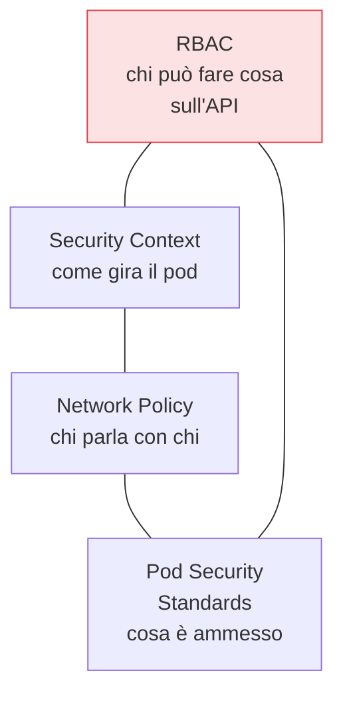

## Perché conta

Abbiamo [immagini minimali](); ora girano in un
cluster. E un cluster Kubernetes di default è progettato per *funzionare facilmente*, non per essere
sicuro: permessi ampi, nessuna restrizione di rete, pod che possono girare come root. L'hardening è il
lavoro di restringere questi default senza rompere i carichi. Si appoggia al
[modello di rete di Kubernetes]() già visto, e ne
chiude i margini.

## Le quattro leve principali



### 1. RBAC a privilegio minimo

Il controllo d'accesso all'API è la prima linea. L'errore classico è concedere `cluster-admin` "per
non avere problemi". Ogni ServiceAccount e ogni utente deve potere *solo* ciò che serve. Attenzione
speciale ai permessi che consentono l'escalation: creare pod, leggere i secret, modificare i
RoleBinding sono poteri che equivalgono quasi al controllo del cluster.

### 2. Security context del pod

Come abbiamo indurito l'immagine, induriamo l'esecuzione:

```yaml {hl_lines=[3,4,5,6]}
securityContext:
  runAsNonRoot: true            # mai root nel container
  readOnlyRootFilesystem: true  # niente scrittura sul filesystem del container
  allowPrivilegeEscalation: false
  capabilities: { drop: ["ALL"] }  # togli tutte le capability Linux, riaggiungi solo il minimo
```

Queste quattro righe eliminano le vie più comuni di escape e di movimento. Un container che non può
diventare root, non può scrivere su disco e non ha capability è molto meno utile a un attaccante.

### 3. Network policy di default-deny

Di default, in Kubernetes *ogni pod parla con ogni pod*. È l'opposto dello Zero Trust. Una
[microsegmentazione]() con network policy di
**default-deny** chiude tutto il traffico est-ovest e riapre solo i flussi necessari. Così un pod
compromesso non può raggiungere liberamente il resto del cluster.

### 4. Pod Security Standards

I **Pod Security Standards** (Restricted, Baseline, Privileged) definiscono cosa un pod può chiedere.
Applicati a livello di namespace tramite il Pod Security Admission, impediscono che venga schedulato
un pod privilegiato o con host mount pericolosi — un controllo *all'ammissione*, che è il ponte verso
il prossimo capitolo.

## L'isolamento dei nodi e il resto

Oltre ai pod: proteggere l'accesso all'**etcd** (contiene tutti i segreti del cluster, in chiaro se
non cifrato a riposo), limitare l'accesso all'API server, isolare i nodi, e trattare i carichi
multi-tenant con namespace separati e, per i casi più sensibili, sandbox di runtime (gVisor,
Kata). L'hardening non è una checklist una tantum: è un confronto periodico con il CIS Benchmark.


<details>
<summary><strong>Domanda:</strong> se applico RBAC stretto, readOnlyRootFilesystem, drop di tutte le capability e default-deny di rete, non rischio di rompere metà dei miei workload che oggi funzionano?</summary>
<p>Il rischio di rottura è reale, ma rivela una verità scomoda: se un workload smette di funzionare quando
gli togli root, la scrittura sul filesystem, le capability e la rete libera, vuol dire che oggi sta
<em>usando</em> privilegi che non dovrebbe avere, e quello è precisamente il problema di sicurezza che stai
cercando di chiudere. L'hardening non va fatto a martellate su tutto il cluster in un giorno, va fatto
come una migrazione guidata. Prima <em>osservi</em>: molti di questi controlli hanno una modalità non
bloccante — i Pod Security Standards si applicano per namespace con livelli <code>warn</code> e
<code>audit</code> prima di <code>enforce</code>, così vedi quali pod violerebbero la policy senza
fermarli; per le network policy usi strumenti che registrano il traffico reale prima di passare al
default-deny, così sai quali flussi riaprire. Poi correggi alla fonte: un'app che vuole scrivere lo fa su
un volume emptyDir montato apposta, non sul root filesystem; una che crede di aver bisogno di root quasi
sempre non ne ha bisogno davvero una volta sistemati i permessi dei file; le capability si riaggiungono
una per una, solo quelle effettivamente necessarie (spesso zero). Poi procedi per gradi: un namespace non
critico prima, i default stretti sui nuovi workload subito (è molto più facile nascere conformi che
diventarlo), e i workload legacy migrati uno alla volta con una deroga tracciata dove serve tempo.
Infine, imposti i default sicuri a livello di piattaforma, così il prossimo team parte già hardened senza
doverci pensare. Il punto è che la rottura non è un effetto collaterale dell'hardening: è la diagnosi. Ti
dice esattamente dove i tuoi workload sono sovra-privilegiati, che è l'informazione che ti serviva per
renderli difendibili.</p>
</details>


## Conclusione

Un cluster sicuro è un cluster ristretto: RBAC a privilegio minimo, security context che impediscono
root e scrittura, network policy di default-deny, Pod Security Standards per namespace, più etcd
cifrato e API protetta. Molti di questi controlli si fanno rispettare *al momento dell'ammissione* di
un pod — il meccanismo che permette di dire "no" prima ancora che qualcosa parta. È l'admission
control, prossimo capitolo.
