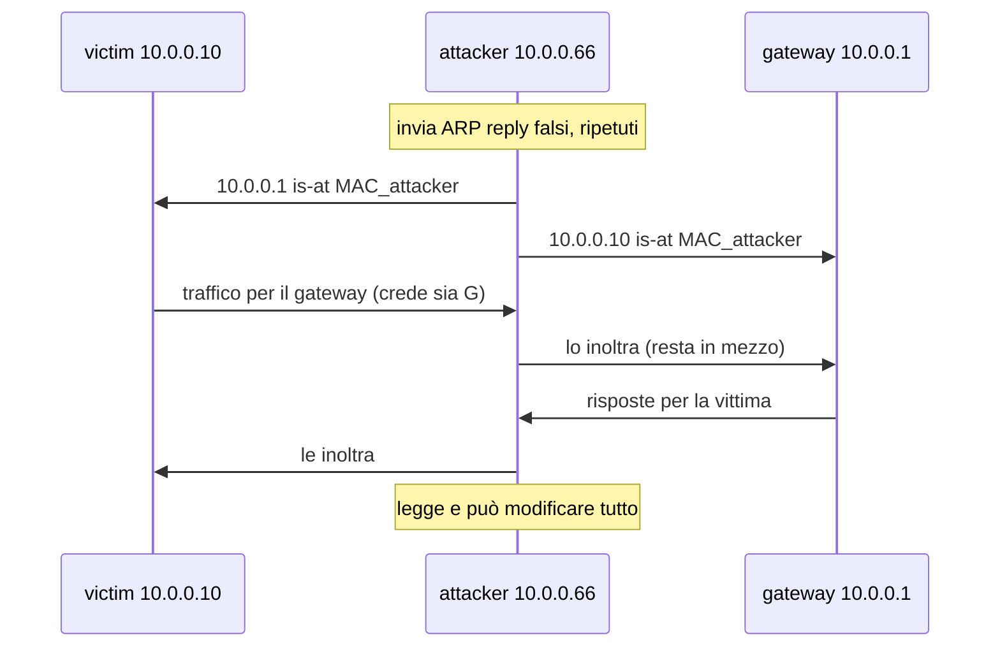

## Perché conta

Nel [capitolo precedente]() la minaccia con rischio
più alto dopo la rete ospiti era la T2: un dispositivo già dentro la LAN che si mette in mezzo al
traffico. Qui la rendiamo concreta.

Lo strato 2 è quello che quasi nessuno guarda. Un firewall perimetrale non vede cosa succede
_dentro_ la LAN, e i protocolli di livello 2 — ARP, DHCP — sono nati negli anni '80 senza nessuna
autenticazione. Chi riesce a collegarsi a una porta dello switch può, con pochi pacchetti,
diventare l'uomo nel mezzo tra due macchine che si credono sole.

Tutti gli esempi girano nel lab containerlab descritto nella
[roadmap](): tre nodi (`attacker`, `victim`,
`gateway`) attaccati a uno switch Open vSwitch. Non provate nulla di questo su una rete che non è
vostra.

## ARP spoofing: avvelenare la cache

### Come funziona

Quando `victim` (10.0.0.10) vuole parlare con `gateway` (10.0.0.1), non conosce il suo indirizzo
MAC. Manda in broadcast una richiesta ARP: "chi ha 10.0.0.1?". Il gateway risponde con il suo MAC,
e la vittima lo mette in cache. Il problema: ARP accetta anche risposte che nessuno ha chiesto, e
non verifica chi le manda.

L'attaccante sfrutta proprio questo. Invia alla vittima una risposta ARP falsa — "10.0.0.1 sono
io" — e al gateway un'altra — "10.0.0.10 sono io". Da quel momento tutto il traffico tra i due
passa dall'attaccante.



### L'attacco

Con scapy bastano poche righe. Lo script manda una coppia di reply falsi ogni due secondi, perché
le cache ARP scadono e vanno "rinfrescate":

```python
from scapy.all import ARP, send

victim, gateway = "10.0.0.10", "10.0.0.1"

def poison():
    # op=2 è una ARP reply; psrc è l'IP che fingiamo di essere
    send(ARP(op=2, pdst=victim,  psrc=gateway), verbose=False)
    send(ARP(op=2, pdst=gateway, psrc=victim),  verbose=False)

while True:
    poison()
    __import__("time").sleep(2)
```

Perché l'attaccante possa restare in mezzo e non interrompere la connessione, deve inoltrare i
pacchetti che riceve:

```bash
# sul nodo attacker: inoltra i pacchetti invece di scartarli
sysctl -w net.ipv4.ip_forward=1
```

Da `victim`, prima e dopo l'attacco, la cache ARP mostra il cambio:

```bash
victim:~$ ip neigh show 10.0.0.1
10.0.0.1 dev eth1 lladdr 00:aa:...:gw REACHABLE      # prima: MAC del gateway
10.0.0.1 dev eth1 lladdr 00:bb:...:att REACHABLE     # dopo: MAC dell'attaccante
```

## MAC flooding: trasformare lo switch in un hub

Uno switch impara quale MAC sta dietro quale porta e salva la coppia nella **CAM table**. Quando
la tabella è piena, molti switch entrano in _fail-open_: inoltrano i frame sconosciuti a **tutte**
le porte, come un vecchio hub. L'attaccante può allora sniffare traffico che non gli è destinato.

```bash
# macof (dal pacchetto dsniff) riempie la CAM table con MAC casuali
macof -i eth1
```

> Nota sul lab: il vero fail-open della CAM table è un comportamento degli switch hardware. Né i
> bridge Linux né Open vSwitch lo riproducono fedelmente (gestiscono l'esaurimento in altro modo).
> Per vederlo sul serio serve uno switch Cisco in GNS3 — lo usiamo nel capitolo 03 per DTP.

## DHCP starvation e rogue DHCP

L'attacco ha due tempi. Prima **starvation**: l'attaccante chiede al server DHCP legittimo tutti
gli indirizzi disponibili, con tanti MAC diversi, finché il pool è esaurito. Poi **rogue DHCP**:
accende un proprio server DHCP, che ora è l'unico a rispondere. Assegna alle vittime un gateway e
un DNS che controlla lui.

```bash
# fase 1: esaurisce il pool del server legittimo
dhcpstarv -i eth1          # oppure: yersinia dhcp -attack 1

# fase 2: il server fasullo distribuisce sé stesso come gateway e DNS
# (dnsmasq minimale sul nodo attacker)
dnsmasq --interface=eth1 --dhcp-range=10.0.0.100,10.0.0.200,1h \
        --dhcp-option=3,10.0.0.66 --dhcp-option=6,10.0.0.66
```

Il risultato è lo stesso dell'ARP spoofing — l'attaccante diventa il gateway — ma qui le vittime
glielo chiedono spontaneamente.

## La difesa

Tutte e tre le difese stanno sullo switch, non sugli host. Su uno switch gestito si attivano con
tre funzioni che lavorano insieme.

```text {hl_lines=[2,5,8]}
! port security: limita quanti MAC può imparare una porta -> blocca il MAC flooding
switchport port-security maximum 2
switchport port-security violation restrict
! DHCP snooping: solo le porte "trust" possono ospitare un server DHCP -> blocca il rogue DHCP
ip dhcp snooping
ip dhcp snooping vlan 10
! Dynamic ARP Inspection: verifica le reply ARP contro la tabella di DHCP snooping -> blocca l'ARP spoofing
ip arp inspection vlan 10
```

Le tre righe evidenziate sono il cuore: **port-security** tappa il MAC flooding, **DHCP snooping**
decide da quali porte può arrivare un'offerta DHCP, e **Dynamic ARP Inspection (DAI)** usa proprio
la tabella costruita da DHCP snooping per scartare le reply ARP che non combaciano.

Con Open vSwitch, che non ha DAI, l'equivalente si ottiene con regole OpenFlow che fissano la
coppia IP–MAC per porta, oppure limitando a una porta sola il traffico DHCP server (`udp src port 67`).

## Lab

Nel lab `lab-l2.clab.yml`:

1. Avviate una cattura su `victim` (`tcpdump -i eth1 -n`).
2. Dal nodo `attacker`, lanciate lo script scapy di ARP spoofing e attivate `ip_forward`.
3. Da `victim`, fate `ping 10.0.0.1` e osservate su `attacker` (con `tcpdump`) che i pacchetti
   passano da lì.
4. Guardate come cambia `ip neigh` su `victim`.


<details>
<summary><strong>Domanda:</strong> perché la vittima non si accorge di nulla, anche se il ping continua a funzionare?</summary>
<p>Perché l'attaccante inoltra i pacchetti (<code>ip_forward=1</code>): la connessione resta viva, la
latenza aumenta di pochissimo, e a livello 3 (IP) tutto sembra normale. L'unico segno è a livello 2:
il MAC associato al gateway è cambiato. È per questo che la difesa sta sullo switch e guarda i MAC,
non sugli host che guardano gli IP. Uno strumento come <code>arpwatch</code> sull'host può segnalare
il cambio di MAC, ma è un allarme, non una difesa: non impedisce l'attacco.</p>
</details>


## Conclusione

I tre attacchi condividono la stessa radice: a livello 2 nessuno verifica l'identità. La difesa
non sta nel rendere "più sicuri" gli host, ma nel dare allo switch il compito di controllare chi
dice cosa — port security, DHCP snooping, Dynamic ARP Inspection. Sono funzioni che quasi ogni
switch gestito ha e che quasi nessuno attiva.

C'è però un pezzo che manca: fin qui abbiamo dato per scontato che le porte siano già assegnate
alla VLAN giusta. Nel prossimo capitolo vediamo come un attaccante può **saltare da una VLAN
all'altra**, e perché la VLAN nativa è il punto debole.

**Prossimo nella serie:** [03 · VLAN hopping e hardening degli switch]() ·
[Torna alla roadmap]()
