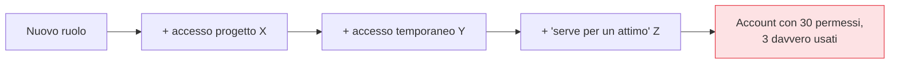
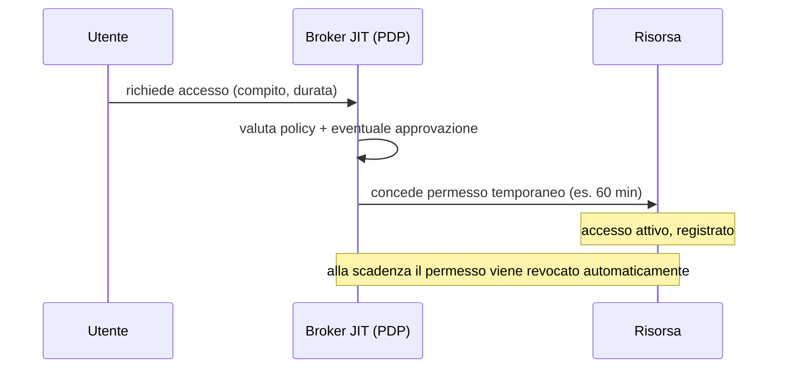

## Perché conta

Il terzo dei [cinque principi]() è il minimo
privilegio, e spesso è il più tradito. Nelle organizzazioni reali i permessi si **accumulano**:
qualcuno riceve un accesso per un progetto, il progetto finisce, il permesso resta. Anni dopo,
account con decine di privilegi dimenticati sono la norma. E quando uno di quegli account viene
compromesso, l'attaccante eredita ogni permesso in un colpo solo. Lo Zero Trust risponde dando il
**minimo** accesso per il **minimo tempo**.

## Il privilege creep



Il "privilege creep" è entropia: aggiungere un permesso è facile e richiesto, toglierlo non lo chiede
mai nessuno. Il risultato è una superficie d'attacco che cresce in silenzio. La soluzione non è
ricordarsi di revocare (non succede), è rendere i permessi **temporanei per costruzione**.

## Due assi: enough e in-time

- **Just-enough-access (JEA)**: non "accesso admin", ma esattamente il permesso per il compito —
  leggere quella tabella, riavviare quel servizio, nulla di più.
- **Just-in-Time (JIT)**: il permesso non è permanente, si **richiede al momento** del bisogno, è
  concesso per una finestra breve, e **scade** da solo.

Insieme: invece di "Alice è amministratrice del database", si ha "Alice può *richiedere* 1 ora di
accesso in scrittura al database, con motivazione, e l'accesso sparisce da solo".

## Il flusso Just-in-Time



Il punto non è solo la scadenza: è che ogni elevazione è **esplicita, motivata e registrata**. Lo
stato "a riposo" di ogni identità è il minimo; l'elevazione è l'eccezione tracciata, non la regola.

## Gli account più pericolosi: gli admin

Dove il JIT conta di più è sugli account privilegiati. Un amministratore che resta admin 24/7 è un
bersaglio permanente. Con il **PAM (Privileged Access Management)** in modalità JIT, nessuno è admin
di default: lo si diventa per una sessione approvata e tracciata, con credenziali effimere. Un
account admin compromesso che non ha privilegi *attivi* in quel momento vale molto meno.

```text {hl_lines=[2,3]}
# modello concettuale
stato normale:   permessi = { minimo per il ruolo }
elevazione JIT:  richiesta + (approvazione) → permesso temporaneo con TTL
scadenza:        permesso revocato automaticamente, torna al minimo
```

## Il legame con il resto

Il minimo privilegio non vive da solo: ha senso solo se l'[identità]()
è forte (altrimenti non si sa a chi si concede), se il [PDP]()
valuta le richieste, e se tutto è [registrato]()
(altrimenti l'elevazione non è verificabile). Lo stesso principio vale per i workload: un servizio
ottiene scope minimi e token a vita breve, non una chiave onnipotente.

## Lab

Con un broker di accesso o uno script che gestisca permessi temporanei (es. su un DB o via sudo con
timeout):

1. Partite da un utente senza privilegi su una risorsa.
2. Implementate una richiesta JIT che conceda un permesso con TTL (es. accesso in scrittura per 15
   minuti).
3. Verificate l'accesso durante la finestra e la revoca automatica allo scadere.
4. Registrate ogni richiesta ed elevazione in un log e rileggetele: chi, cosa, quando, perché.


<details>
<summary><strong>Domanda:</strong> chiedere l'accesso ogni volta e aspettare che scada non rallenta il lavoro degli amministratori fino a renderlo insopportabile?</summary>
<p>È la tensione reale tra sicurezza e operatività, e si gestisce dosando l'attrito sul rischio. L'errore
è pensare che ogni elevazione richieda un'approvazione umana lenta: la maggior parte può essere
<em>auto-approvata</em> dalla policy (identità valida, dispositivo conforme, orario lavorativo), con
concessione in pochi secondi e scadenza automatica — l'amministratore quasi non se ne accorge, ma lo
stato a riposo resta il minimo. L'approvazione manuale si riserva alle azioni davvero sensibili
(produzione, dati critici), dove qualche minuto di attesa è un prezzo accettabile per un'operazione
rara. E il beneficio è concreto proprio per gli admin: non essere un bersaglio con privilegi perenni
significa che una loro credenziale rubata, da sola, non apre nulla. Il JIT fatto male è burocrazia;
fatto bene, è invisibile quando il rischio è basso e presente solo dove serve — la stessa logica
dell'accesso adattivo.</p>
</details>


## Conclusione

I permessi permanenti sono debito che si accumula e che un account compromesso eredita per intero.
Lo Zero Trust li rende temporanei per costruzione: minimo privilegio (just-enough) concesso al
momento (just-in-time) e revocato da solo, con ogni elevazione motivata e registrata — soprattutto
per gli amministratori. Finora abbiamo parlato di utenti; i prossimi capitoli applicano la stessa
logica ai servizi, partendo dall'identità dei workload con mTLS.
