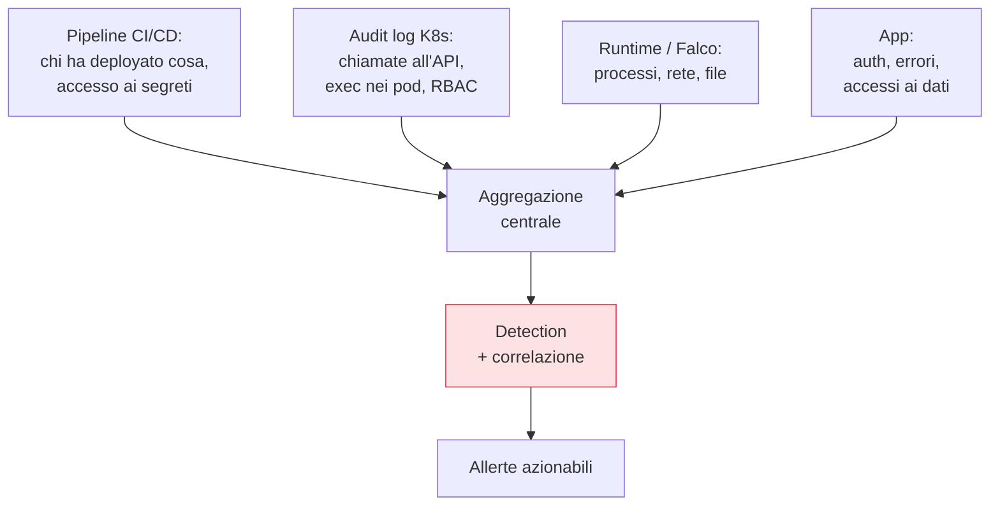

## Perché conta

Il [vulnerability management]() ordina ciò che
sappiamo; la [runtime security]() rileva comportamenti
anomali. Ma entrambi dipendono dal *vedere*. Senza log, un attacco riuscito è invisibile: non sai che
è successo, non sai cosa è stato toccato, non puoi rispondere. Il logging è la memoria del sistema, e
la detection è ciò che la rende utile. Estende il tema del [SIEM e della correlazione dei
log]() al mondo DevSecOps: pipeline, cluster, runtime.

## Quali segnali, dove



I quattro flussi che contano in DevSecOps:

- **Audit log di Kubernetes**: ogni chiamata all'API — chi ha creato cosa, chi ha letto quali
  secret, chi ha fatto `exec` in un pod. È la fonte primaria per investigare una compromissione del
  cluster.
- **Log della pipeline**: chi ha innescato quale deploy, chi ha acceduto a quali segreti, quali
  eccezioni ai gate sono state usate. La pipeline è un bersaglio: va osservata.
- **Eventi di runtime** (Falco/eBPF): i comportamenti anomali dei container.
- **Log applicativi**: autenticazioni, errori, accessi ai dati sensibili.

## A prova di manomissione

Un attaccante esperto, dopo essere entrato, cancella le proprie tracce. Se i log vivono dove gira il
carico, può alterarli. Perciò i log di sicurezza vanno **spediti fuori** verso un deposito append-only
e ad accesso ristretto, a cui il carico compromesso non può scrivere né cancellare. È il principio di
non-ripudio dello STRIDE: i log servono proprio quando qualcuno vuole poter dire "non sono stato io".

```text {hl_lines=[2]}
Log sul nodo compromesso        → l'attaccante li cancella → cieco
Log spediti a store append-only → immutabili → hai la timeline dell'attacco
```

## Dal data lake alla detection

Raccogliere tutto e non guardarlo è il fallimento più comune: un data lake costoso che serve solo
dopo, per l'autopsia. Il valore sta nella **detection**: regole che trasformano i log in allerte
*mentre* l'attacco accade.

- **Basata su regole**: pattern di tecniche note, idealmente mappati su **MITRE ATT&CK** ("accesso a
  un secret seguito da connessione in uscita insolita").
- **Basata su anomalie**: deviazioni dal comportamento normale appreso.
- **Correlazione**: unire segnali deboli di fonti diverse in un segnale forte — un fallimento di auth
  *più* un exec nel pod *più* una connessione a un IP sconosciuto raccontano una storia che ogni
  singolo evento non racconta.

## Meno rumore, più segnale

Vale qui la legge della [runtime security](): le allerte
inutili addestrano il team a ignorarle. Una detection va *tarata* — soppressione del noto, soglie
sensate, arricchimento con il contesto (quale servizio, quale ambiente, quale owner) — così ogni
allerta che arriva merita di essere guardata. Una detection ignorata è peggio di nessuna, perché dà
l'illusione di vedere.


<details>
<summary><strong>Domanda:</strong> con l'observability che già abbiamo per il debugging (metriche, log, tracce), perché serve un flusso di logging separato "di sicurezza"? Non sono gli stessi dati?</summary>
<p>Si sovrappongono in parte, ma hanno requisiti così diversi su tre assi che trattarli come un flusso
solo compromette entrambi gli scopi. Primo asse, l'integrità e la fiducia. L'observability per il
debugging è ottimizzata per comodità e costo: i log vivono vicino ai carichi, sono scrivibili, spesso con
ritenzione breve e accesso ampio perché servono agli sviluppatori per lavorare. I log di sicurezza hanno
il requisito opposto: devono essere a prova di manomissione, perché il loro utente avversario è proprio
chi ha compromesso il sistema e vuole cancellare le tracce. Un log di debug che l'attaccante può alterare
è inutile come prova; un log di sicurezza deve vivere in uno store append-only che il carico compromesso
non può toccare. Secondo asse, il contenuto. L'observability cattura ciò che serve a capire <em>perché il
sistema è lento o rotto</em>: latenze, code, stack trace. La detection ha bisogno di eventi che il
debugging spesso non raccoglie affatto — chi ha letto quale secret, chi ha fatto exec in quale pod, quali
RBAC sono cambiati, quali eccezioni ai gate sono state usate — e che vanno registrati anche quando tutto
"funziona", perché un attacco riuscito spesso non rompe nulla. Terzo asse, la ritenzione e la conformità.
Un incidente si scopre in media mesi dopo: i log di sicurezza devono sopravvivere molto più a lungo dei
log operativi, spesso per obblighi normativi, con garanzie di conservazione che l'observability non ha.
Detto questo, non significa costruire due infrastrutture che si ignorano: i dati di observability sono
una <em>fonte</em> preziosa per la detection (un picco anomalo di errori può essere un attacco), e molte
piattaforme uniscono i pipe di raccolta. Il punto è che i log di sicurezza aggiungono requisiti —
immutabilità, eventi di audit specifici, ritenzione lunga, accesso ristretto — che l'observability da
sola non soddisfa. Puoi condividere la raccolta, non puoi condividere le garanzie: un data lake di debug
riusato come fonte di prova forense ti lascia scoperto esattamente quando l'attaccante ha fatto il suo
lavoro.</p>
</details>


## Conclusione

Non puoi rispondere a ciò che non vedi: audit log del cluster, log della pipeline, eventi di runtime e
log applicativi, spediti fuori in uno store a prova di manomissione, trasformati in detection
correlate e tarate contro il rumore. Il logging è la memoria, la detection è l'allarme. Ma un allarme
senza una procedura di risposta è solo un suono nel vuoto. Cosa fare *quando* la detection scatta è la
risposta agli incidenti, prossimo capitolo.
