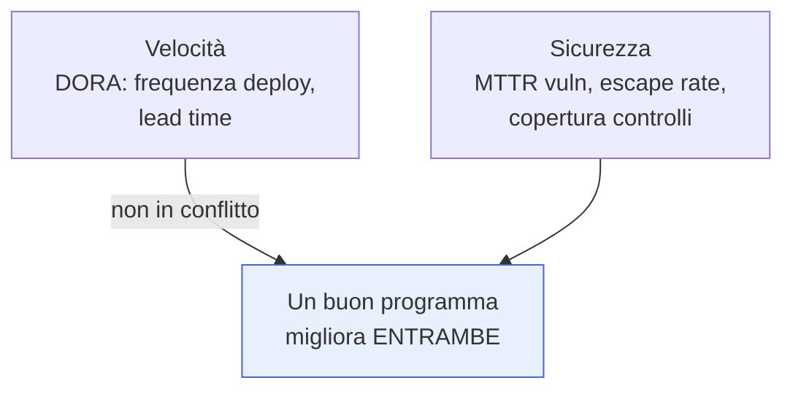

## Perché conta

Abbiamo costruito controlli lungo tutto il ciclo. Funzionano? Migliorano? Senza **metriche**, la
sicurezza è opinione: chi urla più forte ottiene le risorse. Ma le metriche sbagliate sono peggio di
nessuna, perché orientano il comportamento nella direzione sbagliata con l'autorità apparente del
numero. Questo capitolo è su cosa misurare per governare DevSecOps — e sulle trappole che trasformano
una buona intenzione in un incentivo perverso.

## Le metriche che contano

- **MTTR delle vulnerabilità** (Mean Time To Remediate): quanto tempo passa dalla scoperta di un CVE
  alla sua correzione in produzione. È la metrica regina: misura la capacità di *reagire*, che è ciò
  che conta davvero.
- **Escape rate**: quanti difetti sfuggono ai controlli e arrivano in produzione (o peggio, a un
  incidente). Misura l'efficacia *reale* della pipeline di controlli.
- **Copertura dei controlli**: quale percentuale di servizi ha SAST, SCA, scanning immagini, firma. La
  sicurezza è forte quanto l'anello più scoperto.
- **Metriche DORA** (frequenza di deploy, lead time, change failure rate, tempo di ripristino): perché
  la sicurezza non deve distruggere la velocità, e le due vanno lette *insieme*.

## MTTR: la forma che conta

Un MTTR medio nasconde la coda pericolosa. La media può essere buona mentre pochi CVE critici restano
aperti per mesi:

$$ \text{MTTR} = \frac{1}{n}\sum_{i=1}^{n} (t_{\text{fix},i} - t_{\text{scoperta},i}) $$

La media su tutti gli $n$ CVE livella i casi gravi con i banali. Meglio misurare l'MTTR *per severità*
e guardare i **percentili** (il 95° percentile dei critici), non la media: è nella coda — i pochi CVE
critici dimenticati — che vivono gli incidenti, non nel valore medio.

## La metrica tossica: "vulnerabilità trovate"

Contare le vulnerabilità *trovate* come misura di performance è un classico errore. Più cerchi, più
trovi: il numero sale quando *migliori* la detection, e scende quando *smetti di guardare*. Premiare
"poche vulnerabilità trovate" incentiva a cercare meno, l'esatto contrario dell'obiettivo. Conta ciò
che riguarda il *rischio gestito* — MTTR, escape rate, copertura — non l'attività grezza.

## La legge di Goodhart

> "Quando una misura diventa un obiettivo, cessa di essere una buona misura."

È il rischio di *ogni* metrica, non di una sola. Se l'MTTR diventa il bersaglio su cui si viene
valutati, si imparerà a chiudere i ticket velocemente — magari marcando come "risolto" senza
risolvere, o declassando la severità per far quadrare i numeri. Le contromisure: usare le metriche per
*apprendere e orientare*, non per punire; guardarne *più d'una* insieme così barare su una peggiora
l'altra (chiudere ticket in fretta fa salire l'escape rate); e verificare sul campo che il numero
rifletta la realtà. Lo stesso principio del [postmortem blameless]():
le metriche servono a migliorare il sistema, non a trovare colpevoli.

## Maturità, nel tempo

Oltre ai numeri operativi, un modello come **OWASP DSOMM** misura la *maturità* dei controlli nel
tempo — la stessa logica del [Secure SDLC](): non "fai SAST?" ma "a
che livello, con quale copertura, con quale efficacia?". Serve a mostrare una traiettoria di
miglioramento, che è ciò che un programma di sicurezza deve dimostrare più di qualsiasi valore
assoluto.



<strong>Domanda:</strong> se ogni metrica è soggetta alla legge di Goodhart e può essere manipolata, non è meglio evitare di misurare e fidarsi del giudizio degli esperti?

No, e questa è la conclusione sbagliata da trarre da Goodhart — una trappola simmetrica a quella che
mette in guardia. "Non misurare e fidarsi del giudizio" suona prudente ma significa tornare esattamente al
mondo che le metriche risolvono: la sicurezza come opinione, dove le risorse vanno a chi è più
persuasivo o più allarmista, dove non sai se stai migliorando o peggiorando, dove non puoi dimostrare a
nessuno — né a te stesso — che un controllo vale il suo costo. Il giudizio degli esperti è prezioso ma non
scala, non è verificabile e non protegge da bias: due esperti onesti possono dissentire su dove sta il
rischio, e senza dati la discussione non si chiude. Goodhart non dice "non misurare", dice "non trasformare
una singola misura in <em>il</em> bersaglio da ottimizzare a tutti i costi". La differenza è enorme. Le
contromisure pratiche esistono e sono quelle che un programma maturo applica: primo, misurare un
<em>insieme</em> bilanciato di metriche che si tengono a vicenda, così barare sull'una peggiora l'altra —
accorciare l'MTTR chiudendo ticket a vuoto fa esplodere l'escape rate e il tasso di riapertura, e il trucco
emerge. Secondo, separare le metriche di <em>apprendimento</em> (che usi per capire dove migliorare, e che
non devi mai legare a valutazioni individuali, o le corrompi) dalle metriche di <em>allineamento</em> con
cui comunichi verso l'alto. Terzo, usare le metriche come inizio di una conversazione, non come verdetto:
un numero che peggiora è una domanda ("perché?"), non una condanna. Quarto, validare periodicamente che il
numero rifletta la realtà con controlli a campione, red team, incidenti reali — se l'escape rate dice zero
ma gli incidenti no, la metrica mente e va aggiustata. Il giudizio degli esperti rientra proprio qui: serve
a scegliere le metriche giuste, a interpretarle, a cogliere ciò che sfugge ai numeri. Non è metriche
<em>contro</em> giudizio, è metriche <em>che informano</em> il giudizio. Rinunciare a misurare per paura di
Goodhart è come rinunciare a guidare per paura che il tachimetro possa essere ingannato: la risposta a uno
strumento imperfetto è usarlo con criterio e affiancarne altri, non guidare a occhi chiusi.



## Conclusione

Misurare DevSecOps significa guardare MTTR per severità e percentili, escape rate, copertura dei
controlli e metriche DORA insieme — mai "vulnerabilità trovate", e sempre con Goodhart in mente: le
metriche orientano e insegnano, non puniscono. Ma nessuna metrica e nessuno strumento funziona se le
persone non vogliono la sicurezza. L'ultimo capitolo è quello che tiene su tutti gli altri: la cultura
e i security champions.
