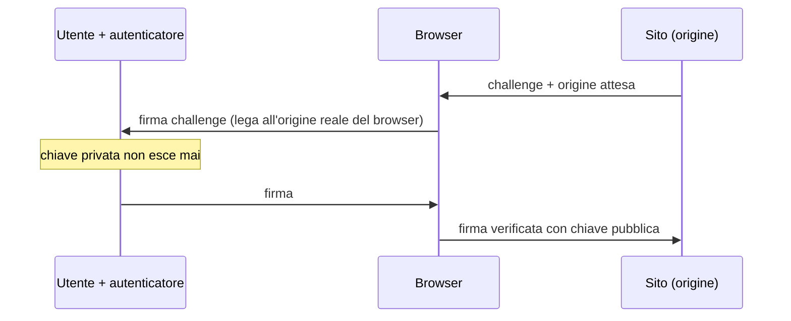

## Perché conta

Se l'[identità è il perimetro](), l'autenticazione è
la serratura. E non tutte le serrature sono uguali: aggiungere "un secondo fattore" non basta se quel
fattore si può rubare con l'inganno. Gran parte delle brecce odierne non rompe la crittografia, ruba
le credenziali — compresi i codici MFA — con il phishing. La MFA **resistente al phishing** (FIDO2/
WebAuthn) chiude proprio questa strada, ed è il tipo di autenticazione che lo Zero Trust richiede.

## Perché OTP e push non bastano

I fattori più diffusi sono rubabili perché l'utente può essere ingannato a consegnarli:

- **OTP (codici a tempo)**: un sito di phishing che imita quello vero chiede il codice; l'utente lo
  digita; l'attaccante lo inoltra al sito vero in tempo reale. Il codice non sa *a chi* lo stai
  dando.
- **Push "approva/nega"**: l'attaccante tenta il login e l'utente riceve la richiesta; con il
  **MFA fatigue** (richieste ripetute, di notte) prima o poi qualcuno approva per sfinimento.
- **SMS**: in più soffre di SIM swapping.

Il difetto comune: il fattore non è **legato al sito legittimo**. L'utente è l'anello che può essere
indirizzato verso il posto sbagliato.

## L'idea di FIDO2: legare la credenziale al dominio

FIDO2/WebAuthn usa la **crittografia a chiave pubblica** e lega la credenziale all'**origine** (il
dominio) per cui è stata creata. La chiave privata vive in un autenticatore (chiave di sicurezza,
TPM, Secure Enclave del telefono) e **non lascia mai** il dispositivo; al sito va solo una firma.



Il punto decisivo: il browser include l'**origine reale** nella firma. Se l'utente è su un sito di
phishing (`banca-login.evil.com`), la firma è per *quel* dominio, e il sito vero (`banca.it`) la
rifiuta. La credenziale **non è trasferibile** a un dominio diverso. Il phishing smette di
funzionare non perché l'utente è più attento, ma perché la tecnica è inefficace.

## Passkey: FIDO2 usabile

Le **passkey** sono credenziali FIDO2 sincronizzabili (via il portachiavi del sistema operativo) o
legate a un dispositivo. Rendono FIDO2 pratico per il grande pubblico: niente password, sblocco con
biometria o PIN locale, e resistenza al phishing di serie. Per lo Zero Trust sono il fattore da
preferire per gli utenti; per gli account ad alto privilegio, le chiavi di sicurezza hardware
dedicate.

## Registrazione e verifica, in breve

```text {hl_lines=[2,6]}
# registrazione (una volta)
navigator.credentials.create(...)   # genera coppia di chiavi legata a questa origine
# → la chiave pubblica viene salvata dal sito, la privata resta nell'autenticatore

# login (ogni volta)
navigator.credentials.get(...)      # firma la challenge SOLO per questa origine
# → il server verifica la firma con la chiave pubblica registrata
```

Le due righe evidenziate sono il cuore: la creazione lega la credenziale all'origine, e il login
firma solo per quell'origine. Nessun segreto condiviso viaggia mai.

## Non dimenticare il recupero

L'anello debole di ogni MFA forte è il **recupero account**: se "ho perso la chiave" riporta a un
codice via email o a una domanda segreta, l'attaccante punta lì. Il recupero va trattato con lo
stesso rigore: un secondo autenticatore registrato in anticipo, o un processo verificato, non una
backdoor via SMS.

## Lab

Con una libreria WebAuthn in laboratorio (o un IdP come Keycloak che supporta FIDO2) e una chiave di
sicurezza o una passkey:

1. Registrate una credenziale FIDO2 su un'app di test servita da `localhost`.
2. Effettuate il login con la passkey/chiave: nessuna password.
3. Simulate il phishing: servite la stessa app da un host diverso e verificate che l'autenticatore
   **non** produca una firma valida per l'origine sbagliata.
4. Registrate un secondo autenticatore come recupero e provate a perdere il primo.


<details>
<summary><strong>Domanda:</strong> se la passkey è sul telefono e perdo il telefono, non resto chiuso fuori da tutto?</summary>
<p>È la preoccupazione giusta, e il motivo per cui le passkey moderne sono pensate attorno al recupero,
non solo all'accesso. Due meccanismi la risolvono. Primo: le passkey sincronizzate vivono nel
portachiavi del vostro ecosistema (Apple, Google, un password manager) e si ripristinano sul nuovo
dispositivo dopo esservi autenticati a quell'account — la passkey non è prigioniera di un singolo pezzo
di hardware. Secondo, e sempre consigliato in azienda: registrare <em>almeno due</em> autenticatori in
anticipo (ad esempio il telefono più una chiave hardware tenuta al sicuro), così la perdita di uno non
chiude fuori. Il rischio reale non è perdere l'accesso, è un recupero <em>debole</em>: se il "ho perso
tutto" ripiega su un codice via email, avete riaperto proprio la porta che FIDO2 aveva chiuso. Il
recupero va progettato forte quanto l'accesso.</p>
</details>


## Conclusione

La MFA conta solo se è resistente al phishing: OTP e push si fanno rubare perché non sanno a chi si
consegnano, FIDO2/WebAuthn no perché lega la credenziale al dominio e non la fa mai uscire dal
dispositivo. È il fattore che lo Zero Trust richiede per utenti e, a maggior ragione, per gli
amministratori. Autenticata l'identità, serve il motore che decide cosa può fare: PDP e PEP, il
prossimo capitolo.
