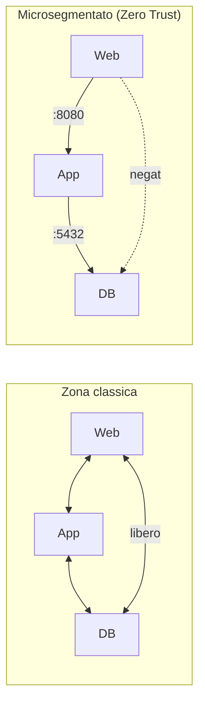

## Perché conta

Il principio "assumere la breccia" ha una conseguenza diretta: se l'attaccante sarà dentro, bisogna
limitare dove può andare. La microsegmentazione è la risposta a livello di rete — portare il
[PEP]() fino al **singolo workload**, così che
ogni carico parli solo con ciò che gli serve. È lo strumento principale contro il movimento laterale,
e la traduzione concreta dello Zero Trust nel piano di rete.

> Questo capitolo inquadra la microsegmentazione nel contesto Zero Trust. Per il come operativo —
> le NetworkPolicy di Kubernetes, il default deny, gli esempi — si veda l'approfondimento dedicato
> [Microsegmentazione: dividere la rete fino al singolo workload]().

## Macro, micro, e lo Zero Trust

La segmentazione classica divide la rete in poche zone con [VLAN]()
e firewall; dentro ogni zona, tutto parla con tutto. La microsegmentazione elimina quel "dentro"
fidato:

Nel modello Zero Trust non esiste una zona fidata: ogni coppia di workload è un confine con la sua
policy. È il principio "non fidarsi mai" applicato al traffico est-ovest (tra server), non solo a
quello nord-sud (verso Internet).

## Identità, non indirizzo

La microsegmentazione Zero Trust non si basa sull'IP — effimero e falsificabile — ma sull'**identità**
del workload: un'etichetta, un ruolo, un certificato. È lo stesso spostamento che abbiamo fatto per
gli utenti ([identità come perimetro]()), applicato
ai servizi. La regola "il DB accetta solo dal ruolo *app*" vale anche quando gli IP dei pod cambiano
a ogni riavvio.

Quando il confine deve anche **autenticare e cifrare** la comunicazione, la segmentazione per
identità incontra [mTLS](): la policy dice chi può
parlare con chi, mTLS prova che è davvero quel chi.

## Default deny: il punto di partenza

Come nell'approfondimento dedicato, la microsegmentazione funziona solo partendo da **nega tutto** e
aprendo le sole rotte necessarie — l'opposto del
[firewall perimetrale]() "apri tutto e blocca le
minacce note". Nel linguaggio PDP/PEP: il PEP davanti a ogni workload nega per default e consente
solo ciò che il PDP autorizza esplicitamente.

## Il prerequisito: conoscere i flussi

La difficoltà non è scrivere le regole, è **sapere** quali flussi sono legittimi. Senza quella mappa,
il default deny spegne l'applicazione. Per questo la microsegmentazione inizia dall'osservazione
(vedi [telemetria e analytics]()): si
raccolgono i flussi reali, si costruisce la mappa, poi si traduce in policy. Strumenti basati su
[eBPF]() come Cilium osservano e poi applicano.

## Lab

In un cluster di test con un CNI che supporti le NetworkPolicy (Calico, Cilium):

1. Distribuite web, app, db con le rispettive etichette.
2. Applicate un `default-deny` di ingresso: tutto si blocca.
3. Aprite solo web→app e app→db; verificate che web→db resti negato.
4. Dimostrate il contenimento: da una shell nel pod web, provate a raggiungere il db e osservate il
   rifiuto. L'approfondimento [dedicato]() ha gli
   esempi YAML completi.



<strong>Domanda:</strong> microsegmentare tutto non produce migliaia di regole impossibili da mantenere?

Il rischio è reale, ed è il motivo per cui la microsegmentazione <em>per identità</em> è gestibile
dove quella per IP non lo sarebbe. Se le regole fossero "l'IP 10.0.0.5 può parlare col 10.0.0.9", con
host effimeri sarebbe ingestibile. Ma la policy Zero Trust si scrive sui <em>ruoli</em> — "i workload
<code>web</code> parlano con i workload <code>app</code> sulla porta applicativa" — e una sola regola
copre tutte le istanze presenti e future di quei ruoli. Il numero di regole cresce con i tipi di
servizio, non col numero di macchine. In più la policy vive nel PDP, in un punto solo, ed è
<a href="/p/policy-as-code-con-opa/">codice versionato</a>, non configurazioni sparse. Resta lavoro —
e per questo non si microsegmenta tutto allo stesso livello, ma si parte dai dati che valgono di più —
però è lavoro che scala con l'architettura, non con l'inventario.



## Conclusione

La microsegmentazione è lo Zero Trust applicato al traffico tra server: niente zona fidata, un
confine per identità attorno a ogni workload, default deny, e contenimento del movimento laterale.
Richiede di conoscere i flussi reali prima di chiudere. È metà della storia dell'accesso di rete;
l'altra metà è come l'utente remoto raggiunge le risorse senza una VPN che lo "porta dentro": è lo
ZTNA, il prossimo capitolo.
