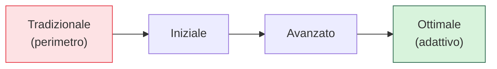

## Perché conta

Dopo 19 capitoli, la tentazione è pensare che lo Zero Trust sia un progetto gigantesco da fare tutto
insieme — e proprio questa idea è il primo motivo per cui i progetti falliscono. Lo Zero Trust non si
compra e non si accende: **si costruisce per gradi**, sopra l'infrastruttura che già avete, dando
valore a ogni passo. Questo capitolo mette insieme la serie in un percorso: come misurare dove siete,
in che ordine procedere, e quali errori evitare.

## Misurare: il modello di maturità

Non si parte da zero e non si arriva a "fatto": ci si **muove lungo un continuum**. Il modello di
maturità della CISA valuta il progresso su pilastri (identità, dispositivi, rete, applicazioni/
workload, dati) attraverso stadi:

| Pilastro | Tradizionale | Ottimale |
|---|---|---|
| Identità | password | [MFA phishing-resistant]() + adattivo |
| Dispositivi | nessun controllo | [postura]() continua |
| Rete | perimetro piatto | [microsegmentazione]() |
| Workload | fiducia implicita | [mTLS]() + policy |
| Dati | in chiaro | [classificati e cifrati]() |

Si valuta ogni pilastro, si trova il più debole, si avanza di uno stadio. Pochi raggiungono
"ottimale" ovunque — né è necessario: la maturità giusta dipende dal rischio.

## La roadmap per fasi

Un ordine che dà valore presto e costruisce sulle basi:

1. **Fondamenta d'identità**: un [IdP]() unico, SSO,
   [MFA resistente al phishing]() ovunque. È il passo
   con il miglior rapporto valore/sforzo: blocca la categoria d'attacco più comune.
2. **Visibilità**: [telemetria]() e mappatura
   dei flussi. Non si segmenta ciò che non si vede.
3. **Accesso senza VPN**: sostituire la VPN con lo [ZTNA]() su
   un'applicazione pilota, poi estendere.
4. **Segmentazione**: [microsegmentare]()
   partendo dai sistemi più critici, con default deny guidato dai flussi osservati.
5. **Identità dei workload**: [mTLS]() /
   [service mesh]() dove i servizi sono tanti.
6. **Policy as code e adattività**: [OPA]() come PDP e
   [accesso adattivo]().
7. **Dati**: [classificazione, cifratura, DLP]().

Ogni fase è utile **da sola**: anche fermarsi dopo la 1 e la 3 migliora molto la postura.

## Gli errori che fanno fallire

- **Comprare "una soluzione Zero Trust"**: nessun prodotto è Zero Trust (cap. 01). Chi compra una
  scatola e la accende ha un prodotto nuovo, non un'architettura.
- **Big bang**: provare a fare tutto insieme paralizza l'organizzazione e non consegna nulla. Lo
  Zero Trust è incrementale per natura.
- **Dimenticare l'usabilità**: se il modello frustra gli utenti, lo aggirano (shadow IT), e la
  sicurezza peggiora. L'[accesso adattivo]()
  esiste per tenere basso l'attrito.
- **Saltare la visibilità**: segmentare senza conoscere i flussi rompe le applicazioni e genera
  sfiducia nel progetto.
- **Trascurare i dati**: proteggere l'accesso e lasciare i dati in chiaro vanifica lo scopo.
- **Ignorare l'identità dei workload**: curare gli utenti e dimenticare il traffico est-ovest lascia
  aperto il movimento laterale.

## Non è mai "finito"

Lo Zero Trust è un **programma**, non un progetto con una data di fine. L'ambiente cambia — nuove
app, nuovi servizi, nuove minacce — e la postura va mantenuta e fatta evolvere. La
[verifica continua]() vale anche
all'organizzazione: ci si rivaluta, si misura la maturità, si avanza.

## Lab

Un esercizio di pianificazione, il più utile della serie:

1. Prendete il [modello di maturità CISA](https://www.cisa.gov/zero-trust-maturity-model) e valutate
   la vostra organizzazione su ciascun pilastro, onestamente.
2. Identificate il pilastro più debole e l'azione di fase 1 che lo migliora di più.
3. Scegliete **una** applicazione o un **un** sistema critico come pilota e applicategli i primi
   passi (identità forte + accesso per-app).
4. Definite come misurerete il successo del pilota prima di estendere.



<strong>Domanda:</strong> con budget e tempo limitati, se potessi fare una sola cosa di tutta questa serie, quale darebbe più sicurezza?

Senza esitazione: identità forte con MFA resistente al phishing ovunque, a partire dagli account
amministrativi. È la singola misura con il miglior rapporto tra valore e sforzo, e il motivo è
statistico: la stragrande maggioranza delle brecce reali inizia con credenziali rubate — phishing,
password riutilizzate, token intercettati — e la <a href="/p/mfa-resistente-al-phishing/">MFA FIDO2</a>
chiude proprio quella porta, rendendo il furto di credenziali inefficace invece che semplicemente più
difficile. Non richiede di riprogettare la rete né di comprare piattaforme costose, e protegge
immediatamente il bersaglio più attaccato. Se restasse margine per una seconda cosa, sarebbe la
visibilità: sapere cosa succede, perché non si può migliorare ciò che non si misura. Ma la prima mossa,
quella che non va rimandata, è togliere alle credenziali rubate il loro potere. Tutto il resto della
serie costruisce da lì.



## Conclusione

Migrare a Zero Trust significa muoversi lungo un continuum di maturità, per fasi che danno valore
subito, costruendo sull'infrastruttura esistente — mai in un big bang, mai comprando una scatola. Si
parte dall'identità forte, si guadagna visibilità, si sostituisce la VPN, si segmenta, si proteggono
workload e dati. Gli errori che lo affondano sono noti ed evitabili. E non finisce: lo Zero Trust è un
programma che si rivaluta come rivaluta gli accessi. Qui si chiude la serie — venti capitoli dal
principio alla pratica — ma per la vostra rete è il punto di partenza.
