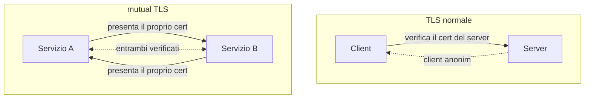

## Perché conta

Nel [capitolo su TLS]() il server dimostra la propria identità al
client con un certificato. Ma il client resta anonimo: TLS verifica che stiate parlando con
`banca.it`, non che `banca.it` stia parlando con voi. Per un sito web va bene — l'utente si
autenticherà dopo, con la password. Per due **servizi** che si parlano in un'architettura a
microservizi, invece, non c'è nessun "dopo": il servizio A deve sapere, subito e con certezza, che
chi lo contatta è davvero il servizio B. Questo è il mutual TLS.

## TLS normale contro mTLS



In mTLS il server, durante l'handshake, invia un messaggio `CertificateRequest`: chiede al client
di presentare **a sua volta** un certificato. L'handshake si completa solo se **entrambi** i
certificati sono validi e firmati da una CA di cui l'altro si fida. L'identità è reciproca e provata
a livello di trasporto, prima che passi un solo byte applicativo.

## Dove serve davvero

mTLS brilla dove non c'è un utente umano a digitare una password:

- **Microservizi**: decine di servizi che si chiamano a vicenda dentro un cluster. mTLS dà a
  ciascuno un'identità crittografica e cifra tutto il traffico interno.
- **Zero Trust**: il principio "mai fidarsi della rete" (vedi
  [Zero Trust Architecture]()) richiede che ogni
  chiamata sia autenticata, anche dentro il perimetro. mTLS è il meccanismo.
- **API tra organizzazioni**: due aziende che si scambiano dati possono legare l'accesso a un
  certificato invece che a una API key, che è solo una stringa da rubare.

## L'identità sta nel certificato

La differenza rispetto a una API key è sostanziale. Una key è un segreto condiviso: chi la ruba
diventa te. Un certificato client lega l'identità a una **chiave privata** che non lascia mai il
servizio; sul filo viaggia solo una firma, mai il segreto. E un certificato ha una scadenza e si può
revocare, mentre una key resta valida finché qualcuno non se ne accorge.

L'identità del chiamante viene letta dal campo del certificato, ad esempio il Subject o un SAN:

```bash
# generare un certificato client firmato dalla CA interna
openssl req -new -newkey ed25519 -nodes -keyout svcA.key -out svcA.csr \
    -subj "/CN=service-a.internal"
openssl x509 -req -in svcA.csr -CA ca.crt -CAkey ca.key -out svcA.crt -days 90
```

Certificati a vita **breve** (giorni, non anni) riducono il danno di una chiave compromessa: è il
modello di SPIFFE/SPIRE, che emette identità effimere ai workload.

## La configurazione (nginx)

Lato server, abilitare la verifica del certificato client è questione di tre direttive:

```nginx {hl_lines=[4,5]}
server {
    listen 443 ssl;
    ssl_certificate     /etc/tls/server.crt;
    ssl_certificate_key /etc/tls/server.key;
    ssl_client_certificate /etc/tls/ca.crt;   # la CA che firma i client fidati
    ssl_verify_client on;                       # richiedi e verifica il cert del client
    location / {
        # passa l'identità del client all'applicazione
        proxy_set_header X-Client-CN $ssl_client_s_dn;
    }
}
```

Le due righe evidenziate trasformano un normale server TLS in un endpoint mTLS: `ssl_verify_client
on` rifiuta chi non presenta un certificato valido firmato dalla CA indicata.

## Il vero costo: gestire i certificati

mTLS è potente ma sposta il problema sulla **gestione dei certificati**. Con decine di servizi e
certificati a vita breve, l'emissione e la rotazione manuale non sono praticabili. Per questo mTLS
"su larga scala" vive quasi sempre dentro un **service mesh** (Istio, Linkerd) o un sistema come
SPIRE, che emettono e ruotano i certificati automaticamente, trasparenti all'applicazione. Senza
automazione, mTLS tra molti servizi diventa ingestibile — ed è l'errore più comune di chi lo adotta.

## Lab

Con una CA di test e due servizi (o `openssl s_server`/`s_client`):

1. Create una CA, un certificato server e un certificato client, tutti firmati dalla CA.
2. Avviate il server con `ssl_verify_client on`.
3. Connettetevi **senza** certificato client: deve fallire.
4. Connettetevi **con** il certificato client: deve riuscire, e il server deve vedere il CN.
5. Provate un certificato firmato da un'altra CA: deve essere rifiutato.


<details>
<summary><strong>Domanda:</strong> se il traffico tra microservizi è già dentro un cluster privato, perché cifrarlo e autenticarlo con mTLS?</summary>
<p>Perché "dentro il cluster" non significa "fidato". È proprio l'assunzione che il
<a href="/p/zero-trust-architecture/">modello Zero Trust</a> smonta: se un attaccante compromette un
singolo pod o si inserisce nella rete interna (pensate all'ARP spoofing del
<a href="/p/layer2-attacks-arp-spoofing/">capitolo 02</a>), senza mTLS può leggere il traffico tra
servizi e impersonarne uno, perché nulla verifica le identità. mTLS rende quel traffico illeggibile e
ogni chiamata autenticata: anche chi entra nella rete non può né ascoltare né fingersi un altro
servizio. La rete piatta e fidata è esattamente ciò che non vogliamo più dare per scontato.</p>
</details>


## Conclusione

mTLS estende TLS dall'autenticazione del solo server a quella reciproca: entrambe le parti provano
chi sono con un certificato. È il modo in cui i servizi si fidano l'uno dell'altro senza affidarsi
alla rete, e il mattone dell'architettura Zero Trust. Il prezzo è la gestione dei certificati, che
su scala richiede automazione — un service mesh o SPIRE — altrimenti il rimedio diventa più
oneroso del problema.
