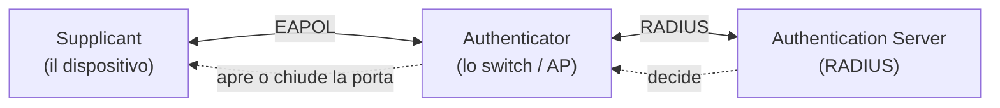
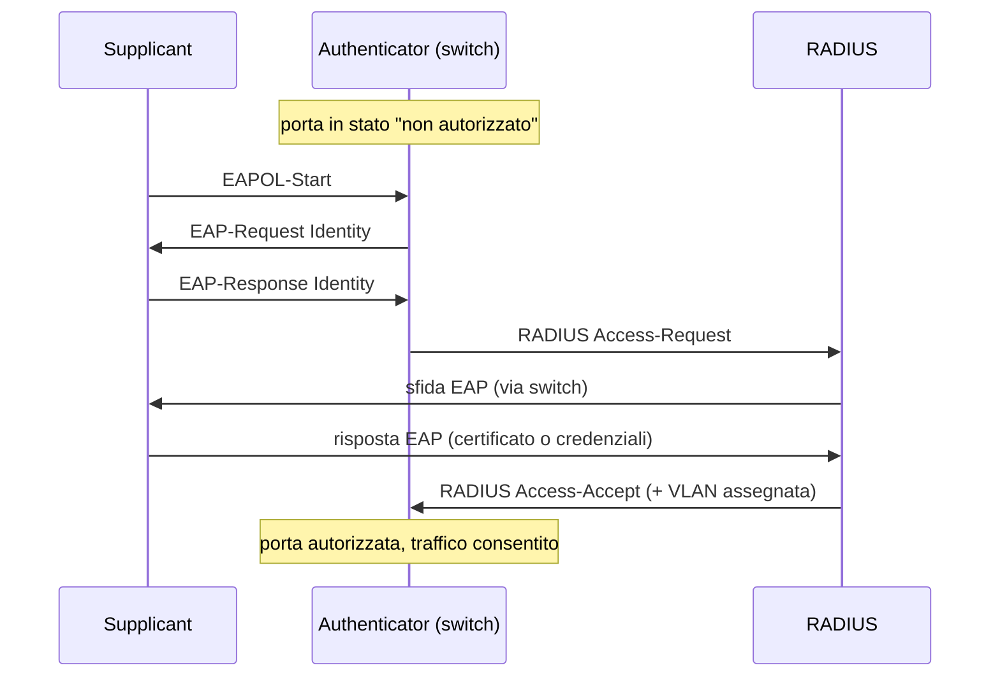

## Perché conta

Nel [capitolo sugli attacchi L2]() la port security
limitava quanti MAC può usare una porta. Ma un MAC si falsifica in un secondo: non prova **chi** sei,
solo che usi un certo indirizzo. In una rete seria — un ufficio, un campus — serve che un dispositivo
si **autentichi** prima di ottenere accesso alla LAN. Questo è 802.1X, il cuore del Network Access
Control (NAC): la porta dello switch resta chiusa finché non sai dimostrare di avere diritto a
entrare.

## I tre attori

802.1X definisce un dialogo a tre:



- **Supplicant**: il client che vuole entrare (un PC, un telefono).
- **Authenticator**: lo switch o l'access point. Non decide: fa da tramite. Tiene la porta in stato
  "non autorizzato" e inoltra solo il traffico di autenticazione (EAPOL) finché non riceve il via
  libera.
- **Authentication Server**: tipicamente **RADIUS**. È lui che verifica le credenziali e dice allo
  switch sì o no.

La separazione è il punto di forza: lo switch non conserva credenziali, le centralizza nel server.
Aggiungere o revocare un utente si fa in un posto solo.

## EAP: il metodo dentro il protocollo

802.1X trasporta **EAP**, che non è un singolo metodo ma un contenitore. Il metodo scelto decide
*come* ci si autentica:

| Metodo EAP | Credenziale | Note |
|---|---|---|
| EAP-TLS | certificato client | il più sicuro; richiede una PKI |
| PEAP / EAP-TTLS | utente + password in un tunnel TLS | più semplice da distribuire |
| EAP-MD5 | hash della password | obsoleto, nessuna protezione: da non usare |

EAP-TLS lega l'accesso a un **certificato** per dispositivo: niente password da rubare, e si integra
con una PKI interna. È la scelta migliore dove si può gestire l'emissione dei certificati.

## Il flusso di autenticazione



Un dettaglio potente: nell'`Access-Accept` il server può indicare **quale VLAN** assegnare alla
porta. Così un dipendente finisce nella VLAN uffici, un dispositivo ospite in quella ospiti, un
telefono VoIP nella sua — tutto deciso dall'identità, non dalla porta fisica. È la segmentazione
dinamica, vicina al principio [Zero Trust]().

## Configurazione: lo switch e RADIUS

Lato switch (sintassi tipo Cisco):

```text {hl_lines=[2,4]}
! abilita 802.1X globalmente e sulla porta
dot1x system-auth-control
interface Gi0/1
  authentication port-control auto      ! la porta richiede autenticazione
  dot1x pae authenticator
  spanning-tree portfast
```

La riga `authentication port-control auto` è il fulcro: mette la porta in modalità controllata,
dove l'accesso dipende dall'esito di 802.1X.

Lato FreeRADIUS, un client (lo switch) in `clients.conf` e gli utenti/certificati nel backend. Il
server valuta le richieste e risponde Accept/Reject, opzionalmente con gli attributi VLAN.

## Il problema dei dispositivi senza supplicant

Non tutto parla 802.1X: stampanti, telecamere IP, vecchi apparati. Per loro esistono ripieghi:

- **MAB (MAC Authentication Bypass)**: la porta autentica in base al MAC (debole, ma almeno
  centralizzato e tracciato).
- **Guest VLAN**: chi non si autentica finisce in una VLAN isolata con accesso minimo.

MAB eredita la debolezza del MAC spoofing: va usato solo dove 802.1X è impossibile, e limitando
pesantemente ciò che quella VLAN può raggiungere.

## Lab

Con FreeRADIUS e uno switch (o `hostapd` in modalità wired 802.1X, o Open vSwitch con un supplicant
`wpa_supplicant`):

1. Configurate FreeRADIUS con un utente di test (PEAP) e lo switch come client RADIUS.
2. Sul client, configurate `wpa_supplicant` per 802.1X e collegatevi.
3. Osservate la porta passare da "non autorizzato" ad "autorizzato".
4. Provate a collegare un dispositivo senza credenziali: deve restare bloccato o finire nella guest
   VLAN.


<details>
<summary><strong>Domanda:</strong> 802.1X autentica la porta all'inizio; cosa impedisce a un attaccante di staccare il cavo del PC autenticato e collegare il proprio?</summary>
<p>È un limite reale di 802.1X "classico". Se la porta autentica una volta e poi resta aperta, un
attaccante che si inserisce fisicamente dopo l'autenticazione (o con un hub tra PC e presa) può
sfruttare la sessione. Le contromisure sono: la <strong>ri-autenticazione periodica</strong> (il
server forza nuove verifiche a intervalli), il legame con MACsec (802.1AE) che cifra e autentica
ogni frame a livello 2, e il monitoraggio del link-down sulla porta (se il cavo si stacca, la porta
torna non autorizzata). È anche il motivo per cui 802.1X è un controllo d'accesso, non una garanzia
assoluta: va accompagnato dalla segmentazione e dal monitoraggio.</p>
</details>


## Conclusione

802.1X sposta il controllo d'accesso dalla porta fisica all'identità: nessuno entra in rete senza
autenticarsi presso un server RADIUS centrale, e la VLAN può essere assegnata in base a chi sei. È
il passo che la port security da sola non può fare. I punti aperti — dispositivi senza supplicant,
sessioni dopo l'autenticazione — si coprono con MAB limitato, ri-autenticazione e, dove serve,
MACsec.
