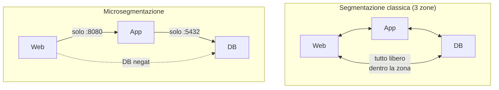

## Perché conta

La segmentazione tradizionale divide la rete in poche zone — uffici, server, ospiti — tipicamente
con [VLAN]() e firewall tra di esse. Il
problema: *dentro* una zona, tutto parla con tutto. Un attaccante che compromette un singolo
server nella zona "server" può muoversi liberamente verso gli altri. Questo **movimento laterale**
è il modo in cui una singola macchina violata diventa una violazione dell'intera infrastruttura.
La microsegmentazione risponde portando il confine fino al singolo workload: ogni carico di lavoro
ha la sua politica, e ciò che non è esplicitamente permesso è negato.

## Macro contro micro



Nel modello classico, se il web server è compromesso raggiunge direttamente il DB. Nel modello
microsegmentato il web può parlare *solo* all'app sulla porta applicativa, e solo l'app raggiunge
il DB: la rotta web→DB semplicemente non esiste. L'attaccante sul web server trova ogni altra
porta chiusa.

## L'identità, non l'indirizzo IP

La svolta della microsegmentazione è che le regole non si basano più sull'IP — che cambia, si
riusa, si falsifica — ma sull'**identità** del workload: un'etichetta, un ruolo, un certificato.
Questo è anche il legame con il [modello Zero Trust]():
la posizione in rete non conferisce fiducia, l'identità sì.

```yaml {hl_lines=[8,9,10,11]}
# Kubernetes NetworkPolicy: il DB accetta solo dall'app, solo sulla 5432
apiVersion: networking.k8s.io/v1
kind: NetworkPolicy
metadata:
  name: db-allow-app-only
spec:
  podSelector:
    matchLabels: { role: database }
  ingress:
    - from:
        - podSelector: { matchLabels: { role: app } }
      ports:
        - { protocol: TCP, port: 5432 }
```

Le righe evidenziate sono la regola: *solo* i pod con etichetta `role: app` possono raggiungere il
database, *solo* sulla 5432. Gli IP dei pod cambiano a ogni riavvio; l'etichetta no. La politica
sopravvive alla volatilità dell'infrastruttura.

## Default deny: il principio che regge tutto

La microsegmentazione funziona solo se la posizione di partenza è **nega tutto**. In Kubernetes,
una volta che un pod è selezionato da una policy di ingress, tutto ciò che non è esplicitamente
permesso è bloccato. Si parte chiudendo, poi si aprono le sole rotte necessarie — l'opposto del
modello "apri tutto, poi blocca le minacce note" dei [firewall perimetrali]().

```yaml
# default deny: nessun ingresso a meno che un'altra policy lo permetta
apiVersion: networking.k8s.io/v1
kind: NetworkPolicy
metadata: { name: default-deny-ingress }
spec:
  podSelector: {}        # tutti i pod del namespace
  policyTypes: [Ingress]
```

## Il vero costo: conoscere i flussi

Scrivere le politiche è la parte facile. La parte difficile è **sapere** quali flussi sono
legittimi: quale servizio parla con quale, su quale porta, in condizioni normali. Senza questa
mappa, il default deny spegne l'applicazione. Per questo la microsegmentazione inizia quasi sempre
con una fase di **osservazione** (vedi [network observability]()):
si raccolgono i flussi reali, si costruisce la mappa, poi si traduce in politiche. Strumenti basati
su [eBPF]() come Cilium fanno proprio questo — osservano
e poi applicano.

## Lab

In un cluster di test (kind, minikube) con un CNI che supporti le NetworkPolicy (Calico, Cilium —
vedi [CNI plugins]()):

1. Distribuite tre pod: web, app, db con le relative etichette.
2. Verificate che, senza policy, web raggiunge direttamente db (il problema).
3. Applicate il `default-deny-ingress`: tutto si blocca.
4. Aggiungete le policy che aprono web→app e app→db: l'applicazione torna a funzionare, ma web→db
   resta negato.
5. Dimostrate il contenimento: da una shell nel pod web, provate a connettervi al db e osservate il
   rifiuto.


<details>
<summary><strong>Domanda:</strong> se ho già firewall e VLAN tra le zone, la microsegmentazione non è solo complessità in più?</summary>
<p>Dipende da cosa volete fermare. Firewall e VLAN fermano l'attaccante <em>tra</em> le zone, ma non
fanno nulla contro il movimento <em>dentro</em> una zona — ed è lì che avviene la maggior parte dei
danni dopo una compromissione iniziale. Un ransomware che entra da una workstation di una VLAN uffici,
in un modello classico, raggiunge ogni altra macchina di quella VLAN senza incontrare un solo
controllo. La microsegmentazione è l'unico modello che contiene questo: anche la macchina accanto è
"fuori" per default. Il costo è reale — serve conoscere i flussi e gestirne le politiche — e per questo
non si applica ovunque allo stesso livello: si concentra dove i dati valgono di più. Non sostituisce il
perimetro, lo completa partendo dall'assunto che il perimetro verrà bucato.</p>
</details>


## Conclusione

La microsegmentazione sposta il confine di sicurezza dalle poche zone di rete al singolo workload,
e lo fa legando le politiche all'identità invece che all'indirizzo. Il suo scopo preciso è
contenere il movimento laterale: trasformare una singola macchina compromessa in un vicolo cieco
invece che in un trampolino. Regge su un principio — default deny — e su un prerequisito — conoscere
i flussi reali. È la traduzione concreta, a livello di rete, del principio Zero Trust.
