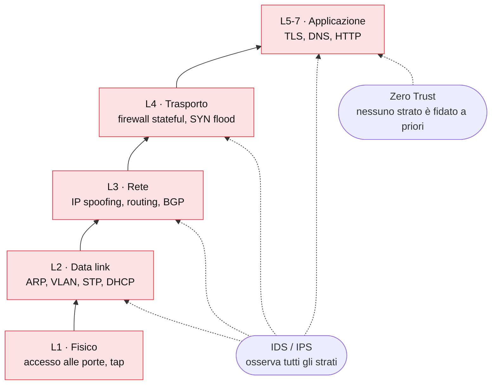
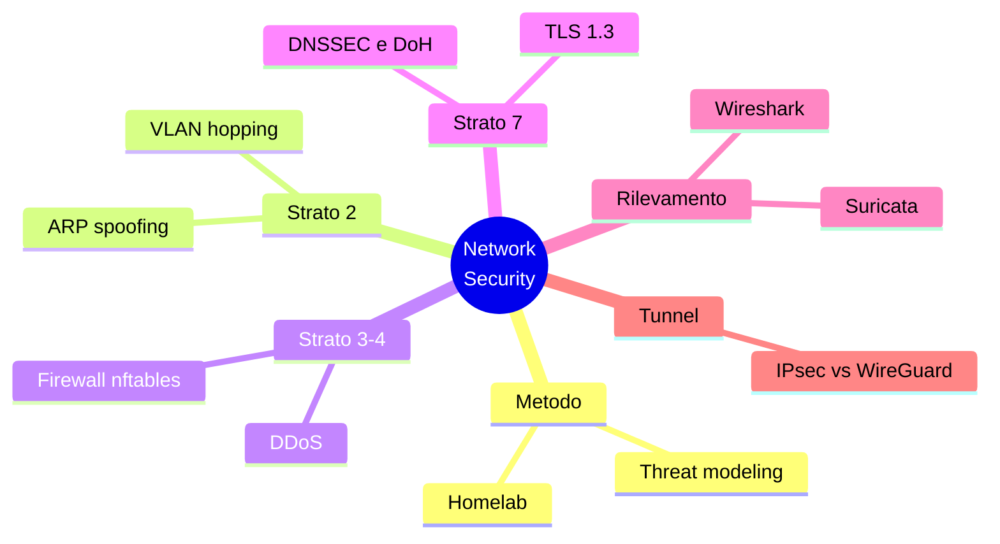

## Perché una serie, e perché "dal cavo in su"

Sulla sicurezza delle reti si trovano due tipi di materiale: guide molto teoriche, che elencano
acronimi senza mai mostrare un pacchetto, e tutorial che spiegano come lanciare uno strumento
senza dire perché funziona. Questa serie prova a stare in mezzo.

L'idea è semplice: partire dal livello più basso, il cavo e lo switch, e salire uno strato alla volta
fino a TLS e DNS. Per ogni livello vediamo **come funziona il protocollo**, **come viene
attaccato** e **come lo si difende**, con comandi reali e un piccolo laboratorio da rifare a casa.


Security is a process, not a product.


Questo post è la mappa: resta fissato in cima al blog e verrà aggiornato man mano che escono i
capitoli.

## Il modello a strati

Ogni livello della rete si fida di quello sotto. Se un attaccante controlla lo strato 2, può
leggere e modificare tutto quello che ci passa sopra, a meno che uno strato superiore (ad esempio
TLS) non aggiunga protezioni proprie. Per questo la difesa si costruisce **in profondità**: ogni
strato deve reggere anche quando quello sotto è compromesso.



La freccia va dal basso verso l'alto: è la direzione in cui si propaga la fiducia, e quindi
anche il danno.

## La mappa della serie



| # | Capitolo | Di cosa parla | Stato |
|---|---|---|---|
| 00 | **Questa roadmap** | Mappa e metodo | ✅ |
| 01 | [Threat modeling per le reti]() | STRIDE applicato a una rete reale | ✅ |
| 02 | [Attacchi a livello 2]() | ARP spoofing, MAC flooding, DHCP starvation | ✅ |
| 03 | [VLAN hopping e hardening degli switch]() | Double tagging, DTP, port security | ✅ |
| 04 | [Firewall stateful con nftables]() | Da iptables a nftables, conntrack | ✅ |
| 05 | [IDS/IPS con Suricata]() | Installazione e scrittura di regole | ✅ |
| 06 | [TLS 1.3 in profondità]() | Handshake, PKI, certificate pinning | ✅ |
| 07 | [Sicurezza del DNS]() | Cache poisoning, DNSSEC, DoH/DoT | ✅ |
| 08 | [Anatomia di un DDoS]() | Attacchi volumetrici, amplificazione, mitigazione | ✅ |
| 09 | [IPsec vs WireGuard]() | Confronto pratico | ✅ |
| 10 | [Analisi dei pacchetti]() | Trovare un attacco in un pcap | ✅ |
| 11 | [Un homelab per la sicurezza]() | OPNsense, VLAN, Suricata | ✅ |

## Cosa c'è già sul blog

Alcuni argomenti li ho già trattati in post separati, che la serie riprende e collega:

- [Sicurezza di BGP con RPKI](): come si valida l'origine di una rotta.
- [Zero Trust Architecture](): il modello "mai fidarsi, verificare sempre".
- [Network Security Mesh](): la sicurezza oltre il perimetro.
- [SASE](): rete e sicurezza come servizio cloud.
- [WireGuard](): la base per il capitolo 09.

## Come leggere i capitoli

Ogni capitolo segue lo stesso schema, così è facile orientarsi:

1. **Perché conta**: il problema in due paragrafi.
2. **Come funziona**: il protocollo, con un diagramma.
3. **L'attacco**: cosa fa l'attaccante, con comandi veri.
4. **La difesa**: la configurazione che lo blocca, con le righe importanti evidenziate.
5. **Lab**: un esercizio da fare nel proprio laboratorio, con la soluzione nascosta.

Gli attacchi vanno provati **solo in un laboratorio vostro** o su reti per cui avete
un'autorizzazione scritta. Il capitolo 11 spiega come costruirne uno con poca spesa.

### Cosa serve per i lab

Basta un PC Linux con 16 GB di RAM. Per quasi tutti i capitoli usiamo
[containerlab](https://containerlab.dev/): descrive una topologia in un solo file YAML, avvia i
nodi come container (quindi consuma poca RAM) e usa un vero switch [Open vSwitch](https://www.openvswitch.org/)
quando serve lavorare sulle VLAN. Solo il capitolo 11 passa a macchine virtuali intere.

La topologia minima dei primi capitoli — attaccante, vittima, gateway e uno switch — sta in un
file `lab-l2.clab.yml`:

```yaml
name: lab-l2
topology:
  nodes:
    sw0:       { kind: ovs-bridge }          # switch reale (Open vSwitch, pre-creato)
    gateway:   { kind: linux, image: alpine:3.20 }
    victim:    { kind: linux, image: alpine:3.20 }
    attacker:  { kind: linux, image: alpine:3.20 }
  links:
    - endpoints: ["gateway:eth1",  "sw0:p-gw"]
    - endpoints: ["victim:eth1",   "sw0:p-victim"]
    - endpoints: ["attacker:eth1", "sw0:p-attacker"]
```

```bash
sudo ovs-vsctl add-br sw0 && sudo ip link set sw0 up   # crea lo switch una volta
sudo containerlab deploy -t lab-l2.clab.yml            # avvia il lab
sudo containerlab destroy -t lab-l2.clab.yml           # lo smonta
```


<details>
<summary><strong>Esercizio zero:</strong> perché lo switch è un nodo Open vSwitch e non un normale bridge Linux?</summary>
<p>Un bridge Linux fa passare i frame tra i nodi, ma gestisce le VLAN 802.1Q in modo limitato: il
double tagging del capitolo 03 ha bisogno di un dataplane che tratti i tag come uno switch vero.
Open vSwitch lo fa, e permette di configurare porte access e trunk con <code>ovs-vsctl</code>,
proprio come su uno switch gestito. Per ARP spoofing, DHCP e MAC flooding (capitolo 02) basterebbe
anche il bridge, ma usare OVS da subito evita di cambiare lab a metà serie.</p>
</details>


## Conclusione

La sicurezza di una rete è forte quanto il suo strato più debole. Questa serie li attraversa tutti
in ordine, dal livello più basso al più alto, mostrando per ciascuno un attacco concreto e la sua
difesa.

**Prossimo nella serie:** [01 · Threat modeling per le reti](). Prima di difendere qualcosa bisogna
sapere cosa si sta difendendo e da chi.
