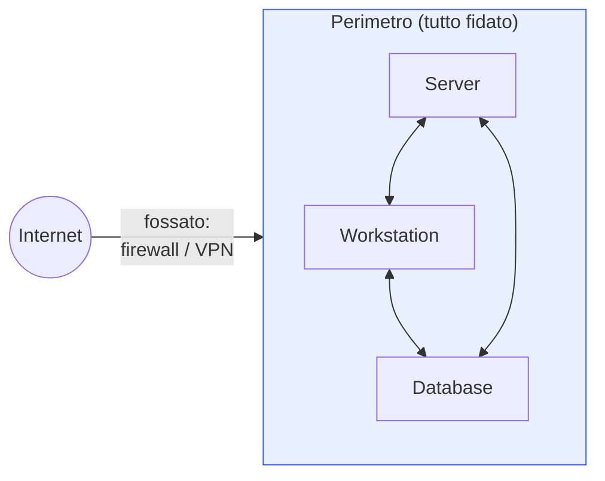
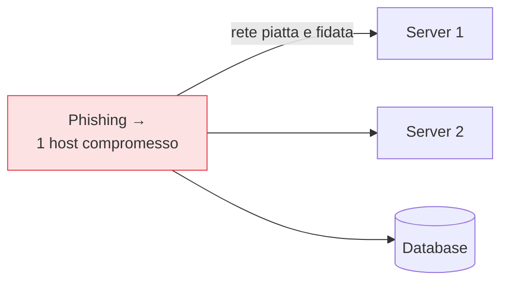

## Perché conta

Per capire dove va lo Zero Trust bisogna capire cosa sta sostituendo. Il modello che ha dominato la
sicurezza di rete per trent'anni è il **castello e fossato**: un perimetro forte (firewall, VPN) che
separa il "dentro" fidato dal "fuori" ostile. Ha funzionato finché il dentro e il fuori erano
luoghi fisici chiari. Oggi non lo sono più, e il modello non solo è insufficiente: è attivamente
pericoloso. Questo è il problema che i [cinque principi]()
risolvono.

## Il modello castello-e-fossato

L'idea: autenticarsi una volta all'ingresso (la VPN), e poi muoversi liberi all'interno. La fiducia
è **binaria e posizionale**: sei dentro, quindi sei fidato. Semplice, e per questo adottato
ovunque.

## Cosa l'ha rotto

Tre cambiamenti hanno dissolto il perimetro:

- **Cloud**: le risorse non sono più "dentro". Un'applicazione SaaS o un carico su un cloud pubblico
  vive fuori dal perimetro per definizione. Dove tracci il fossato attorno a qualcosa che non
  possiedi?
- **Mobile e lavoro remoto**: gli utenti non sono più "dentro". Accedono da casa, da un bar, da un
  telefono. Il perimetro diventa poroso di VPN, e la VPN concede proprio ciò che non vogliamo:
  accesso di rete ampio una volta entrati.
- **Movimento laterale**: l'attaccante non resta "fuori". Una volta compromesso un singolo host
  interno — un allegato aperto, una credenziale rubata — il modello che si fida di tutto il dentro gli
  regala l'intera rete.

## Il peccato originale: fiducia implicita

Il difetto non è tecnico, è concettuale: **la posizione di rete conferisce fiducia**. Nel castello,
un pacchetto che arriva da un IP interno è trattato come legittimo. Ma un attaccante che ha un piede
dentro genera pacchetti da IP interni. La fiducia implicita trasforma una singola compromissione in
un disastro.

È lo stesso meccanismo che la [microsegmentazione]()
e le difese di [livello 2]() cercano di contenere: il
problema non è l'ingresso, è la libertà di movimento dopo.

## La svolta: BeyondCorp

Il caso che ha reso concreta l'alternativa è **BeyondCorp** di Google: spostare i controlli di
accesso dal perimetro di rete a ogni singola richiesta, basandoli su identità e dispositivo invece
che sulla rete. L'idea radicale: trattare la rete interna come **ostile quanto Internet**. Nessuna
VPN che "porta dentro"; ogni applicazione verifica ogni accesso per conto proprio.

## Dal fossato alla verifica

Il passaggio è questo: la fiducia smette di essere un luogo (dentro il perimetro) e diventa una
**decisione** (questa richiesta, ora, da questa identità e questo dispositivo, è legittima?). Il
perimetro non sparisce del tutto — resta utile come prima linea — ma smette di essere la base della
fiducia. La base diventa l'[identità]().

## Lab

Un esercizio di mappatura, non di configurazione:

1. Disegnate il perimetro attuale della vostra rete: dove sono i firewall e le VPN?
2. Elencate le risorse che stanno **fuori** da quel perimetro (SaaS, cloud) e gli utenti che accedono
   da fuori. Quanto del traffico reale attraversa davvero il fossato?
3. Scegliete un host interno e chiedetevi: se fosse compromesso ora, quali altre risorse
   raggiungerebbe senza incontrare un controllo? Quella lista è il costo della fiducia implicita.



<strong>Domanda:</strong> se la rete interna va trattata come ostile, allora firewall e VPN sono inutili e vanno buttati?

No, cambiano ruolo. Il firewall perimetrale resta utile come igiene di base — riduce il rumore,
blocca scansioni e traffico palesemente indesiderato — ma smette di essere ciò su cui si <em>fonda</em>
la fiducia. La VPN è il caso più delicato: nella sua forma classica dà accesso di rete piatto una volta
connessi, ed è esattamente l'anti-pattern dello Zero Trust; viene sostituita dallo
<a href="/p/ztna-oltre-la-vpn/">ZTNA</a>, che dà accesso alla singola applicazione e non alla rete.
Quindi: il perimetro diventa un livello fra i tanti (difesa in profondità), non il livello. L'errore
è buttare tutto e credere che un prodotto "Zero Trust" sostituisca ogni cosa; il modello è stratificato,
e il vecchio perimetro è uno degli strati, non più il fondamento.



## Conclusione

Il castello-e-fossato è caduto perché dentro e fuori hanno smesso di essere luoghi: il cloud, il
mobile e il movimento laterale hanno reso la fiducia posizionale un rischio invece che una
protezione. Lo Zero Trust risponde spostando la fiducia da dove sei a chi sei e in che stato. Il
prossimo capitolo entra nel cuore di questo spostamento: l'identità come nuovo perimetro.
