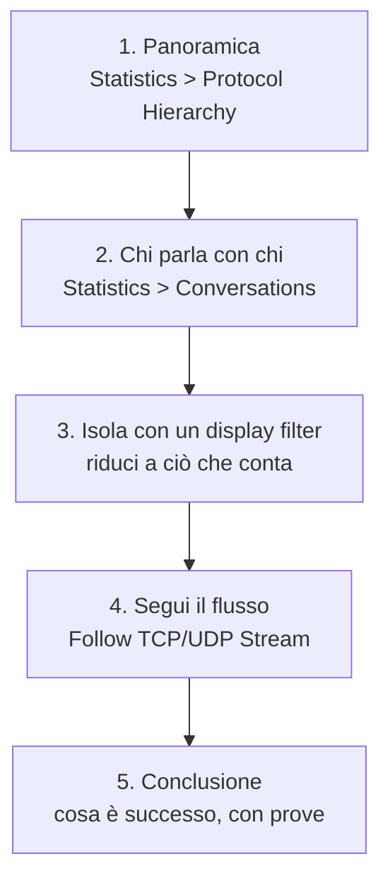

## Perché conta

Ogni capitolo finora ha prodotto traffico: ARP falsi, scan, query DNS avvelenate, SYN flood. Un
file di cattura — un **pcap** — li contiene tutti, byte per byte. Saper leggere un pcap è
l'abilità che chiude il cerchio: è così che dopo un incidente si ricostruisce cosa è successo, ed
è il modo migliore per **capire davvero** i protocolli, vedendoli al lavoro invece che descritti.

Wireshark è lo strumento grafico; `tshark` è la sua versione da riga di comando, utile nel lab e
negli script. Tutte le catture di questo capitolo si producono nel lab containerlab rifacendo gli
attacchi dei capitoli precedenti.

## Un metodo, non clic a caso

Aprire un pcap da 200.000 pacchetti e scorrere a caso non porta da nessuna parte. Il metodo è
sempre lo stesso, dal generale al particolare:



1. **Protocol Hierarchy** dice di che traffico è fatto la cattura: tanto ARP? un picco di DNS? È la
   prima anomalia da cercare.
2. **Conversations** elenca le coppie di host e quanto traffico scambiano: un host che parla con
   tutti gli altri è sospetto.
3. I **display filter** riducono il rumore. Sono la vera competenza di Wireshark.
4. **Follow Stream** ricostruisce una conversazione intera come la vedrebbe un'applicazione.

## Filtri di cattura e filtri di visualizzazione

Due sistemi diversi, spesso confusi:

- **Capture filter** (sintassi BPF, come tcpdump): decide cosa **registrare**. Applicato prima,
  non si può disfare. Es. `host 10.0.0.10`.
- **Display filter** (sintassi Wireshark): decide cosa **mostrare** di ciò che è già catturato.
  Si cambia a piacere. Es. `ip.addr == 10.0.0.10 && tcp.flags.syn == 1`.

Si cattura largo e si filtra stretto: meglio avere tutto e nascondere, che scoprire dopo di non
aver registrato il pacchetto che serviva.

## Ritrovare gli attacchi della serie

### ARP spoofing (capitolo 02)

Wireshark ha un rilevatore integrato. Il segno è lo stesso MAC che si annuncia per due IP diversi,
o un IP che cambia MAC:

```text
# display filter: tutte le reply ARP
arp.opcode == 2
```

Nel pannello "Expert Information" compare l'avviso `duplicate IP address configured`: è l'ARP
spoofing visto dall'analizzatore. In `tshark`:

```bash
tshark -r cattura.pcap -Y 'arp.duplicate-address-detected' -T fields -e arp.src.proto_ipv4 -e arp.src.hw_mac
```

### Port scan SYN (capitoli 04-05)

Un singolo host che invia tanti SYN a porte diverse senza completare gli handshake:

```text
tcp.flags.syn == 1 && tcp.flags.ack == 0
```

In Conversations si vede un host con centinaia di connessioni, ognuna di pochi pacchetti: lo schema
dello scan.

### DNS poisoning (capitolo 07)

Due risposte per la stessa query con IP diversi, o una risposta che arriva prima della domanda al
server reale:

```text
dns.flags.response == 1 && dns.qry.name == "banca.it"
```

Confrontare l'IP nella risposta con quello atteso rivela la falsificazione.

## tshark nel lab

`tshark` rende l'analisi riproducibile e scriptabile. Esempi utili:

```bash
# le 10 conversazioni più voluminose
tshark -r cattura.pcap -q -z conv,ip

# gerarchia dei protocolli (la panoramica, da riga di comando)
tshark -r cattura.pcap -q -z io,phs

# estrarre tutte le query DNS con l'IP di risposta
tshark -r cattura.pcap -Y 'dns.flags.response==1' \
  -T fields -e dns.qry.name -e dns.a
```

## Un caso completo

Mettiamo insieme il metodo su una cattura prodotta nel lab durante un ARP spoofing:

1. **Protocol Hierarchy**: una quota di ARP molto più alta del normale. Sospetto.
2. **Conversations / ARP**: un MAC (l'attaccante) invia reply per due IP, il gateway e la vittima.
3. **Filtro** `arp.opcode == 2`: si vedono le reply non richieste, ripetute ogni paio di secondi.
4. **Follow Stream** su una connessione TCP della vittima: i pacchetti passano fisicamente dal MAC
   dell'attaccante, pur essendo indirizzati al gateway.
5. **Conclusione**: ARP spoofing in corso dall'host con quel MAC, con prova nei pacchetti e negli
   orari.

## Lab

1. Nel lab, avviate una cattura (`tshark -i <switch-port> -w caso.pcap`) e lanciate uno degli
   attacchi dei capitoli 02, 04 o 07.
2. Fermate la cattura e apritela in Wireshark.
3. Applicate il metodo in cinque passi e scrivete una conclusione in tre righe: chi, cosa, con
   quale prova.
4. Rifatelo per un secondo attacco, senza sapere in anticipo quale: alleno il riconoscimento.


<details>
<summary><strong>Domanda:</strong> in una cattura fatta su una porta normale dello switch, perché potreste non vedere il traffico tra altri due host?</summary>
<p>Perché uno switch, a differenza di un hub, inoltra i frame solo alla porta del destinatario: sulla
vostra porta arriva solo il vostro traffico (più broadcast e multicast). Per catturare il traffico
di altri host serve una <strong>porta mirror</strong> (SPAN) configurata sullo switch, che copia il
traffico di altre porte verso la vostra. È lo stesso motivo per cui l'IDS del
<a href="/p/ids-ips-suricata/">capitolo 05</a> in modalità passiva ha bisogno di una porta mirror.
Paradossalmente, durante un MAC flooding riuscito (capitolo 02) vedreste <em>tutto</em>, perché lo
switch degradato si comporta come un hub: la stessa anomalia è sia l'attacco sia il sintomo.</p>
</details>


## Conclusione

L'analisi dei pacchetti è l'abilità che unisce la serie: ogni attacco studiato lascia una traccia
riconoscibile nel pcap, e un metodo ordinato — panoramica, conversazioni, filtro, flusso,
conclusione — la trova senza affogare nei dati. È anche il modo più efficace per interiorizzare i
protocolli: vederli, non leggerli.

Resta un ultimo passo: mettere insieme tutto in un ambiente permanente dove continuare a
sperimentare. Il prossimo e ultimo capitolo costruisce l'homelab completo.

**Prossimo nella serie:** [11 · Un homelab per la sicurezza]() ·
[Torna alla roadmap]()
