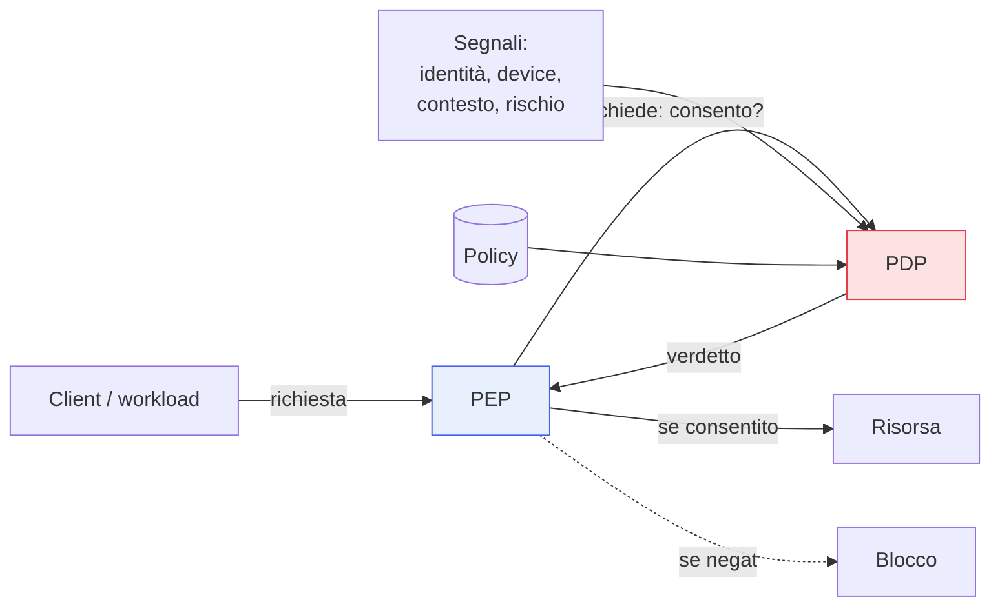

## Perché conta

Abbiamo un'[identità verificata]() con
[autenticazione forte](). Ma chi decide se *questa*
identità può accedere a *questa* risorsa, *ora*? E chi lo fa rispettare? Lo Zero Trust separa
nettamente i due compiti: un componente **decide** (PDP), un altro **applica** (PEP). È l'astrazione
centrale del [NIST 800-207](), e capirla rende tutto il
resto della serie leggibile come variazioni di questo schema.

## I due componenti

- **PDP — Policy Decision Point**: il cervello. Valuta ogni richiesta rispetto alle policy e ai
  segnali (identità, dispositivo, contesto, rischio) e produce un verdetto: consenti, nega, o sfida
  (es. chiedi MFA).
- **PEP — Policy Enforcement Point**: il muscolo. Sta **davanti** alla risorsa, intercetta ogni
  richiesta, interroga il PDP e **applica** il verdetto. Nessuna richiesta raggiunge la risorsa
  senza passare dal PEP.

## Perché separarli

La separazione sembra accademica, ma è ciò che rende lo Zero Trust gestibile:

- **Un cervello, molti muscoli**: le policy si scrivono e si aggiornano in **un** posto (il PDP),
  mentre i PEP sono distribuiti ovunque servano — davanti a un'app web, a un servizio, a un segmento
  di rete. Cambiare una policy non richiede di toccare ogni enforcement point.
- **Coerenza**: la stessa logica di decisione vale per l'utente sul browser, per il servizio che
  chiama un'API, per il dispositivo. Un solo modello, non dieci regole scollegate.
- **Verificabilità**: ogni decisione passa da un punto che può registrarla. Il PDP è anche la fonte
  dei log di accesso (cap. 16).

## Il piano di controllo e il piano dati

NIST aggiunge un terzo elemento, il **Policy Administrator**, che traduce il verdetto del PDP in
azioni concrete: stabilisce o chiude la sessione, emette le credenziali che il PEP userà. La
distinzione chiave è tra:

- **Piano di controllo**: dove si prendono le decisioni (PDP + administrator). Non tocca i dati.
- **Piano dati**: dove scorre il traffico vero (client → PEP → risorsa).

Mantenere il piano di controllo separato dal piano dati significa che chi compromette un flusso di
dati non compromette la logica che governa gli accessi.

## Dove li avete già visti

Lo schema PDP/PEP ricorre in tutta la serie, con nomi diversi:

| Contesto | PEP | PDP |
|---|---|---|
| Accesso wired/wireless | switch/AP ([802.1X]()) | server RADIUS |
| App web / ZTNA | proxy identity-aware ([ZTNA]()) | broker di policy |
| Microservizi | sidecar del [service mesh]() | control plane / [OPA]() |

Riconoscere lo stesso pattern sotto strumenti diversi è metà del lavoro.

## Lab

Concettuale, con [OPA]() come PDP e un reverse proxy come
PEP (approfondito nel cap. 14):

1. Mettete un reverse proxy (PEP) davanti a un'app di test.
2. Configuratelo per chiamare OPA (PDP) a ogni richiesta, passando identità e contesto.
3. Scrivete una policy "consenti solo il gruppo X alla risorsa Y" e verificate che il proxy applichi
   consenti/nega secondo il verdetto di OPA.
4. Cambiate la policy nel solo PDP e osservate l'effetto senza toccare il proxy.



<strong>Domanda:</strong> se ogni singola richiesta deve interrogare il PDP, non diventa un collo di bottiglia e un punto di fallimento?

È la tensione centrale di ogni architettura PDP/PEP, e si gestisce senza rinunciare al modello. Sul
fronte prestazioni: i PEP mettono in <em>cache</em> le decisioni per la durata di una sessione o di un
token a vita breve, così non si interroga il PDP a ogni singolo pacchetto ma a ogni nuova sessione o
alla sua rivalutazione; molti PEP valutano le policy localmente (OPA gira come sidecar accanto al
servizio), eliminando la chiamata di rete. Sul fronte disponibilità: il PDP si rende ridondante e si
definisce un comportamento di fallback esplicito — <em>fail closed</em> (nega se il PDP non risponde)
per le risorse critiche, per non aprire buchi quando il cervello è irraggiungibile. Il collo di
bottiglia è reale solo in un'implementazione ingenua con un PDP remoto interrogato a ogni richiesta; le
architetture serie lo distribuiscono e lo mettono in cache.



## Conclusione

Il cuore dello Zero Trust è una separazione: il PDP decide, il PEP applica, e il piano di controllo
resta distinto dal piano dati. Scrivere le policy in un posto e applicarle in mille è ciò che rende
il modello coerente e gestibile su scala. È lo schema che ritroverete, sotto altri nomi, in ogni
capitolo seguente — a partire dal prossimo, dove il PEP diventa il confine attorno al singolo
workload: la microsegmentazione.
