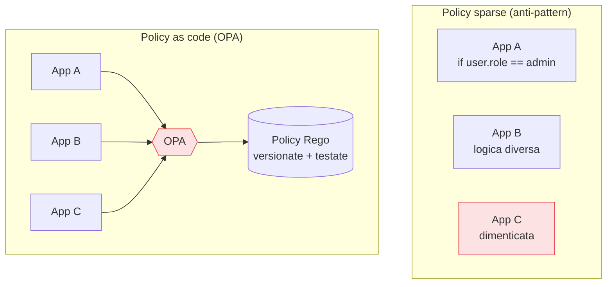

## Perché conta

Finora le policy le abbiamo descritte a parole: "il gruppo X accede alla risorsa Y", "solo da
dispositivi conformi". Ma dove *vivono* queste regole? Troppo spesso sparse nel codice di ogni
applicazione, ciascuna con la propria logica, impossibili da verificare o cambiare in blocco. Lo
Zero Trust ha bisogno di un [PDP]() unico, e la
**policy as code** è il modo di realizzarlo: le regole diventano codice versionato, testato,
applicato da un motore solo. **Open Policy Agent (OPA)** è lo strumento di riferimento.

## Il problema delle policy sparse



Con le policy sparse, nessuno sa quale sia la regola effettiva del sistema, aggiornarla significa
toccare N applicazioni, e quella dimenticata (App C) è il buco. Con OPA, la logica di
autorizzazione è **estratta** dalle app: ciascuna chiede a OPA "posso?", OPA risponde in base a
policy centrali.

## OPA: decisioni come dato

OPA è un motore general-purpose. L'applicazione (il PEP) gli manda un **input** JSON — chi, cosa,
contesto — e OPA valuta le policy restituendo una **decisione**. L'app non contiene più la logica,
solo la domanda.

```rego
# policy.rego — consenti solo il gruppo 'ordini-rw' a scrivere, da device conforme
package authz

default allow := false

allow if {
    input.action == "write"
    "ordini-rw" in input.user.groups
    input.device.compliant == true
}
```

```json
// input che il PEP manda a OPA
{ "action": "write",
  "user":   { "groups": ["ordini-rw"] },
  "device": { "compliant": true } }
// → decisione: allow = true
```

La policy è **dichiarativa** (Rego): descrive *cosa* è permesso, non *come* calcolarlo. È leggibile,
unica, e soprattutto **testabile**.

## Il vantaggio decisivo: testabilità

Perché le policy sono codice, si possono **testare come codice**. Si scrivono casi — "l'admin deve
poter scrivere", "un utente senza gruppo deve essere negato", "device non conforme sempre negato" — e
si eseguono a ogni modifica, in CI. Una regola di sicurezza diventa verificabile prima di andare in
produzione, invece di scoprirne gli effetti sul campo.

```text {hl_lines=[2,3]}
# nel pipeline CI
opa test policy/            # esegue i test delle policy
opa eval --fail-defined ... # valida prima del deploy
```

## Dove si innesta nello Zero Trust

OPA è il PDP riusabile in tutti i contesti visti nella serie:

| Contesto | PEP che interroga OPA |
|---|---|
| App / API | reverse proxy o middleware applicativo |
| Kubernetes | admission controller (Gatekeeper) |
| [Service mesh]() | sidecar Envoy (ext_authz) |
| Infrastruttura | validazione di Terraform, CI/CD |

Un solo linguaggio di policy, un solo motore, applicato ovunque: è la realizzazione concreta del
"scrivi la policy in un posto, applicala in mille" del capitolo 05.

## Lab

Con OPA in laboratorio:

1. Scrivete una policy Rego di autorizzazione (come sopra) e i relativi test; eseguite `opa test`.
2. Avviate OPA come server e interrogatelo con input JSON diversi, osservando le decisioni.
3. Mettete un reverse proxy davanti a un'app di test e configuratelo per chiamare OPA a ogni
   richiesta (il proxy è il PEP, OPA il PDP).
4. Cambiate la policy nel solo OPA e verificate che l'effetto si applichi senza toccare l'app.


<details>
<summary><strong>Domanda:</strong> centralizzare tutte le autorizzazioni in OPA non ricrea il collo di bottiglia e il single point of failure del PDP?</summary>
<p>È la stessa tensione del <a href="/p/pdp-pep-il-motore-delle-policy/">capitolo 05</a>, e OPA è
progettato attorno alla risposta. A differenza di un PDP remoto monolitico, OPA si esegue
<em>distribuito e locale</em>: gira come sidecar o libreria accanto a ogni servizio, valuta le policy
in memoria in microsecondi, senza una chiamata di rete per ogni decisione. Le policy e i dati vengono
<em>distribuiti</em> alle istanze OPA (bundle scaricati periodicamente da un punto centrale), così il
controllo è centralizzato ma l'esecuzione no: se il distributore centrale è irraggiungibile, le istanze
OPA continuano a decidere con l'ultimo bundle. Si ottiene il meglio dei due mondi — governance e test
centralizzati, valutazione locale e resiliente. Il single point of failure resterebbe solo in
un'architettura che interroga un unico server OPA remoto a ogni richiesta, che è esattamente il pattern
da evitare.</p>
</details>


## Conclusione

La policy as code con OPA trasforma le regole di accesso da logica sparsa e invisibile in codice
unico, versionato e testabile, valutato da un motore distribuito che fa da PDP in ogni contesto —
app, Kubernetes, mesh, infrastruttura. È il modo di rendere reale il PDP dello Zero Trust. Abbiamo
costruito identità, segmentazione, policy; ma lo Zero Trust non decide una volta sola. Il prossimo
capitolo chiude il cerchio: la verifica continua e l'accesso adattivo al rischio.
