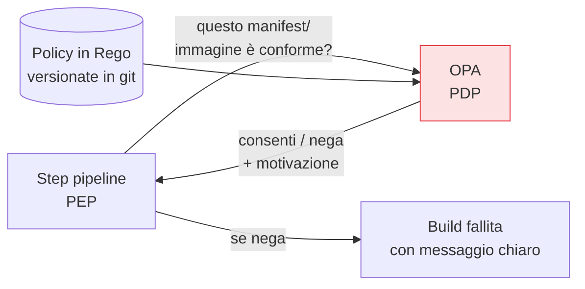

## Perché conta

Lo [scanning dell'IaC]() applica regole *predefinite*. Ma ogni
organizzazione ha regole *proprie*: "solo immagini da registry approvati", "ogni risorsa deve avere un
tag owner", "niente security group aperti al mondo in produzione". Scritte in una wiki, queste regole
non si applicano da sole: si violano per distrazione o per fretta. Il **policy as code** le trasforma
in codice versionato, testabile e applicato automaticamente. È il tema generale di cui avevamo già
parlato con [OPA](); qui lo mettiamo al lavoro nella
pipeline.

## Il pattern PDP/PEP, di nuovo

Il policy as code è lo stesso schema [PDP/PEP]()
dello Zero Trust, applicato agli artefatti e alle configurazioni invece che agli accessi di rete:



La pipeline è il **PEP** (chiede e applica); OPA è il **PDP** (decide in base alle policy). Le policy
vivono in git: revisionate con pull request, testate, con una history di chi le ha cambiate e perché.

## Rego: la regola come codice

OPA usa **Rego**, un linguaggio dichiarativo. Una policy nega finché una condizione non è soddisfatta:

```rego {hl_lines=[4,5]}
package pipeline

# nega qualunque immagine non firmata o da registry non approvato
deny[msg] {
  not input.image.signed
  msg := sprintf("immagine %v non firmata", [input.image.ref])
}
```

Il risultato non è un booleano muto ma un **messaggio azionabile**: lo sviluppatore legge *perché* la
build è fallita e *come* rimediare. Questo distingue un guardrail utile da un cancello frustrante.

## Cosa si esprime come policy

- **Sugli artefatti**: solo immagini firmate ([Sigstore]()),
  con SBOM presente, senza CVE critici, da basi approvate.
- **Sui manifest Kubernetes**: niente container privilegiati, niente `latest`, limiti di risorse
  obbligatori, nessun segreto in chiaro.
- **Sull'IaC**: le regole su misura che lo scanner generico non conosce (le *tue* convenzioni di tag,
  di naming, di rete).

Strumenti come **Conftest** valutano file di configurazione (YAML, JSON, HCL, Dockerfile) contro
policy Rego direttamente in pipeline, con un comando.

## Testare le policy

Il vantaggio decisivo del policy as code è che le policy stesse sono *testabili*. Si scrivono casi —
"questo manifest deve passare", "quest'altro deve essere rifiutato" — e si eseguono in CI. Una policy
senza test è fragile quanto codice senza test: può diventare troppo permissiva senza che nessuno se ne
accorga.

## Un motore, molti punti di applicazione

La stessa policy ("solo immagini firmate") può valere nella pipeline *e* all'ingresso del cluster via
[admission control](). Un solo linguaggio, un solo repository di
regole, più punti di enforcement: è la coerenza che rende governabile la sicurezza su scala, invece di
regole scollegate ripetute in dieci posti.


<details>
<summary><strong>Domanda:</strong> se la policy as code può bloccare le build, chi impedisce che una regola troppo severa (o un bug in una policy) fermi tutti i deploy dell'azienda?</summary>
<p>È un rischio concreto — una policy è codice con potere di veto sulla consegna — e si gestisce con le
stesse pratiche che rendono sicuro qualunque altro codice critico, più alcune specifiche. Primo: le policy
si trattano come software, non come configurazione sacra. Vivono in git, passano da pull request con
revisione, e hanno <em>test propri</em>: casi che devono passare e casi che devono essere rifiutati,
eseguiti in CI a ogni modifica della policy stessa. Una regola troppo severa si manifesta come un test
rosso prima di arrivare in produzione, esattamente come una regressione in un servizio. Secondo: le policy
si rilasciano in modo graduale. Una regola nuova parte in modalità <em>warn</em> (segnala ma non blocca),
si osserva quanto e cosa catturerebbe sui deploy reali per un periodo, e solo quando i falsi positivi sono
sotto controllo si promuove a <em>enforce</em>. Questo evita il blocco a sorpresa dell'intera azienda al
primo giorno. Terzo: serve una via di emergenza esplicita e tracciata — un meccanismo di eccezione o di
break-glass che permetta, con approvazione e audit, di scavalcare una policy quando è palesemente lei a
sbagliare durante un incidente, invece di lasciare l'unica scelta tra "bloccati tutti" e "disattiviamo
tutto". Quarto, la scelta del comportamento di default per fase: in pipeline spesso conviene fail-closed
sulle regole di sicurezza critiche (meglio una build bloccata che un'immagine non firmata in produzione),
ma la decisione va presa consapevolmente regola per regola, non subita. Il punto di fondo: il potere di
bloccare è esattamente ciò che rende la policy utile — una regola che non può fermare nulla non è un
controllo, è un suggerimento — quindi la risposta non è togliere il potere, è circondarlo di test, rollout
graduale e vie di fuga, come si fa con ogni cosa che può rompere la produzione.</p>
</details>


## Conclusione

Il policy as code trasforma le regole dell'organizzazione in codice versionato, testato e applicato:
lo schema PDP/PEP portato nella pipeline, con messaggi azionabili e un solo repository di regole per
più punti di enforcement. Abbiamo blindato codice, artefatti e pipeline. Ora quegli artefatti devono
girare, e il primo è quasi sempre un container: la sicurezza delle immagini, prossimo capitolo.
