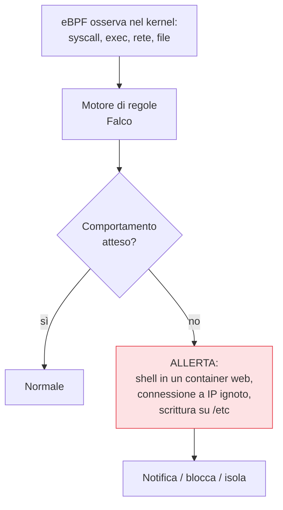

## Perché conta

Ogni controllo visto finora è *preventivo*: cerca di impedire che un difetto nasca o che un carico
non conforme parta. Ma la prevenzione, da sola, è una scommessa che prima o poi si perde: un CVE
zero-day, una configurazione sfuggita, una credenziale rubata. La **runtime security** accetta questa
realtà e aggiunge l'altra metà: *osservare il comportamento reale* dei container in esecuzione e
reagire quando qualcosa esce dal normale. Si appoggia a [eBPF]()
per vedere nel kernel senza modificare le app.

## L'idea: il comportamento atteso

Un container ha un comportamento prevedibile e stretto: un server web ascolta su una porta, legge
certi file, parla con certi servizi. Tutto il resto è sospetto.



A differenza dell'antivirus basato su firme, la runtime security moderna ragiona per **comportamento**:
non "riconosco questo malware", ma "questo container sta facendo qualcosa che un container di quel tipo
non dovrebbe fare".

## Cosa rileva Falco

**Falco**, lo standard CNCF, osserva le syscall via eBPF e le valuta contro regole. Segnali tipici di
compromissione:

```text {hl_lines=[2,3]}
Esempi di regole comportamentali:
  - shell avviata dentro un container             ← quasi mai legittimo in prod
  - processo che legge /etc/shadow                ← tentativo di furto credenziali
  - connessione in uscita verso IP non previsto   ← possibile C2 / esfiltrazione
  - scrittura in una directory di sistema         ← tampering del binario
  - montaggio sospetto o accesso al socket Docker  ← tentativo di escape
```

Molti di questi sono proprio ciò che un'immagine [distroless]()
rende *impossibile* (niente shell) o che l'[hardening]()
rende *difficile* — la prevenzione riduce ciò che Falco deve vedere, e Falco cattura ciò che la
prevenzione non ha fermato. Difesa in profondità.

## Allertare o bloccare?

Due modalità, con un compromesso:

- **Detect (allerta)**: segnala l'anomalia a chi risponde. Nessun rischio di bloccare traffico
  legittimo, ma richiede qualcuno (o un'automazione) che reagisca in fretta.
- **Enforce (blocca/isola)**: ferma il processo o isola il pod automaticamente. Reazione immediata,
  ma un falso positivo può interrompere un servizio.

La pratica comune: partire in detect per *imparare* il comportamento normale e tarare le regole,
riducendo i falsi positivi, e passare a enforce solo sulle anomalie ad alta confidenza. Le allerte
alimentano la [detection e il SIEM]() e innescano la
[risposta agli incidenti]().

## Il rumore è il vero nemico

Come ogni detection, la runtime security vive o muore sui falsi positivi. Mille allerte al giorno
equivalgono a zero allerte: nessuno le guarda. Il lavoro vero non è installare Falco, è *tarare* le
regole sul comportamento reale dei propri carichi, sopprimere il rumore noto e mantenere solo i
segnali azionabili. Una detection ignorata è peggio di nessuna detection, perché dà un falso senso di
copertura.


<details>
<summary><strong>Domanda:</strong> se ho già fatto prevenzione seria — immagini distroless, hardening, admission control, network policy — cosa mi aggiunge davvero la runtime security? Non dovrebbe essere già tutto bloccato?</summary>
<p>La prevenzione risponde alla domanda "può succedere?" e tu l'hai ridotta tanto; la runtime security
risponde a una domanda diversa, "<em>sta</em> succedendo?", e nessuna quantità di prevenzione la rende
superflua, per tre ragioni. Primo, la prevenzione ha un orizzonte: conosce i difetti e le configurazioni
sbagliate <em>note oggi</em>. Uno zero-day nella tua applicazione, una catena di exploit che nessuna
policy prevedeva, una credenziale legittima rubata e usata in modo legittimo-ma-malevolo — tutto questo
passa i controlli preventivi proprio perché non viola nessuna regola conosciuta. La runtime security non
chiede "questo è permesso?" ma "questo è <em>normale</em> per questo container?", e un comportamento
anomalo è anomalo anche se tecnicamente permesso. Secondo, la prevenzione può avere buchi che non sai di
avere: una policy di admission con un'eccezione dimenticata, un namespace legacy non ancora hardened, un
workload con una deroga temporanea diventata permanente. La runtime security è la rete che vede cosa
succede <em>davvero</em>, indipendentemente da cosa credevi di aver bloccato — e spesso è lì che scopri
che un controllo preventivo non era attivo dove pensavi. Terzo, e decisivo: la prevenzione non lascia
<em>testimonianza</em>. Se un attacco riesce nonostante tutto, senza osservazione a runtime non lo sai —
non hai allerta, non hai timeline, non hai le prove per capire cosa è stato toccato. La runtime security
è ciò che trasforma una compromissione silenziosa e indefinita in un incidente rilevato, delimitato e
investigabile. Il punto non è che la prevenzione sia debole: più è forte, meno rumore deve gestire la
detection e più ogni allerta è significativa. I due lavorano insieme — la prevenzione riduce la
superficie e il volume, la detection copre l'inevitabile residuo e ti dà occhi su ciò che la prevenzione
non ha visto. La sicurezza seria non sceglie tra "impedire" e "rilevare": fa entrambi perché falliscono
in modi diversi.</p>
</details>


## Conclusione

La runtime security accetta che la prevenzione prima o poi ceda: osserva il comportamento reale via
eBPF, segnala la shell inattesa e la connessione sospetta, allerta o blocca, e dà la testimonianza
che la prevenzione non lascia. Vive e muore sulla taratura dei falsi positivi. Tra i comportamenti più
sensibili c'è l'accesso ai segreti: come i container ottengono le credenziali in un cluster, senza
lasciarle in chiaro, è il prossimo capitolo.
