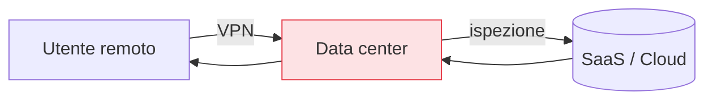
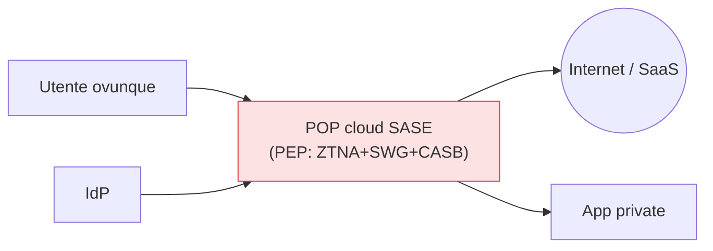

## Perché conta

Lo [ZTNA]() risolve l'accesso alle applicazioni, ma un'azienda
ha bisogno anche di navigare in sicurezza, filtrare il traffico, proteggere i dati verso il SaaS. Se
utenti e risorse sono ovunque, far passare tutto il traffico da un data center centrale (per
"ispezionarlo") è assurdo e lento. Il **SASE (Secure Access Service Edge)** sposta rete e sicurezza
nel **cloud, al bordo vicino all'utente**, e include lo ZTNA come tassello di accesso. È lo Zero
Trust che segue l'utente invece di aspettarlo al perimetro. Per il quadro generale del SASE si veda
anche l'[articolo dedicato]().

## Il problema del "tromboning"

Con le risorse nel cloud e gli utenti a casa, il modello tradizionale fa un giro assurdo: l'utente
remoto si collega in VPN al data center, da lì esce verso il SaaS, e la risposta rifà il percorso al
contrario. Questo "tromboning" aggiunge latenza e carica un data center che non è più il centro di
nulla.

Il SASE elimina il giro: l'utente si connette al **punto di presenza cloud** più vicino, dove
avvengono ispezione e policy, e va direttamente alla risorsa.

## I componenti del SASE

Il SASE unisce funzioni di **rete** e di **sicurezza** erogate come servizio cloud. Il lato
sicurezza è spesso chiamato **SSE (Security Service Edge)**:

| Componente | Funzione |
|---|---|
| **ZTNA** | accesso Zero Trust alle applicazioni (cap. 07) |
| **SWG** (Secure Web Gateway) | filtra la navigazione, blocca malware e siti pericolosi |
| **CASB** (Cloud Access Security Broker) | controlla l'uso del SaaS, applica policy sui dati |
| **FWaaS** (Firewall as a Service) | firewall nel cloud |
| **DLP** | previene la fuga di dati sensibili (cap. 18) |
| **SD-WAN** | il lato rete: instrada il traffico in modo ottimale |

## Dove sta lo Zero Trust

Il SASE non *è* lo Zero Trust: è un **modello di erogazione** (sicurezza come servizio al bordo) in
cui lo Zero Trust è il principio di accesso. Il collante è l'identità: ogni componente — dallo ZTNA
al SWG — applica policy basate su chi è l'utente e in che stato è il dispositivo, non su dove si
trova. Il SASE, in pratica, mette i [PEP]() nel
cloud, al bordo, invece che nel data center.

## Il compromesso: dipendere dal fornitore

Il SASE concentra una quantità enorme di traffico e di policy in un fornitore cloud. È potente — un
solo posto dove applicare lo Zero Trust a tutto il traffico — ma crea una dipendenza critica:
disponibilità, copertura geografica dei POP, e fiducia nel fornitore che vede (e potenzialmente
decifra) il traffico. Va scelto con gli stessi criteri con cui si sceglie un IdP: è
infrastruttura di cui ci si fida per tutto.

## Lab

Il SASE commerciale non si riproduce in laboratorio, ma se ne possono assemblare i pezzi open
source per capirne la logica:

1. Uno ZTNA (cap. 07) per l'accesso alle app private.
2. Un proxy di navigazione (Squid + filtri, o un SWG open source) come secure web gateway.
3. Un IdP comune che alimenta le policy di entrambi.
4. Verificate che un utente, autenticato una volta, abbia navigazione filtrata **e** accesso
   per-app, con policy coerenti basate sull'identità.



<strong>Domanda:</strong> SASE non è solo un pacchetto di prodotti vecchi (proxy, firewall, VPN) rietichettato come Zero Trust?

In parte la critica è giusta, ed è il motivo per cui conviene distinguere il modello dal marketing.
È vero che i mattoni — gateway web, firewall, broker di accesso — esistono da anni. La novità reale del
SASE è <em>dove</em> e <em>come</em> vengono erogati: non apparati nel data center che l'utente deve
raggiungere, ma servizi distribuiti al bordo cloud, con un piano di policy <em>unificato</em> e centrato
sull'identità. La differenza non è cosmetica: elimina il tromboning, e soprattutto fa applicare a tutte
le funzioni la <em>stessa</em> decisione basata su identità e dispositivo, invece di dieci prodotti con
dieci logiche scollegate. Detto questo, il rischio del rietichettamento è concreto: un fornitore che
vende una VPN e un proxy sotto il cappello "SASE/Zero Trust" senza un piano di policy unificato e senza
verifica per-risorsa sta usando la parola, non il modello. Il metro resta quello del
<a href="/p/zero-trust-i-cinque-principi/">capitolo 01</a>.



## Conclusione

Il SASE porta rete e sicurezza nel cloud, al bordo vicino all'utente, con lo ZTNA come componente di
accesso e l'identità come collante. Non è lo Zero Trust, è il modo di erogarlo quando utenti e
risorse sono ovunque. Finora abbiamo verificato utenti e applicazioni; il prossimo capitolo aggiunge
un attore che la verifica esplicita non può ignorare: il dispositivo e la sua postura.
