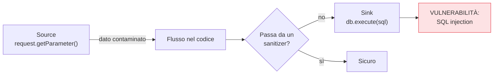

## Perché conta

Tolti i [segreti dal codice](), possiamo analizzare il
codice stesso. Il **SAST (Static Application Security Testing)** legge il sorgente — senza eseguirlo —
cercando pattern che portano a vulnerabilità. È il primo controllo che tocca la logica di ciò che
scriviamo, e si attiva prima ancora della compilazione, nel punto più a sinistra possibile dopo il
threat modeling.

## Cosa trova (e cosa no)

Il SAST eccelle sui difetti *locali e riconoscibili nel codice*:

- **Injection** (SQL, comandi, LDAP): input non sanitizzato che finisce in una query o in una shell.
- **Path traversal**, **XSS**, deserializzazione insicura.
- **Crypto debole**: MD5 per le password, algoritmi deprecati, chiavi hardcoded.
- **Pattern pericolosi**: `eval`, formattazione di stringhe in query.

Non vede i difetti che emergono solo a runtime o dalla *configurazione*: un bucket pubblico, un
header mancante, una logica di autorizzazione sbagliata che il codice esprime "correttamente". Per
quelli servono DAST e analisi di configurazione, capitoli successivi.

## Come funziona: la taint analysis

Il cuore del SAST moderno è l'analisi del *flusso dei dati contaminati* (taint): segue un dato da una
**sorgente** non fidata (input utente) fino a un **sink** pericoloso (una query), controllando se
passa per un *sanitizer*.



Se un dato arriva dalla sorgente al sink senza sanitizzazione, lo strumento segnala. Questo spiega
sia la potenza (trova catene non ovvie) sia i limiti (non sa che una certa funzione *è* un sanitizer
se non gliel'hai detto → falso positivo).

## Il problema dei falsi positivi

Il SAST ingenuo è famoso per il rumore. Un tool che segnala 500 problemi di cui 480 irrilevanti
viene disattivato in una settimana. Le contromisure in una pipeline sana:

```yaml {hl_lines=[4,5,6]}
# esempio di gate SAST ragionevole nella CI
sast:
  fail_on: high          # blocca solo su severità alta, non su tutto
  diff_aware: true       # analizza solo il codice cambiato nella PR
  baseline: true         # ignora il debito preesistente, blocca il NUOVO
  suppress_with: comment # i falsi positivi si marcano, tracciati e revisionati
```

Le righe evidenziate sono ciò che rende il SAST sopportabile: **blocca solo il nuovo rischio alto**,
non tutto il debito storico, e lascia una via esplicita (tracciata) per i falsi positivi.

## Nel flusso di lavoro

Il posto giusto è la **pull request**: il feedback arriva come commento in linea, nel contesto, a chi
ha appena scritto quel codice. Molti team aggiungono il SAST anche nell'IDE (feedback in tempo reale)
e un passaggio nella CI come gate. Regole personalizzate (Semgrep rende questo semplice) codificano
gli *abuse case* del threat model: la minaccia diventa una regola che fallisce se la falla ritorna.


<details>
<summary><strong>Domanda:</strong> se il SAST ha tanti falsi positivi e non vede i difetti di runtime, perché non affidarsi solo al DAST che testa l'app reale?</summary>
<p>Perché vedono cose diverse e in momenti diversi, e scartarne uno lascia un buco. Il SAST ha una
visibilità totale sul codice — ogni ramo, ogni percorso, anche quelli che un test dinamico non
raggiungerebbe mai senza l'input giusto — e dà feedback sulla singola riga, in fase di scrittura, quando
correggere costa un minuto. Il DAST vede l'applicazione viva, quindi trova i difetti di configurazione e
di ambiente che il SAST ignora, ma solo sui percorsi che riesce effettivamente a esercitare, e arriva
tardi, in staging, quando il codice è già scritto e il contesto mentale perso. Non sono ridondanti, sono
complementari: il SAST è la copertura ampia e precoce con il prezzo del rumore, il DAST è la conferma
realistica ma tardiva e parziale. La risposta ai falsi positivi non è eliminare il SAST, è configurarlo
bene — diff-aware, baseline, gate solo su severità alta, regole tarate sul tuo codice — così il segnale
emerge dal rumore. Un difetto di injection trovato dal SAST sulla pull request costa un commento; lo
stesso difetto trovato dal DAST in staging costa un ticket; trovato in produzione costa un incidente.
Vuoi entrambe le reti, non la più comoda.</p>
</details>


## Conclusione

Il SAST legge il codice senza eseguirlo e segue i dati contaminati dalla sorgente al sink: ampio,
precoce, ma rumoroso se non tarato su diff, baseline e severità. Cattura però solo il codice che
*scriviamo noi*. La maggior parte di un'applicazione moderna, però, è codice che non abbiamo scritto:
le dipendenze. Analizzarle è un problema diverso — la Software Composition Analysis, prossimo capitolo.
